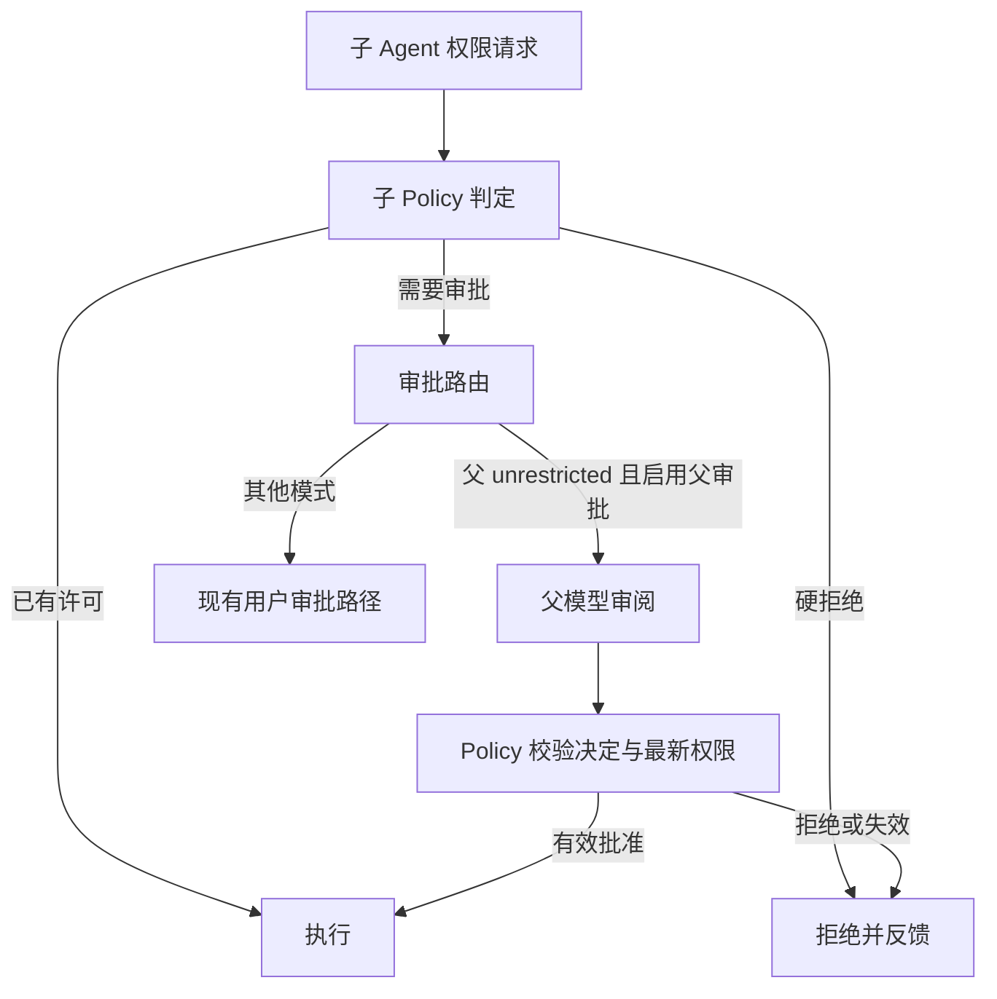

# unrestricted 父 Agent 审批子 Agent

归档日期：2026-10-04。原位置：`nexttodo/parent-agent-approval-plan.md`。保留原设计、实现状态和
2026-10-03 验收摘要；代码基线为 `8043063`。设计目标不自动等同于当前接口，当前行为见
[权限指南](../guide/permissions.md)，剩余证据边界见 [后续工作](../../nexttodo/README.md)。
原始 `temp/` 材料未随仓库分发，本次归档未重新运行历史场景。

设计日期：2026-09-29。实现更新：2026-10-03。

当前状态：实现、构建及真实父子任务验收已完成；全面排查后的修复与剩余验证边界见第 8.2 节。
真实运行覆盖 headless 父审批、一次/子会话授权、并发隔离、拒绝、硬上限、人工路由、取消/降权、预算及回放。
完整原始记录与验收说明位于 `temp/parent-agent-approval/VERIFY.md`。
最后集成后的正向运行保存在 `temp/parent-agent-approval/records/final-headless.jsonl`，父子均完成，实际子读取为父模型单次授权。
当前权限行为见 [权限指南](../guide/permissions.md)。

## 1. 目标

用户选择 unrestricted 持续工作时，由父 Agent 审阅子 Agent 的扩权请求，避免每次子任务授权都打断用户。子 Agent 继续使用 workspace 或更窄的权限模式，按需获得明确范围的授权，不直接继承 unrestricted。

本计划独立于 [SRT 适配计划](2026-09-30-srt-permissions-plan.md)，接入现有 `Approval → Decision → ExecutionGrant` 链路。
实现父模型决策不应改写 SRT 的能力结论；联合验收使用现有 SRT 执行和运行时网络审批路径。

父模型负责判断请求是否服务于用户任务；确定性 Policy 负责检查授权是否合法，实际执行后端负责隔离。父审批不能补足当前后端缺少的 OS 能力。

## 2. 设计基线与改造目标

下表记录设计时的行为与改造目标；当前实现状态见第 7 节。

| 位置 | 当前行为 | 改造目标 |
| --- | --- | --- |
| `agent/permission.cpp::derive_permission` | unrestricted 父派生 workspace 子 | 保留默认收窄，增加可委托审批的权限上限 |
| `agent/port_delegation.hpp` | DelegationContext 包含父 mode 快照和 Approver 指针 | 增加审批路由及活跃父权限视图，不能只依赖创建时快照 |
| `runtime/subagent.cpp::ChildExecution` | 子请求转发到父 Approver，实际仍向用户弹窗 | unrestricted 父路由到父模型审阅，其他情况保留用户路径 |
| `agent/dispatch.cpp` | task worker 执行子任务，父线程 join 等待 | 父等待期间消费审批请求，避免父等子、子等父的死锁 |
| `runtime/session_control.cpp` | headless 不提供用户 Approver | 父模型审批不依赖用户 Approver，非交互运行同样有效 |
| `agent/record_codec`、UI/协议 | 主要记录用户审批结果 | 区分 parent_model 与 user，保留子调用来源及有效范围 |

## 3. 用户场景

1. 作为 unrestricted 用户，我希望子任务所需授权由父 Agent 处理，以持续完成委派工作。
2. 作为用户，我希望父 Agent 根据任务与我的约束判断请求，而不是自动批准全部子请求。
3. 作为用户，我希望子 Agent 一次获批后仍保持原权限模式，不把权限扩散到其他子任务。
4. 作为用户，我希望能够降权或取消父任务，使尚未使用的父授权失效。
5. 作为非交互用户，我希望同样使用父审批，模型无法决策时得到任务反馈而非等待不存在的弹窗。
6. 作为用户，我希望记录说明是谁批准、批准了什么，以及是否实际执行。

## 4. 路由与权限语义

- 启用条件：父当前 `mode=unrestricted`，父没有 read_only/planning 上限，配置选择 `parent_when_unrestricted`，父任务仍活跃。条件在请求时和消费批准时都检查。
- 已有许可直接执行；危险命令、语法错误、只读上限、显式 deny 等硬拒绝不提交给父模型覆盖。
- 子定义中的工具名单及只读模式仍是上限；父审批只处理 Policy 明确列为可审批的请求，不增加子工具或继续委派能力。
- 父可批准原请求、批准接口能表达的请求子集、拒绝并给子反馈；不允许添加未请求资源。现有接口不能表达子集时，只接受完整批准或拒绝，不能伪造窄授权。
- 一次批准只对指定 child/call/execution 生效；会话批准仅属于当前子任务会话，不共享给兄弟任务，不自动修改父规则。敏感请求与 host_access 继续限定一次。
- 子明确请求 host_access，且父当前具备相应权限时，父可以批准一次宿主执行。必须记录 `authority=parent_model`、`scope=one_call`、`backend=host`，并显示真实边界；后续子调用仍回到原受限模式。
- 在当前后端下，host_access 就是宿主全访问，不能写成“仅放行域名”。SRT 独立计划完成后，普通网络/文件审批可落实为更窄边界，父审批规则本身不随之扩大。
- 父模型失败、超时、输出无效或预算耗尽时默认拒绝并反馈；不静默批准，不自动改为用户弹窗。父任务可以在正常流程中重新规划；只有确实缺少用户业务信息时才提出具体问题。
- 父降权使既有 parent-review 请求失效，取消并反馈，不把同一个陈旧请求自动转交用户。之后在新模式下发起的请求按正常路由处理。

## 5. 架构、状态与所有权

### 5.1 审批路由

在现有中立审批契约上增加 `ApprovalAuthority`（user / parent_model）和请求身份，不建立第二套 Policy。runtime 装配审批路由，子任务只提交请求，不掌握父模型或父可写 Session。

待审批项至少关联父/子 session、origin task、call/execution、request ID、父权限 revision、当前批准范围与部分执行状态。每项只有一次终态：approved / denied / cancelled / expired。重复、迟到和跨会话答复被拒绝。

### 5.2 父等待 task 时处理审批

父 Dispatcher 的 task 等待改为事件驱动：worker 运行子任务；父线程等待并处理子完成、审批请求和取消事件。子提交审批后只等待自己的答复；其他子任务仍可继续执行。

父模型审阅在独立请求中进行，使用父当前模型配置和任务上下文快照。它属于父 Agent 的决策，不新增第三个 Agent，不递归调用父 `TurnRunner`，也不在尚未结束的 task 工具调用中插入普通会话轮次。

每个父会话串行进行模型审阅。审阅请求等待期间仍须响应取消与权限变化，不能持 Policy、交互队列或 Conversation 锁。子任务调度保持现有并发预算。

### 5.3 审阅输入与输出

输入包括：父用户目标与明确约束、委派任务、子申请的结构化资源范围、原始命令/目标、已有权限、预期副作用及部分执行状态。提供判断所需的有限证据；子说明与工具输出作为待判断数据，不能覆盖父用户约束或授权规则。

审阅请求不提供工具，只返回受校验的结构化决定、范围和简短理由。父模型不能自己执行子请求、申请更多权限或改写审批规则。复用现有模型调用与 usage 统计能力，通过窄接口装配，核心不引用 provider 私有实现。

批准消费前，Policy 检查最新父/子上限、请求身份与范围。模型输出不是可直接执行的 capability；校验成功后才生成现有 ExecutionGrant。

### 5.4 降权、退出与预算

- 为父授权提供活跃 revision/取消句柄；不能只读 DelegationContext 的初始 mode。父降权或退出取消待审阅与未使用授权。
- 对依赖被撤销父授权而运行的子调用发出取消，并等待现有执行器收尾。已发生的写入与远端操作无法回滚；现有 MCP 的进程级隔离缺口由 SRT 计划单独解决，不能靠本计划宣称已消除。
- 审阅调用计入父模型调用及令牌总预算，另有审阅次数与超时上限；正常的父模型调用不能与审阅调用分别使用不受约束的预算。
- 子请求命中现有许可时不再次调用父模型。重复请求可合并等待，但决定仍绑定具体子任务和范围，不能跨兄弟任务缓存授权。
- 模型切换发生在允许的会话边界；在途审阅记录实际使用的模型，不能把一个模型的答复拼进另一个模型的在途请求。

## 6. 配置与审计

配置位于受信任 Home 配置的 `subagents.approval`，不由子模型参数控制：

| 字段 | 首版配置值 | 含义 |
| --- | --- | --- |
| mode | parent_when_unrestricted | unrestricted 父代审；可明确改为 user |
| max_reviews_per_turn | 16 | 每父 turn 的额外审阅次数上限，仍受总调用预算约束 |
| review_timeout_ms | 60000 | 模型审阅超时 |
| failure | deny_with_feedback | 错误向任务反馈，默认不转用户弹窗 |

UI 用英文说明 unrestricted 可委托父审批，并以 `Reviewing subagent permission` 等非模态状态显示进度。ask/workspace 仍采用现有用户流程，headless 没有用户审批出口时保留明确的 approval-unavailable 结果。

子 Dispatcher 通过自己的 SessionCommitter 记录决定；父侧记录审阅用量并接收关联事件。审阅 worker 不直接写子 Journal。记录 authority、父/子来源、请求与批准范围、理由、实际 grant、模型及取消原因；恢复仅回放，不恢复临时授权。

## 7. 实施顺序

| ID | 工作 | 依赖 | 完成条件 |
| --- | --- | --- | --- |
| PA01 | 中立审批身份、authority、配置与活跃父权限接口 | 无 | 用户/父审批可区分，子不能扩大自身硬上限 |
| PA02 | task 等待事件队列、一次性答复、取消与 revision 校验 | PA01 | 父等待子时仍能处理审批，不递归执行、不死锁 |
| PA03 | 父模型专用审阅请求与共享预算 | PA01、PA02 | 结构化决定经 Policy 校验，超时/无效输出有确定结果 |
| PA04 | 子任务审批路由，交互与 headless 接线 | PA02、PA03 | unrestricted 父接手审批，其他模式行为保持明确 |
| PA05 | 一次/子会话授权、父降权传播、审计/UI/回放 | PA04 | 授权不串任务，陈旧答复无效，记录来源准确 |
| PA06 | 构建与真实父子任务验收 | PA05 | 下列真实场景通过，未验证项明确记录 |

这些项不依赖 SRT 的 S00–S10。两份计划都涉及审批请求身份、权限修订号和执行事件队列：先实施的一方提供公共契约，另一方复用，不能重复创建控制通道或修改同一文件产生冲突。

### 7.1 实现状态（2026-10-03）

| ID | 状态 | 落地内容 |
| --- | --- | --- |
| PA01 | 已实现 | 中立 authority、请求身份、父权限 revision/取消租约及受信任 Home 配置；保留子定义硬上限 |
| PA02 | 已实现 | 复用 Dispatcher 等待邮箱接收子申请，单次终态，父模型审阅串行，等待期间响应取消与降权 |
| PA03 | 已实现 | 无工具的结构化父模型请求，完整请求范围校验，复用父模型调用与令牌预算，审阅次数和超时上限 |
| PA04 | 已实现 | unrestricted 的父模型路由独立于人工 Approver；ask/workspace、显式 user 配置保留人工路由 |
| PA05 | 已实现 | 一次/子会话授权、权限撤销取消、父子审计与 usage 归属、英文进度及只读历史回放 |
| PA06 | 已完成本轮验收 | 构建及真实 Qwen 父子任务通过；各场景证据与未验证边界见第 8.1 节 |

## 8. 真实运行验收

| 场景 | 预期 |
| --- | --- |
| unrestricted 父委派，子请求现有可审批操作 | 父模型决定，用户无模态弹窗；批准后子继续 |
| ask/workspace 父委派同一任务 | 仍按现有用户审批路由 |
| readonly/planning 子提出写入 | 硬拒绝，父模型不能放宽 |
| 多子任务同时申请 | 父审阅串行，任务可并行，不死锁、不串授权 |
| 父批准一次宿主访问 | 只执行对应调用，记录 parent_model/host；后续仍受原模式限制 |
| 拒绝并反馈 | 子获得可用原因，父可重新规划，用户不被强制打断 |
| 审阅期间父取消/降权 | 模型调用与等待及时结束，迟到批准不能执行 |
| 审阅模型错误/超时/预算耗尽 | 拒绝并反馈，不批准、不自动转用户弹窗 |
| headless unrestricted 父 | 无前端 Approver 仍可代审，使用真实模型完成子任务 |
| 恢复记录、模型切换 | 能区分用户与父批准；恢复不重授临时权限，usage 归属正确 |

只进行构建和真实模型、真实父子任务运行；检测材料放 `temp/`。不添加测试代码、模拟模型、模拟服务或测试目标。审批通道的验收使用现有真实命令；SRT 域名级授权的联合验收记录见第 8.2 节，不代替 SRT 独立计划的全部验收。

### 8.1 真实验收结果（2026-10-03）

模型为用户明确授权启动的本地 `Qwen3.6-35B-A3B`，使用生产 CLI/backend 与隔离 Home。
下表路径均相对于 `temp/parent-agent-approval/`，CLI 结果另附 SQLite 审计导出；
不以父 turn 的 `done` 代替子工具实际成功。

| 场景 | 结果 | 证据 |
| --- | --- | --- |
| headless unrestricted 父审批 | 外部 read 的实际 grant 为 parent_model/native/once，父子均完成，无用户弹窗 | `records/headless-local.jsonl`、`.audit.json` |
| 一次与子会话授权 | ask 子两次 write 仅审阅一次，真实文件内容正确；授权未进入父持久规则 | `records/ask-session.jsonl`、`.audit.json` |
| 多子任务并发 | 两个并行子分别请求不同文件，父审阅串行、请求身份分离，父子全部完成且无工具错误 | `records/concurrent-once.jsonl`、`.audit.json` |
| 一次宿主批准 | 真实 host 命令写出文件；同子后续外部 read 再次审批且 mode 仍为 workspace | `records/host-command.jsonl`、`.audit.json` |
| 父拒绝 | 顶层禁止读取的文件被父 reviewer 拒绝，子收到原因，没有实际 read 执行 | `records/denial.jsonl`、`.audit.json` |
| readonly 硬上限 | 子实际尝试 write，Policy 直接拒绝，没有父审阅、文件未创建 | `records/hard-deny.jsonl`、`.audit.json` |
| 人工及无交互路由 | ask/workspace 与显式 mode=user 均产生 user 交互并成功处理；headless 无人工通道返回 approval unavailable | `rpc-user-*.result.json`、`records/user-route-*.jsonl` |
| 审阅中取消/降权 | 原请求 cancelled，无工具执行、无 grant，不转人工；取消约 0.052 秒完成父 turn 收尾 | `rpc-cancel-final.result.json`、`rpc-downgrade-final.result.json` |
| 活跃父授权撤销 | 宿主命令实际运行后父降权，子约 86ms interrupted；原进程退出，22 秒后计划写入仍未发生 | `rpc-active-grant-final.result.json` |
| 预算/超时/无效输出 | 审阅次数、共享父调用及 token 预算均拒绝；真实超时与无效 JSON 安全失败并反馈 | `FAILURE-PATHS.md`、`records/failure-paths-summary.json` |
| usage、恢复与模型切换 | 父普通 usage 加审阅 usage 与 turn_end 相等；回放保留来源，恢复及空闲切模型后无临时 grant | `records/headless-local.usage.json`、`rpc-replay-switch-final.result.json` |

并发零错误场景使用显式 `review_timeout_ms=180000`。默认 60000ms 的早期并发运行出现过
排队超时，另一轮出现过真实模型 Markdown fence/无效 JSON；对应请求均被拒绝，记录保留，未将其当成成功执行。
一次宿主场景使用复制到临时路径的真实二进制，其 SRT probe 因实际宿主 namespace 前置不足失败；
不修改系统 AppArmor/sysctl、不模拟能力结果。

明确边界：

- reviewer 开始后真实 HTTP/provider 故障未单独触发；最初配置的 401/503 发生在父普通模型调用，不能算审阅故障验收。
- 模型切换验证了空闲边界安装、历史回放及不恢复临时权限，未在切换后继续推理；生产 API 不单独恢复历史子会话。
- provider 未报告的取消前 token 不能当作实际 usage；单独记录估算用于预算扣减。
- 首版未验证初始受限父在任务中升级后再审阅，以及 SRT 联合网络路径；后续真实运行及修复已补齐，见第 8.2 节。

### 8.2 全面排查与修复（2026-10-03）

本轮按审批路由、Policy 范围与并发消费、父子生命周期、模型预算、SRT、审计/协议及 UI 展示检查。
详细证据见 本地排查记录 `temp/parent-approval-audit/VERIFY.md`（未随仓库分发）。已发现并修复：

- 普通目录的用户会话授权会绕过 `.env` 敏感读取审批；真实修前读取成功，修后要求独立审批，拒绝后不读取。
- 父会话授权错误按工具名/显示文案匹配，不能覆盖 write→edit 或目录→普通子文件；现按意图和范围匹配。
- 批准校验与消费分离存在权限变化窗口；现由 Policy 原子校验和签发，执行登记后再核对 revision。
- 模型重试、失败请求及摘要的预算统计不统一；实际尝试现在统一计入父 turn 的次数与 token 预算，未报告 usage 单独估算。
- 深层 Home 使 SRT 的 Unix socket 超长，真实执行失败却被报告为 bridge timeout；临时 HOME 使用短路径，初始化异常按协议报告。
- `run.cancel` 的 null 字段可使后端 SIGABRT；现返回 -32602，后续快照请求正常。
- 审阅异常可能漏解等待项、网络审批失败可能误存会话拒绝、实际执行 ID 和网络展示不完整；已修正对应交接与审计。
- 网络审批预算拒绝曾被工具报告为“用户中断”且 is_error=false；现记录真正终止原因并保留已产生输出。

真实补验：SRT 父审批访问 example.com:443 得到 HTTP 200；动态目标和 once 来源正确；
SRT 执行中父降权约 52ms 中断，预定写入未发生；初始 workspace 父在运行中升级 unrestricted，
成功审阅后再降权，子约 51ms 中断、无迟到写入、无人工弹窗。
同子两次网络请求在审阅额度为 0 时各自走父审批拒绝，没有误复用“用户拒绝”缓存。
真实超时场景确认 max_model_calls=1/2 分别最多发送 1/2 次；token=5000 在首次失败扣减后阻止下一次请求。

仍需区分实现与证据：原子消费的竞态窗口已从代码消除，未通过概率运行复现旧窗口；
reviewer 开始后的独立 provider 故障、模型切换后的继续推理、摘要耗尽预算的独立运行尚无专项证据。
手动 compact 使用独立 Run 预算，现有操作记录不单独持久化其用量。
这些边界不等同于已确认故障，也不能据此宣称全项目绝无隐藏问题；SRT 独立计划的其余验收仍按原计划跟踪。

## 9. 不包含的工作

不实现 SRT、不修改系统 AppArmor/sysctl、不新增多级 Agent 委派、不赋予子默认 unrestricted、不让父审阅自动改变用户持久配置，也不把父审批作为现有执行器隔离缺口的修复证明。
