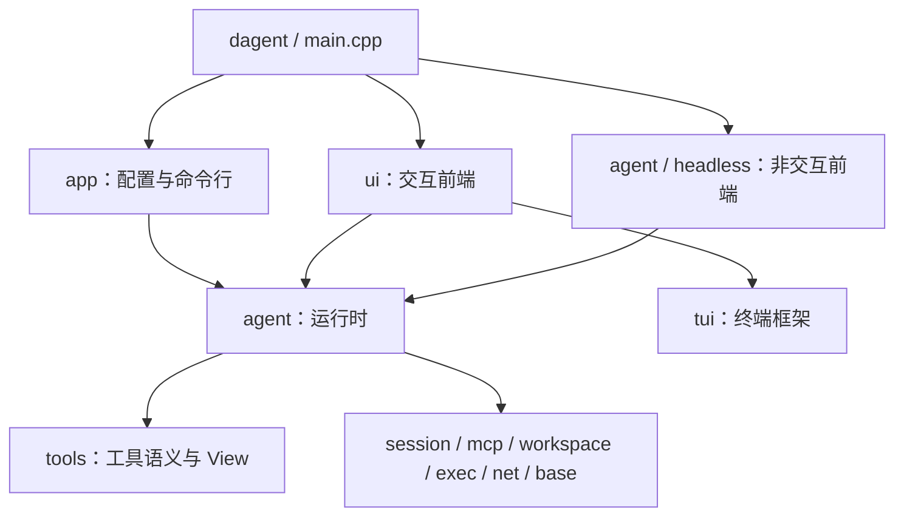
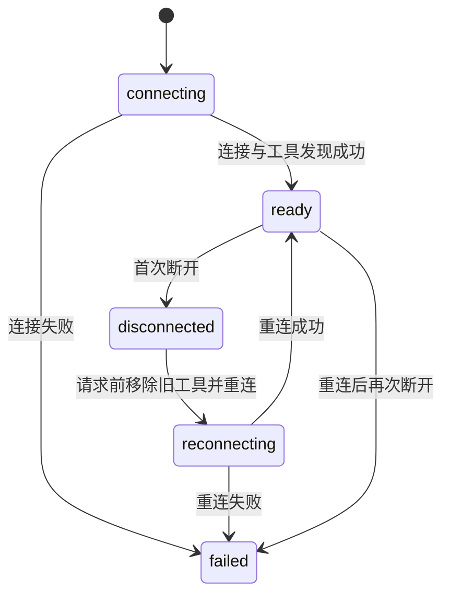

# agent：运行时与程序入口

DAgent 的核心负责把用户输入变成「请求模型 → 执行工具 → 回填结果」的循环，并维护权限、上下文、会话记录和
MCP 连接。头文件在 `src/public/agent/`，实现在 `src/private/agent/`，命名空间 `dagent::agent`，库为
`dagent_agent`。本文描述当前实现；模型协议见 [llm](llm.md)，交互前端见 [ui](ui.md)。

## 1. 分层与状态归属



`main.cpp` 只编进可执行目标，负责把 app 的配置映射为 `Setup` 并选择前端。`dagent_agent` 不依赖 app、ui 或 tui；
两个前端通过 `Sink` 接收事件，通过 `Approver` 回答权限询问。`sessions` 命令排版借用 tui 的字素宽度计算。

一个 `Agent` 对应一个会话，持有以下部件：

| 部件 | 头文件 / 实现 | 职责 |
| --- | --- | --- |
| `Setup`、`Options` | `agent/options.hpp` | 已解析的模型、工作区、外围模块配置和运行环境 |
| `Model` | `agent/model.hpp`、`model.cpp` | 一次完整的流式调用、累积与重试 |
| `Conversation` | `agent/conversation.hpp`、`conversation.cpp` | 有序消息、协议不变式与请求组装 |
| `Agent` | `agent/agent.hpp`、`agent.cpp` | 一轮循环、计数、中断与收尾 |
| 调度器 | `dispatch.cpp`，Agent 私有部分 | prepare、权限、并行组与有序提交 |
| `Policy` | `agent/permission.hpp`、`permission.cpp` | 权限规则和内存中的会话授权 |
| `Compactor` | `agent/compaction.hpp`、`compaction.cpp` | 预算、裁剪、摘要与失败退化 |
| 提示词 | `agent/prompt.hpp`、`prompt.cpp` | 内置模板与会话环境渲染 |
| `Recorder` | `agent/record.hpp`、`record.cpp` | 核心记录格式、回放与崩溃闭合 |
| `McpHub` | `agent/mcp_hub.hpp`、`mcp_hub.cpp` | 多服务连接、刷新、重连与状态快照 |
| 非交互前端 | `agent/headless.hpp`、`headless.cpp` | 输出格式、进度、进程中断与退出码 |

Agent 同时持有 `tools::Registry`、`tools::Context`、`TokenEstimator` 和渲染后的 system prompt。
Registry 的 MCP 工具引用 Client，因此 **Registry 必须先于 McpHub 析构**；Hub 停止并等待连接线程后再销毁 Client。

### 线程与取消

| 线程 | 工作与边界 |
| --- | --- |
| agent 线程 | 交互模式由 Shell 创建，run 模式就是主线程；执行模型请求、串行工具、记录写入和 Registry 更新 |
| 渲染线程 | 交互模式主线程；只操作控件、Document 和事件处理器 |
| 工具工作线程 | 每个只读并行组临时创建，同时最多 8 个；只执行 `Call::run` |
| MCP 连接线程 | 每个 server 一个；连接结果交给 Hub，不直接改 Registry 或调用前端 Sink |
| MCP 读取线程 | stdio 传输内部线程；工具变化回调只置标志 |
| 信号线程 | `sigwait` 接收 SIGINT / SIGTERM，触发进程中断 |

Agent 的常规接口在同一个 agent 线程上串行调用。两个跨线程例外是原子的 `set_permission_mode` 和加锁复制的
`mcp_states`；调用方仍须保证对象存活。`session::Writer` 的单写入者、HttpClient 不并发使用、Registry 不加锁等约束
由这个线程归属保证。

`Sink` 必须线程安全：`ToolOutput` 可从工具线程发出，其余运行事件由 agent 线程交付。交互前端用 `Runtime::post`，
非交互前端加锁输出。`Approver` 只在 agent 线程调用，同一时刻至多一个，不能反向重入 Agent。

一轮使用调用方提供的 `stop_token`，贯穿模型、重试等待、权限等待、工具、摘要和 MCP 连接等待。
MCP 后台连接使用自身线程的 token，一轮取消不关闭后台连接；Hub 析构才取消它们。

## 2. 对外接口与事件

| 接口 | 行为 |
| --- | --- |
| `Agent::create(Setup)` | 渲染提示词、创建记录、注册内置工具，启动 MCP 后台连接 |
| `Agent::resume(Setup, id, replay_sink)` | 重建消息、补齐崩溃记录，用事件重画历史，并更新提示词 |
| `run_turn(input, sink, approver, stop)` | 阻塞完成一轮，返回 `TurnStatus` |
| `compact(sink, stop)` | 手动摘要，返回 `TurnStatus`；不创建一轮，不追加用户消息或 `turn_end` |
| `set_permission_mode(mode)` | 下一次权限决策生效 |
| `mcp_states()` / `meta()` | 连接状态快照 / 会话元信息；只有前者支持跨线程读取 |

创建与恢复失败会抛异常，由入口报错。运行中的模型与 MCP 已知失败转换成结束状态；工具失败作为 `Result` 回填，
记录失败由 Recorder 停用写入。未预期异常仍可传播，调用方的最外层负责收尾，不能把接口理解成 `noexcept`。

| `TurnStatus` | 含义 |
| --- | --- |
| `done` | 模型给出没有工具调用的回复；空回复会警告并结束 |
| `interrupted` | 本轮被取消 |
| `denied` | 用户拒绝且没有附加说明，等待新指示 |
| `limit` | 达到模型或工具调用上限 |
| `failed` | 模型不可用、上下文仍超长等；原因在 `TurnEnded::error` |

### Event 与 JSONL

`agent/events.hpp` 定义值类型的 `Event`；`to_json(Event)` 使用以下 `type` 和字段。
这份实时事件流与第 10 节的持久化记录是两种格式。

| 事件 / JSON type | 主要字段与用途 |
| --- | --- |
| `TurnStarted` / `turn_started` | `input`，显示用户输入 |
| `StepStarted` / `step_started` | `step`，从 1 开始 |
| `TextDelta` / `text` | `text`，assistant 正文增量 |
| `ReasoningDelta` / `reasoning` | `text`，思考增量 |
| `StreamReset` / `stream_reset` | 无附加字段；本次模型尝试的可见内容作废 |
| `ToolPending` / `tool_pending` | `id, name`；参数仍在传输，仅作提示 |
| `ToolStarted` / `tool_started` | `id, name, summary, sandbox, network`；已通过权限，开始执行 |
| `ToolOutput` / `tool_output` | `id, chunk`；bash 原始输出块 |
| `ToolFinished` / `tool_finished` | `id, name, summary, text, is_error, interrupted, view`；结果已提交 |
| `Retrying` / `retrying` | `attempt, max_attempts, wait_ms, reason`；重试次数从 1 开始 |
| `Compacted` / `compacted` | `before, after, summarized`；压缩前后估算及是否摘要 |
| `ContextUpdate` / `context` | `prompt, completion, cached, used, limit` |
| `Notice` / `notice` | `level` 为 info / warn / error，另有 `text` |
| `TurnEnded` / `turn_ended` | `status, error, steps, tool_calls, usage`；本轮结束 |

正常一轮的主线如下，等待、重试和失败会使其中部分阶段省略：

```text
TurnStarted
  MCP 等待与合并
  [Compacted → ContextUpdate]          自动压缩
  StepStarted → ContextUpdate         主请求前估算
  TextDelta / ReasoningDelta / ToolPending …
  ContextUpdate                       模型返回后的 usage
  [ToolStarted → ToolOutput … → ToolFinished] …
  ……继续下一步……
TurnEnded
```

每轮只有一个 `TurnStarted` 和最后一个 `TurnEnded`。`Notice` 可穿插；记录写入失败时也可能在 `TurnStarted` 前提示。
`StreamReset` 只在 `Retrying` 之后、且失败尝试已有可见事件时发出。自动压缩发生在 `StepStarted` 之前，
不会随这一步的流式重试被前端清除。服务端报超长后的强制压缩与重发留在同一步内。

进入历史的一批工具调用按原序得到 `ToolFinished`，包括参数错误、拒绝和未执行的调用；没有执行的调用不发
`ToolStarted`。并行调用的 `ToolOutput` 可交错，同一调用内部保持顺序。`ToolPending` 可能随重试或中断作废，
不能据此认为调用已经执行。

回放只发 `TurnStarted`、正文与思考、`ToolFinished`、`TurnEnded`；恢复完成后另外发上下文估算及必要的提示。
手动压缩不发轮开始/结束事件，前端依据返回值结束忙碌状态。

## 3. 模型调用

`Model::complete` 把中立 `Request` 经 Codec 和流式 HTTP 转成 `Reply{message, finish, usage}`。
协议翻译由 [llm](llm.md) 负责；Model 负责累计正文、思考、工具参数和 usage，并判断请求是否完整结束。

每次尝试使用新的 Codec 和 SSE 解析器；HttpClient 在同一线程上复用。工具调用按 index 归集参数，按首次出现顺序
进入回复，补齐空 id、处理重复 id。参数 JSON 留给工具的 `prepare` 解析，报错可回填给模型修正。

| 失败 | 处理 |
| --- | --- |
| stop 已请求 | `ModelError::cancelled`，带当前尝试的部分回复 |
| 连接失败、传输中断、超时；HTTP 408 / 429 / 5xx；流错误或缺正常结束标记 | 整个请求重试 |
| HTTP 分类为上下文超长 | `context_too_long`，交给 Agent 压缩 |
| TLS 问题、不可重试 HTTP 错误、2xx 却没有 SSE 事件 | `rejected` |
| 重试次数耗尽或 Retry-After 太长 | `exhausted` |

默认最多重试 2 次，即最多 3 次尝试。退避从 1 秒开始指数增长，以 30 秒为基础上限，增加 0.8–1.2 倍随机抖动；
服务端的 Retry-After 更长时采用它，超过 300 秒则直接失败。等待可取消；已输出过内容的失败尝试通知前端清除，
不写入历史。重试期间取消不会保存已作废尝试的半截内容。

入口把模型 HTTP 的总超时设为 0；配置的 idle timeout 为 0 时补成 120 秒。连接超时和 TLS 选项沿用配置。
idle timeout 看收到的字节，包括 SSE 注释。大上下文预填充期间没有字节时仍可能超时，需按实际模型调整配置。

## 4. 消息历史与协议不变式

`Conversation` 是不做 I/O 的内存历史。每个 `Entry` 保存消息、递增 `ordinal`、工具摘要、是否已裁剪和 token 缓存。
`ordinal` 由历史分配、记录原样保存；压缩摘要使用 −1，后续新消息继续原有序号，不因裁剪重新编号。

请求前须满足以下约束：

| 编号 | 约束 |
| --- | --- |
| I1 闭合 | 带 tool_calls 的 assistant 后紧跟全部 tool 结果，数量和顺序与调用一致 |
| I2 非空 | assistant 必须有正文或工具调用，只有 reasoning 不够 |
| I3 归属 | 不允许游离的 tool 消息，`tool_call_id` 必须对应前面的调用 |
| I4 开头 | 非空历史以 user 开头，允许是压缩摘要 |
| I5 system 独立 | system prompt 不存进 entries，由 `build` 放在最前面 |
| I6 文本 | 发给模型的文本须是合法 UTF-8；用户输入和工具输出在各自入口处理 |

`validate()` 检查 I1–I4，Debug 构建在 `build` 前断言；I5–I6 由组装与文本边界维持。
加进带调用的 assistant 后，历史暂时打开；调度器必须为每个调用回填结果后才能再次请求模型。
`safe_cuts()` 提供 user / assistant 之前的边界，在闭合历史上不会拆开一个工具批。

`build` 复制 system、有效历史和当前工具定义，填上模型参数。历史通常只追加，system 在本次会话打开期间固定，
工具顺序稳定，便于模型服务复用前缀缓存。压缩和 MCP 工具变化会改变这个前缀。

### 给模型的状态说明

标准说明集中在 `agent/conversation.hpp` 的 `texts` 常量及 `agent/compaction.*` 的格式化函数。
调用方与回放共用它们；不在文档里复制一份可变的实现文本。

| 标记 | 语义 |
| --- | --- |
| T1 / T2 | 回复被中断 / 本轮中断使调用没有执行 |
| T3 / T4 / T5 | 用户拒绝并等待指示 / 拒绝附说明、允许继续 / 同批前一调用被拒而未执行 |
| T6 / T7 / T8 | 策略拒绝及原因 / 未知工具及可用列表 / 工具调用达到上限、要求总结进展 |
| T9 | 崩溃时调用结果未知，修改性操作须先检查当前状态 |
| T10 / T11 | 包装后的历史摘要 / 旧工具输出已省略、需要时重新调用 |
| T12 / T13 | MCP 下一步将自动重连一次 / 本会话不再重连，不要再调用它的工具 |

## 5. 一轮循环、上限与收尾

一轮（turn）对应一次用户输入；一步（step）是一次主模型请求，不包含摘要；一批（batch）是一条 assistant
消息中的全部工具调用。网络重试、上下文超长后的唯一一次重发仍属于同一步。

1. 用户输入修复为合法 UTF-8，追加进历史并记录，发 `TurnStarted`。
2. 检查模型调用上限；在下一步主请求前处理 MCP 连接、刷新与重连，再按整请求预算自动压缩。
3. 发 `StepStarted`、请求前的 `ContextUpdate`，调用 Model，向 Sink 转发可见流事件。
4. 返回后更新 usage 和估算校正，保存有效 assistant 回复；没有工具调用则结束。
5. 有工具调用则交给调度器，有序回填结果；未中断、未被用户拒绝且未到上限时继续。
6. 所有正常及已知错误退出路径汇入 `finish`：补齐仍打开的调用、记录并同步 `turn_end`、交付待报告 MCP 警告，
   最后发 `TurnEnded`。记录停用时只能保证内存与事件收尾，不能保证落盘成功。

执行工具看 `tool_calls` 是否为空，不依赖服务端的 finish reason。正文因 `length` 或 `content_filter` 截断时提示后
结束，不自动续写；空正文且没有调用（包括仅有思考）不加入历史，警告后结束。

默认 `run.max_model_calls=24`、`run.max_tool_calls=35`、`run.max_model_retries=2`。未知工具、参数失败和策略拒绝
也消耗已处理调用预算；因中断、同批拒绝或超额而跳过的调用不消耗执行预算。超额调用回填 T8，若还有模型步数，
给予一次总结机会；普通总结或继续要工具都以 `limit` 收尾，后者不再执行工具。摘要不计入主循环的 steps 或总 usage。

取消发生在主模型流中时，只保存已有正文加中断说明，丢弃未完成的工具调用和思考；没有正文就不加 assistant。
权限等待中的调用及剩余调用回填未执行说明，已运行的工具保留中断结果与部分输出。所有工具线程结束后才返回，
下一轮使用的历史保持闭合。

## 6. 工具调度

工具语义见 [tools](tools.md)。调度器只决定顺序、权限和并行：

```text
tool_calls → 查 Registry → prepare → Intent → Policy
                                               ├─ 允许 → 串行执行或加入只读并行组
                                               ├─ 询问 → Approver → 执行或拒绝
                                               └─ 拒绝 → 生成结果
结果按原调用顺序 → Conversation → Recorder → ToolFinished
```

可并行的是 Policy 直接放行的 read 意图，以及获准使用 `read_only` 沙箱的 bash；写入、编辑、MCP 和经过询问的调用
串行执行。连续的可并行调用构成一组，分块创建线程，每块最多 8 个。

遇到不能加入挂起组的调用，先运行并等待整个组，再重新 prepare 当前调用。这样「read a → edit a」能使用刚读到的
FileTracker，「edit a → edit a」的后一个 diff 基于前一个修改。权限对话框也只在前面的挂起组结束后出现。

执行顺序可并行，结果提交顺序固定。调度器只提交已有结果的连续前缀，能提交就尽早落盘，避免后续崩溃丢掉已完成
调用的结果。未知工具不需要 prepare，不触发挂起组执行；其结果仍按原序提交。

用户直接拒绝使本批余下调用跳过、本轮 `denied`；拒绝附说明只拒绝当前调用，本轮继续。策略拒绝同样只是工具错误
结果，不直接结束一轮。MCP 断开在提交结果时标记，并附给模型的重连说明；Registry 留到下一安全点更新。

## 7. 权限与沙箱

Policy 是纯逻辑，不弹窗、不读配置。它依据 `Intent` 的规范化路径、命令分析和外部工具名给出 allow / ask / deny；
允许时的 `Grant` 决定 bash 沙箱和网络权限。工作区根决定写入范围，项目根决定项目配置归属。

### 模式和默认规则

| 模式 | 未命中已有授权时的行为 |
| --- | --- |
| `ask` | 交互默认，需要权限就询问 |
| `accept_edits` | 自动允许普通文件写入；受保护或被分类为工作区外的写入仍询问 |
| `automatic`（配置值 `auto`） | run 默认，将询问转为允许；受保护或被分类为工作区外的写入拒绝 |
| `deny` | 将需要询问的操作转为策略拒绝 |

路径分类包括：项目 `.dagent/` 下的文件、文件名为 `.mcp.json` 或含 `.git` 路径段的受保护路径；`.env`、`.env.*`、
`*.pem`、`*.key`、`id_rsa*`、`id_ed25519*` 及含 `.ssh` / `.gnupg` 段的敏感路径；其余按工作区内外区分。
分类是依次匹配，受保护和敏感分类优先于工作区外，不能把这些检查理解成彼此独立的文件系统隔离层。

| 操作 | 默认决定 |
| --- | --- |
| 普通读取 | 允许；敏感读取或被分类为工作区外的读取询问 |
| edit / write | 询问，按上面的模式转换；受保护及工作区外分类不提供会话授权 |
| 已知只读 bash，沙箱可用 | 自动允许，但仍放进 `read_only` 沙箱 |
| 其他 bash，沙箱可用 | 询问，允许后用 `workspace_write`，可写工作区与 `/tmp`，默认不联网 |
| bash，沙箱不可用 | 包括只读命令都询问；auto 模式记录警告并以 `full_access` 执行 |
| MCP 工具 | external 意图，默认询问，同样受模式转换及会话授权影响 |

沙箱可用要求 `exec::probe()` 同时发现 Landlock 和 seccomp。auto 不授予 bash 网络权限；沙箱不可用而降级到
`full_access` 时不能再依赖网络或文件系统隔离。具体限制见 [exec](exec.md)。

### Approver 与会话授权

`Approval` 携带 call id、工具名、Intent、询问原因、可记住的规则文本和是否可提供联网选项。
`Decision` 支持单次允许、会话允许、拒绝、拒绝附说明；执行前记录用户回答。Approver 应在 stop 后立即结束等待，
核心按取消处理而非普通拒绝。run 模式传空 Approver，Policy 的 auto / deny 足以决策。

| 授权 | 记住什么 |
| --- | --- |
| 普通文件写入 | 本会话工作区普通文件免询问 |
| 工作区外读取 | 路径所在目录；敏感读取不提供此选项 |
| bash | 每条非只读简单命令的「命令名 + 第一个非选项参数」，以及授权的联网位 |
| MCP | 完整的限定工具名 |

bash 有命令替换等不可静态判断结构时不提供前缀授权。匹配时每条命令必须只读、为 `cd`，或命中已记住的前缀；
例如授权 `npm test` 不会自动允许后接的 `rm`。这些规则只在内存中，恢复或新建会话后清空。

权限不是完整的敏感文件隔离：只读 bash 能读 `.env`，可写 bash 能改工作区内的 `.dagent`、`.mcp.json` 和 `.git`。
Landlock 的可写白名单不能在已放行的工作区内再排除它们；MCP 执行也不使用 bash 的沙箱。

## 8. 上下文预算与压缩

`Budget` 从配置和回复预留量得到主请求可用空间：

```text
limit   = max(0, window_tokens − safety_margin_tokens − max_tokens)
trigger = limit × compaction_trigger_percent / 100
target  = limit × compaction_target_percent / 100
```

ContextOptions 默认窗口 262144、安全余量 8192、触发 80%、目标 60%。若 max_tokens 为 4096，则 limit 为 249856。
预留量用尽窗口时预算为零，非空历史不能继续请求。估算包含 system、工具定义和历史；不能只统计消息正文。

`TokenEstimator` 用真实 prompt usage 校正上一次请求估算。摘要单独 estimate / observe；主请求在压缩后重新 build
并 estimate，避免校正错位。状态栏有 usage 时显示 prompt + completion，否则显示整请求估算，分母是 limit。

### 保护区与切点

从尾部累计到超过目标的四分之一，并向前对齐到完整消息批；**最近一批 assistant 工具调用及其全部结果始终保留**，
即使后面已有正文。所有裁剪、摘要和丢弃都不得进入保护区。

自动压缩使用配置 target；强制与手动压缩收紧为 `min(target, 历史缓存 tokens / 2)`，避免依赖服务端已否定的过大窗口，
也让手动压缩能作用于低于自动触发线的历史。

摘要切点选保护区以前、尾部不超过目标一半的最早安全切点，否则选最大可用切点。前缀必须包含 assistant：
只有初始 user 或旧摘要时没有进展可总结，不请求模型、不追加重复 compaction。

### 两级处理

第一级按从旧到新顺序，把保护区外、尚未裁剪且缓存大于 256 tokens 的工具结果换成固定占位：

```text
[旧的工具输出已省略：{工具摘要}。需要时请重新调用。]
```

自动模式到 target 即停止；强制模式遍历所有符合条件的旧输出。只替换内容，不删除 tool 消息。
若待裁剪结果之后还没有 assistant 正文，即使已降到 target，也须由第二级摘要先接收原文，切点覆盖这些结果。

第二级为旧前缀请求摘要，不带工具，以 compact prompt 为 system，末尾附总结指令。摘要能看到未裁剪的工具原文，
包括本次尚未提交的第一级裁剪；更早已提交的占位无法恢复原文。摘要请求超预算时依次：

1. 从最旧的工具输出开始换成占位。
2. 仍过大时丢弃最旧的完整 assistant 批及其 tool 消息。
3. 用户请求和旧摘要最后才丢，保留最终总结指令并说明更早内容已丢弃。

缩减后仍超预算或已无 assistant 时不请求模型，进入失败退化。成功则用一条 user 摘要替换旧前缀，
包装包含 `<summary>` 和「需要文件内容时重新读取，不凭摘要猜测」的说明。

### 提交、失败与触发

裁剪和摘要先在历史副本上完成，最终才提交历史、写记录、发 `Compacted` 与 `ContextUpdate`。
**摘要取消不提交历史或压缩记录**，也不会把半截摘要当主对话回复保存。

摘要为空、被拒或重试耗尽时，退化为整批丢弃旧历史并警告。已有摘要留在最前；没有摘要只能丢到下一条 user 之前，
保护 I4。没有安全切点就保留；没有压缩进展且仍超过 limit 时失败，提示 `/new`。

| 触发点 | 行为 |
| --- | --- |
| 每一步主请求前超过 trigger | 第一级；不足或需要接收未记录事实时再做第二级 |
| 服务端 `context_too_long` | 同一步强制压缩后重发一次；再次超长则 failed |
| `/compact` | 直接第二级；无可压缩旧历史时提示并跳过 |

压缩不清 FileTracker；恢复会话才清。单批输出或固定提示词本身过大时无法保证压到 target，保护区不会为满足预算
被破坏。摘要质量依赖模型，已省略且未留下结论的信息仍须重新读取。

## 9. 提示词与环境快照

[system.md](../../prompts/system.md) 和 [compact.md](../../prompts/compact.md) 由 CMake 嵌入二进制，改动后下一次构建
自动重新配置。`gateway.system_prompt_file` 可覆盖主模板；入口读好内容放进 Setup，路径规则见 [app](app.md)。
摘要模板使用内置版本。模板都经 workspace 的 inja 渲染，模板错误或覆盖文件读取失败会使启动失败。

system 在创建或恢复时渲染一次，之后不随日期、git 状态或权限切换改写，保持前缀稳定。变量包括：

| 变量 | 来源 |
| --- | --- |
| `cwd, os, shell, date` | workspace 环境采集 |
| `git` | 仓库根、分支、状态、近期提交；不可用时 null |
| `instructions` | 全局到当前目录的 AGENTS.md，包含来源、内容和截断标记 |
| `model, project_root, sandbox, permission_mode` | Setup 与启动环境 |

system 描述先读后改、独立读取可并行、bash 不保留 cwd、权限拒绝后停下等跨工具规则。
上下文部分要求模型先在正文记录后续所需事实，再继续调用工具；看到省略占位而无明确事实记录时重新调用。

compact 模板要求六项：用户原始请求及补充、已做决定、改过文件、当前进度、剩余工作、未解决报错。
用户原话和路径逐字保留，优先于 1500 字的建议长度；从可见工具原文提取任务所需事实，省略占位不代表调用失败。
渲染后的 system 写进会话记录供排查，恢复时仍按当前环境重新渲染。

## 10. 会话记录与恢复

[session](session.md) 负责信封、JSONL、脱敏、blob 和尾部恢复；`Recorder` 定义 payload，且只追加写入。
消息序号 `n` 与 session 的事件序号 `seq` 不同：只有 user / assistant / tool 消耗 n，权限与压缩事件不消耗。

| type | payload 的主要字段 |
| --- | --- |
| `system` | `schema: 1, text` |
| `user` | `n, text` |
| `assistant` | `n, content, reasoning, tool_calls, finish`，有 usage 时另存 `usage` |
| `tool` | `n, call_id, name, summary, text, is_error, interrupted, view` |
| `permission` | `call_id, answer, rule, network`；只记录用户回答，不存为持久授权 |
| `prune` | `ordinals`；恢复时用工具摘要生成同样的占位 |
| `compaction` | `keep_from, summary`；空 summary 表示丢弃前缀、保留既有摘要 |
| `turn_end` | `status, error, steps, tool_calls, usage`；另允许记录状态 `crashed` |

usage 内字段是 `prompt, completion, cached`，避免被 session 按 `token` 等敏感键名脱敏。
工具调用记录包含 `id, name, arguments`；View 使用 tools 的序列化。权限决定在对应 tool 记录之前写入。
每轮结束、手动压缩结束及 Agent 析构时同步，不对每条消息 fsync。

写入或同步失败时 Recorder 记录错误并永久停用后续写入；Agent 通过 `broken()` 报告一次记录不可用，当前工作仍继续。

### 回放与崩溃闭合

`replay_into` 校验 schema、字段和消息序号，重建 Conversation，同时发历史显示事件。
`prune` 和 `compaction` 只改变有效上下文；已发生的工具显示仍从原始记录回放。因此界面可以保留旧工具详情，
模型只看到压缩后的历史。切点必须安全，裁剪对象必须是 tool；`next_ordinal` 从全记录序列继续。

最后一轮没有 `turn_end` 时，先在内存副本中投影缺失结果并验证历史，确认合法后才打开 Writer 续写：
为没结果的调用补 T9，再追加 `turn_end{crashed}` 并同步；第二次恢复不会重复补齐。T9 表示结果未知，
不能声称没有执行，因为修改可能已完成但结果尚未落盘。

恢复后使用当前配置重新渲染 system、写新的 system 记录；模型与原 meta 不同会提示。
FileTracker 和会话授权均从空开始，MCP 重新连接；旧读取状态不能用于覆盖已被外部改动的文件。
不认识的 schema、不一致历史或关闭 `record_payloads` 的记录直接报错，不猜测修复。

`resolve_session_id` 只搜索当前项目，接受完整 id 或唯一前缀，歧义时列候选；完整 id 也不能跨项目恢复。
`--continue` 选当前项目最近更新的会话。标题来自首条用户输入第一行，截到 60 个字符，列表再按显示宽度排版。

## 11. MCP 生命周期

协议和单个 Client 见 [mcp](mcp.md)，工具包装见 [tools](tools.md)。McpHub 在构造时为每个 server 启动后台连接，
立即返回；**启动不等 MCP，每一步模型请求前等待连接结果**，防止模型因首轮没有工具而直接放弃任务。



每个 server 在当前 Hub 生命周期里只自动重连一次；初始连接失败不重试。新建或恢复会话会创建新 Hub。
断开调用的结果追加 T12 / T13，告诉模型下一步会重连还是已不可用；同批重复断开只标记一次。

`apply_pending` 是 agent 线程上、两次主模型请求之间的安全点：

1. 移除 failed / disconnected 服务的旧工具，再销毁 Client；为首次断开启动重连。
2. 有 connecting / reconnecting 时发等待 Notice，可取消地等待，至多 `mcp.connect_timeout_ms`。
   等待到期仍未完成的连接暂不带工具继续，后来连接成功可在下一步合并；连接本身另有超时。
3. 合并已完成连接；`on_tools_changed` 只置原子标志，在这里 refresh 后替换该服务的工具。
4. 刷新失败沿同一状态机重连或停用，在本次安全点内继续处理；刷新取消保留标志，不消耗重连机会。

连接线程只交接 Client、状态和警告，不保留一轮的 Sink。警告在安全点或轮末交付一次；失败服务不阻止其他服务使用。
状态快照中的 ready 表示连接及工具发现完成，Registry 仍只在安全点更新，工具执行中途不变更。

锁内只交接状态、连接和警告；连接、刷新、Client 析构、join、Sink 均在锁外。
关闭时先停止全部连接线程再逐一 join，Registry 已先销毁，避免工具引用失效 Client。
界面显示及轮询见 [ui](ui.md#7-活动与状态)，run 模式在 stderr 报告失败，jsonl 同时保留结构化 Notice。

## 12. 配置装配与非交互入口

`Setup` 是 Agent 的全部输入，包含 `Options`、模型参数与 Codec、HTTP、工作区与项目根、外围 Options、MCP server
列表、沙箱探测结果、权限模式及可选 system 模板文本。Agent 不读配置文件；配置优先级与密钥归 app 管理。

`main` 在任何线程创建前安装信号处理，然后解析参数、读取配置与密钥、初始化日志，分派四种模式：

| 模式 | 入口行为 |
| --- | --- |
| 交互 | 进入全屏前询问信任未受信任的项目配置，确认后重新加载；调用 `ui::run_interactive` |
| `run` | 新建或恢复会话，使用 auto / deny 完成一轮后退出 |
| `sessions` | 列当前项目最近 20 个会话，本地时间、50 列标题、完整 id |
| `trust` | 信任指定目录所属项目，供之后配置加载使用 |

进程不 chdir；所有模块显式接收 `Args::cwd`。交互权限固定从 ask 开始；run 优先用 `--permissions`，再用配置，
默认 auto。交互强制关闭日志的 `also_stderr`，避免污染全屏；run 沿用配置。

### 输出格式

| `--output` | stdout | stderr |
| --- | --- | --- |
| `text` | 结束时打印最后一步正文，不流式写入 | 工具进度、Notice、重试及等待模型的心跳 |
| `json` | 结束时一个结果对象 | 同 text |
| `jsonl` | 第一行 session 元信息，随后实时 Event，一行一个 JSON | 启动错误及 warn / error Notice；info 留在 jsonl |

json 结果字段为 `session_id, status, error, result, steps, tool_calls, usage, duration_ms`。
jsonl 的首行为 `{"type":"session","id":"…","resumed":false}`。恢复时非交互前端不输出历史回放。
text / json 的结果缓冲在新步和流重试时重置，使重试的半截输出不会混入最终结果。

`ToolOutput` 的任意字节分片可能截断 UTF-8 字符，jsonl 按调用 id 暂存尾部字节，与下一片拼接；调用结束仍不完整才
替换为 U+FFFD。stdout 被关闭时 jsonl 取消本轮并返回 1，text / json 最终写出失败不改变运行状态。

### 信号与退出码

main 忽略 SIGPIPE，并在其他线程启动前屏蔽 SIGINT / SIGTERM，由 sigwait 线程处理。
可优雅结束期间第一个信号请求 stop，第二个信号直接 `_Exit(130)`；加载配置、读取 stdin 等轮外阶段直接退出。
exec 在子进程中清空信号屏蔽，工具的 SIGTERM 清理因此仍然有效。

交互的 raw 模式 Ctrl+C 是按键，行为由 ui 决定；全屏期间的进程信号走退出流程，先还原终端，再等待任务结束。
工具取消的实际时延取决于底层取消和进程清理，不能把「即时触发 stop」理解成所有任务固定在某时限内结束。

| 情况 | 退出码 |
| --- | --- |
| run 的 done；正常关闭交互；列表与信任成功 | 0 |
| run 的 failed / limit / denied，启动失败，jsonl 写出失败，交互工作线程异常 | 1 |
| 参数或配置错误 | 2 |
| run 被信号中断，或交互因进程中断信号退出 | 130 |

## 13. 当前范围

当前提供单会话、单模型的文本编码 Agent，支持六个内置工具、MCP tools、非交互与终端前端、记录恢复和上下文压缩。
尚未实现子 Agent、多模型路由、图片输入、web_fetch、todo 工具、hooks、插件、自定义斜杠命令或会话搜索索引。
编解码器目前只有 OpenAI Chat Completions，MCP 的协议限制见其模块文档。

构建与真实功能验证约定见 [文档索引](../README.md)。开发模型为本地 Qwen3.8-Flash-Next；文档和实现不依赖
`temp/` 中的临时检测程序，也不依赖旧里程碑计划。
