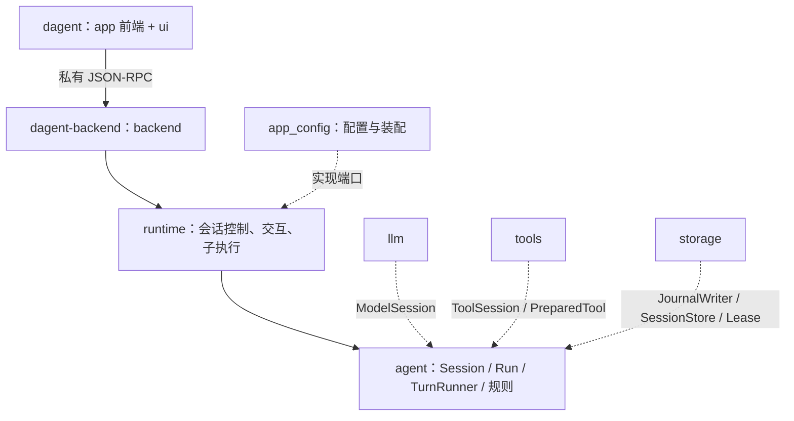
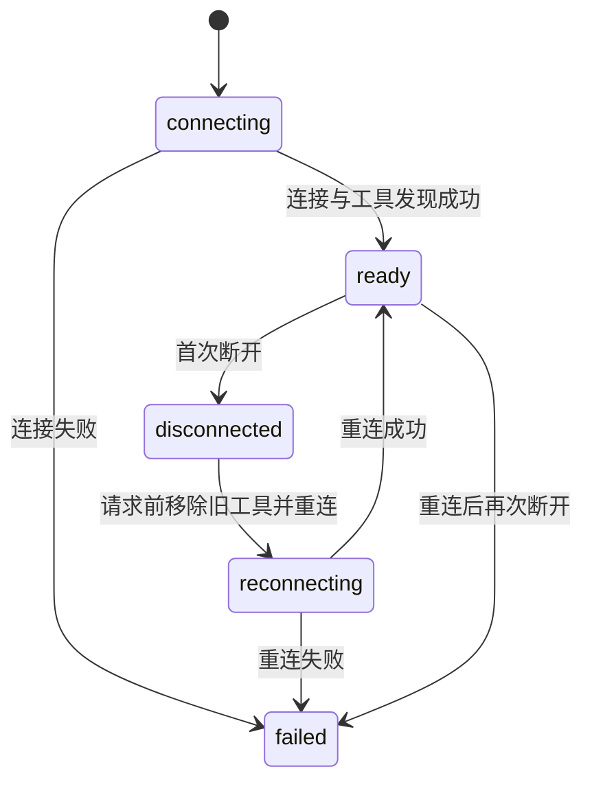

# agent：核心业务对象与执行循环

DAgent 的核心负责把用户输入变成「请求模型 → 执行动作 → 回填结果」的循环，并维护权限、上下文、会话记录语义与
控制动作规则。头文件在 `src/public/agent/`，实现在 `src/private/agent/`，命名空间 `dagent::agent`，库为
`dagent_agent`，**只依赖 base**。模型请求、工具、存储和 MCP 通过核心定义的端口由外层实现；会话控制与交互等待见
[runtime](runtime.md)，前后端进程与协议见 [protocol](protocol.md)，模型协议见 [llm](llm.md)。

## 1. 分层与对象



核心不包含 HTTP、SQLite、shell 分析树、MCP Client、终端控件或配置文件读取。外层实现的端口（`agent/port_*.hpp`）：

| 端口 | 能力 | 实现 |
| --- | --- | --- |
| `ModelSession` | 中立请求 + 流接收器 + 取消 → `Reply` 或分类的 `ModelError` | `llm::Model` |
| `ToolSession` / `PreparedTool` | 普通工具描述、按名准备、带授权执行 | `tools::ToolSession` |
| `JournalWriter` / `SessionStore` / `SessionLease` | 追加已编码记录与同步；读取记录与高水位；写所有权 | storage |
| `DelegationChannel` | 一次 task 委派 → 原 task 结果 | `runtime::SubagentExecutor` |
| `SessionResources` | 主会话步骤边界的 MCP 等待/合并/重连、断连说明、轮末通知 | app 装配（包装 `tools::McpHub`） |

主要对象：

| 对象 | 头文件 | 职责 |
| --- | --- | --- |
| `Session` | `session.hpp` | 一份对话的长期状态：Conversation、WorkPlan、Policy、模型与工具环境、Compactor、控制动作执行器、提交器；只暴露构造请求、快照与策略控制 |
| `SessionConfig` | `session.hpp` | 已解析的会话配置：Options、公开模型、提示词文本、cwd/项目根/控制根、沙箱中立值、权限档、只读/planning、是否主会话 |
| `Run` | `run.hpp` | 一次 turn 或 compact：本轮技能、steps/tool_calls/usage、一次性 `finish` 返回 `RunOutcome`；不落库 |
| `TurnRunner` | `turn_runner.hpp` | 阻塞循环算法与唯一收尾；无跨会话状态，只经 Session/Run/RunServices 工作 |
| `ActionCatalog` | `catalog.hpp` | 稳定的动作顺序与准备入口：普通工具、控制动作、动态 MCP |
| `ActionDispatcher` | `dispatch.hpp` | 一批调用的准备、权限、分组执行与有序提交 |
| `ControlActionExecutor` | `control.hpp` | ask / exit_plan / todo / task 的类型化规则 |
| `Policy` | `permission.hpp` | 权限规则、会话授权与模式快照（短锁，跨线程可切换；撤销及其审计记录由执行线程串行提交） |
| `Compactor` | `compaction.hpp` | 预算、裁剪、摘要与失败退化，只产出候选变化 |
| `SessionCommitter` | `committer.hpp` | 内存状态、记录与通知的唯一提交入口；唯一持有 broken |
| `RecordCodec` | `record_codec.hpp` | 10 种记录的编码与类型化解码 |
| `SessionRecovery` / `HistoryProjector` | `recovery.hpp` / `history.hpp` | 从记录重建可执行状态 / 生成只读历史条目 |

`RunServices`（`run_services.hpp`）是一轮所需的全部外部能力：Sink、Approver、Asker、DelegationChannel、SessionResources、
stop_token；不含配置、终端、数据库路径或查找任意对象的方法。

### 线程与取消

| 线程 | 工作与边界 |
| --- | --- |
| 会话执行线程 | runtime 控制器的串行线程；执行模型请求、串行工具、记录写入和工具目录更新 |
| 工具工作线程 | 每个只读并行组临时创建，同时最多 `run.max_parallel_tools` 个；只执行 `PreparedTool::execute` |
| task 组线程 | 每个并发子 Agent 一个，同时最多 `run.max_parallel_tasks`（配置文件为 4，必须为正整数）；在组内创建并运行子会话 |
| MCP 连接/读取线程 | 由 tools 的 McpHub 与 mcp Client 持有；只交接状态与标志，不直接改工具目录或调用 Sink |

Session 只在所属执行线程推进对话、工具目录、模型和记录。跨线程只开放 Policy 的模式切换/撤销、runtime 当前操作的取消和发布出去的快照。
`Sink` 必须线程安全：`ToolOutput` 可从工具线程发出，子 Agent 事件可从 task 线程发出。`Approver` / `Asker` 可能阻塞等待，
由 runtime 的交互代理实现；持有 Policy 锁时不调用它们。

一轮直接使用 RunServices.stop（runtime 当前操作的 token），贯穿模型、重试等待、权限等待、工具、摘要和 MCP 连接等待；
子 Run 共享父的取消。MCP 后台连接使用自身线程的 token，一轮取消不关闭后台连接。

## 2. 执行入口与事件

| 入口 | 行为 |
| --- | --- |
| `TurnRunner::run(Session&, Run&, RunServices, input)` | 阻塞完成一轮，返回 `RunOutcome{kind, TurnStatus, error, steps, tool_calls, usage}` |
| `TurnRunner::compact(...)` | 手动摘要；不追加 user 或 turn_end，使用同一收尾约束 |
| `Session::begin_run` / `end_run` | 绑定本轮 Sink 与控制动作能力、重置本轮提问计数 / 解除绑定 |
| `Session::snapshot` | 执行线程上的即时快照（模型、模式、计划、授权、用量），由 runtime 发布给其他线程 |

运行中的模型与 MCP 已知失败转换成结束状态；工具失败作为 `ToolResult` 回填；记录失败由提交器进入 broken。
未预期异常仍可传播，调用方最外层负责收尾。

| `TurnStatus` | 含义 |
| --- | --- |
| `done` | 模型给出没有工具调用的回复；空回复会警告并结束 |
| `interrupted` | 本轮被取消 |
| `denied` | 用户拒绝且没有附加说明，等待新指示 |
| `limit` | 达到模型或工具调用上限 |
| `failed` | 模型不可用、上下文仍超长等；原因在 `TurnEnded::error` |

### Event

`agent/events.hpp` 定义值类型的 `Event`；`to_json(Event)` 给出原实时 JSON 形状，backend 用它作为协议事件的 data，
`run --output jsonl` 由前端还原同一形状。这份实时事件流与第 10 节的持久记录是两种格式。

| 事件 / JSON type | 主要字段与用途 |
| --- | --- |
| `TurnStarted` / `turn_started` | `input`，显示用户输入 |
| `StepStarted` / `step_started` | `step`，从 1 开始 |
| `TextDelta` / `text` | `text`，assistant 正文增量 |
| `ReasoningDelta` / `reasoning` | `text`，思考增量 |
| `StreamReset` / `stream_reset` | 无附加字段；本次模型尝试的可见内容作废 |
| `ToolPending` / `tool_pending` | `id, name`；参数仍在传输，仅作提示 |
| `ToolStarted` / `tool_started` | `id, name, summary` 加实际 backend/profile、grant source、analysis version、读写/保护范围、network/local sockets/private tmp；已通过权限，开始执行 |
| `ToolOutput` / `tool_output` | `id, chunk`；bash 原始输出块 |
| `ToolFinished` / `tool_finished` | `id, name, summary, text, is_error, interrupted, view`；结果已提交 |
| `SubEvent` / `sub_event` | `session, agent, parent_call` 加递归 `event`；子 Agent 事件信封，父前端按 `parent_call` 归位 |
| `Retrying` / `retrying` | `attempt, max_attempts, wait_ms, reason`；重试次数从 1 开始 |
| `Compacted` / `compacted` | `before, after, summarized`；压缩前后估算及是否摘要 |
| `ModelChanged` / `model_changed` | `model`；恢复/切换时更新后续消息标签 |
| `ModeChanged` / `mode_changed` | `mode, planning`；`exit_plan` 后同步前端状态 |
| `ContextUpdate` / `context` | `prompt, completion, cached, used, limit` |
| `Notice` / `notice` | `level` 为 info / warn / error，另有 `text` |
| `TurnEnded` / `turn_ended` | `status, error, steps, tool_calls, usage`；本轮结束 |

正常一轮的主线如下，等待、重试和失败会使其中部分阶段省略：

```text
TurnStarted
  MCP 等待与合并
  [Compacted → ContextUpdate]          自动压缩
  StepStarted → ContextUpdate         主请求前估算
  TextDelta / ReasoningDelta / ToolPending …
  ContextUpdate                       模型返回后的 usage
  [ToolStarted → ToolOutput … → ToolFinished] …
  ……继续下一步……
TurnEnded
```

每轮只有一个 `TurnStarted` 和最后一个 `TurnEnded`。`Notice` 可穿插；记录写入失败时也可能在 `TurnStarted` 前提示。
`StreamReset` 只在 `Retrying` 之后、且失败尝试已有可见事件时发出。自动压缩发生在 `StepStarted` 之前，
不会随这一步的流式重试被前端清除。服务端报超长后的强制压缩与重发留在同一步内。

进入历史的一批工具调用按原序得到 `ToolFinished`，包括参数错误、拒绝和未执行的调用；没有执行的调用不发
`ToolStarted`。并行调用的 `ToolOutput` 可交错，同一调用内部保持顺序。`ToolPending` 可能随重试或中断作废，
不能据此认为调用已经执行。

每轮只有一个 `TurnStarted` 和最后一个 `TurnEnded`。`Notice` 可穿插；记录写入失败时也可能在 `TurnStarted` 前提示。
`StreamReset` 只在 `Retrying` 之后、且失败尝试已有可见事件时发出。自动压缩发生在 `StepStarted` 之前，
不会随这一步的流式重试被前端清除。服务端报超长后的强制压缩与重发留在同一步内。

进入历史的一批工具调用按原序得到 `ToolFinished`，包括参数错误、拒绝和未执行的调用；没有执行的调用不发
`ToolStarted`。并行调用的 `ToolOutput` 可交错，同一调用内部保持顺序。`ToolPending` 可能随重试或中断作废，
不能据此认为调用已经执行。手动压缩不发轮开始/结束事件，由 runtime 的 `operation_finished` 结束忙碌状态。
历史显示不重放实时事件，而是由 `HistoryProjector` 生成 `HistoryItem`（第 10 节）。

## 3. 模型端口

`ModelSession::complete` 接收中立 `Request`、流事件接收器与 stop，返回 `Reply{message, finish, usage}` 或抛
`ModelError{cancelled, context_too_long, rejected, exhausted}`。流式累积、重试退避与 Retry-After 由 llm 实现，见
[llm §6](llm.md#6-model一次完整调用与重试)。核心只决定：`context_too_long` 触发同一步的强制压缩与一次重发，
`cancelled` 按取消收尾并按 L15 保存部分正文，其余错误以 failed 结束本轮。

## 4. 消息历史与协议不变式

`Conversation` 是不做 I/O 的内存历史。每个 `Entry` 保存消息、递增 `ordinal`、工具摘要、是否已裁剪和 token 缓存。
`ordinal` 由历史分配、记录原样保存；压缩摘要使用 −1，后续新消息继续原有序号，不因裁剪重新编号。

请求前须满足以下约束：

| 编号 | 约束 |
| --- | --- |
| I1 闭合 | 带 tool_calls 的 assistant 后紧跟全部 tool 结果，数量和顺序与调用一致 |
| I2 非空 | assistant 必须有正文或工具调用，只有 reasoning 不够 |
| I3 归属 | 不允许游离的 tool 消息，`tool_call_id` 必须对应前面的调用 |
| I4 开头 | 非空历史以 user 开头，允许是压缩摘要 |
| I5 system 独立 | system prompt 不存进 entries，由 `build` 放在最前面 |
| I6 文本 | 发给模型的文本须是合法 UTF-8；用户输入和工具输出在各自入口处理 |

`validate()` 检查 I1–I4，Debug 构建在 `build` 前断言；I5–I6 由组装与文本边界维持。
加进带调用的 assistant 后，历史暂时打开；ActionDispatcher 必须为每个调用回填结果后才能再次请求模型。
`safe_cuts()` 提供 user / assistant 之前的边界，在闭合历史上不会拆开一个工具批。

`build` 复制 system、有效历史和当前工具定义，填上模型参数。历史通常只追加，system 在本次会话打开期间固定，
工具顺序稳定，便于模型服务复用前缀缓存。压缩和 MCP 工具变化会改变这个前缀。

### 给模型的状态说明

标准说明集中在 `agent/conversation.hpp` 的 `texts` 常量及 `agent/compaction.*` 的格式化函数。
实时提交与恢复共用它们；不在文档里复制一份可变的实现文本。

| 标记 | 语义 |
| --- | --- |
| T1 / T2 | 回复被中断 / 本轮中断使调用没有执行 |
| T3 / T4 / T5 | 用户拒绝并等待指示 / 拒绝附说明、允许继续 / 同批前一调用被拒而未执行 |
| T6 / T7 / T8 | 策略拒绝或当前入口缺少审批器及原因 / 未知工具及可用列表 / 工具调用达到上限、要求总结进展 |
| T9 | 崩溃时调用结果未知，修改性操作须先检查当前状态 |
| T10 / T11 | 包装后的历史摘要 / 旧工具输出已省略、需要时重新调用 |
| T12 / T13 | MCP 下一步将自动重连一次 / 本会话不再重连，不要再调用它的工具 |

## 5. 一轮循环、上限与收尾

一轮（turn）对应一次用户输入；一步（step）是一次主模型请求，不包含摘要；一批（batch）是一条 assistant
消息中的全部工具调用。网络重试、上下文超长后的唯一一次重发仍属于同一步。

1. 用户输入修复为合法 UTF-8，追加进历史并记录，发 `TurnStarted`。
2. 检查模型调用上限；在下一步主请求前处理 MCP 连接、工具合并与重连，再按整请求预算自动压缩。
   MCP 的重连、等待与断线通知只由主会话做（`SessionConfig::is_main`，经 `SessionResources::begin_step`）；子会话只用创建时的工具快照。
3. 发 `StepStarted`、请求前的 `ContextUpdate`，调用 `ModelSession::complete`，向 Sink 转发可见流事件。
4. 返回后更新 usage 和估算校正，保存有效 assistant 回复；没有工具调用则结束。
5. 有工具调用则交给 ActionDispatcher，有序回填结果；未中断、未被用户拒绝且未到上限时继续。
6. 所有正常及已知错误退出路径汇入 `TurnRunner::finish`，`Run::finish` 只成功一次：补齐仍打开的调用、记录并同步 `turn_end`、交付待报告 MCP 警告，
   最后发 `TurnEnded`。记录停用时只能保证内存与事件收尾，不能保证落盘成功。

执行工具看 `tool_calls` 是否为空，不依赖服务端的 finish reason。正文因 `length` 或 `content_filter` 截断时提示后
结束，不自动续写；空正文且没有调用（包括仅有思考）不加入历史，警告后结束。

运行限制必填于 `home/config/config.json` 的 `run` 段，程序没有业务默认值。随附配置为 `max_model_calls=24`、`max_tool_calls=35`、`max_model_retries=2`、`max_parallel_tasks=4`、`max_parallel_tools=8`。调用上限为 0 表示不限；并发数必须大于 0。未知工具、参数失败和策略拒绝
也消耗已处理调用预算；因中断、同批拒绝或超额而跳过的调用不消耗执行预算。超额调用回填 T8，若还有模型步数，
给予一次不提供工具定义的总结机会；总结回合仍以 `limit` 收尾，模型若继续返回工具调用也不再执行。
这次总结计入主循环 steps 和 usage；上下文压缩的摘要请求不计入它们。

取消发生在主模型流中时，只保存已有正文加中断说明，丢弃未完成的工具调用和思考；没有正文就不加 assistant。
权限等待中的调用及剩余调用回填未执行说明，已运行的工具保留中断结果与部分输出。所有工具线程结束后才返回，
下一轮使用的历史保持闭合。

## 6. 工具调度

工具语义见 [tools](tools.md)。ActionDispatcher 只决定顺序、权限和并行：

```text
tool_calls → ActionCatalog.prepare → 普通 PreparedTool ── PreparedIntent → Policy
                                   │                                 ├─ 允许 → 串行执行或加入只读并行组
                                   │                                 ├─ 询问 → Approver → 执行或拒绝
                                   │                                 └─ 拒绝 → 生成结果
                                   └─ ControlRequest → ControlActionExecutor（不进工具线程）
结果按原调用顺序 → SessionCommitter（Conversation + 记录 + ToolFinished）
```

可并行的是 Policy 直接放行的 read 意图，以及获准使用 `read_only` 沙箱的 bash；写入、编辑、MCP 和经过询问的调用
串行执行。连续的可并行调用构成一组，分块创建线程，每块最多 `run.max_parallel_tools` 个。

遇到不能加入挂起组的调用，先运行并等待整个组，再重新 prepare 当前调用并重新判权、重算并行类别。这样「read a → edit a」
能使用刚读到的 FileTracker，「edit a → edit a」的后一个 diff 基于前一个修改。权限对话框也只在前面的挂起组结束后出现。

执行顺序可并行，结果提交顺序固定。只提交已有结果的连续前缀，能提交就尽早落盘，避免后续崩溃丢掉已完成调用的结果。
并行组的 tool_started 在父执行线程上按原顺序先写，再分块执行（L07）。未知工具不需要 prepare，不触发挂起组执行；
其结果仍按原序提交。

用户直接拒绝使本批余下调用跳过、本轮 `denied`；拒绝附说明只拒绝当前调用，本轮继续。策略拒绝同样只是工具错误
结果，不直接结束一轮。MCP 断连是工具结果里的执行信号（`McpDisconnected`），提交时经 `SessionResources::mark_disconnected`
追加 T12/T13；工具目录留到下一步边界更新。

### task 组

task 在权限判定里直接放行（真正的检查发生在子会话自己的 Policy），并单独成组：连续 task 调用不与只读组混跑，类别切换
会先执行挂起组。组宽度取 `run.max_parallel_tasks`（默认 4），超出的调用分块排队，块内 join 完才开下一块，不退化为串行。
组内每个线程构造一次 `DelegationContext` 并调用 `DelegationChannel::delegate`，结果按父调用 id 组装成 `TaskView`。
子 Agent 的事件用 `SubEvent` 信封实时转发给父 Sink，但**不写进父历史**；父只收到最终文本与逐条工具摘要。

## 7. 权限与沙箱

Policy 是纯逻辑，不弹窗、不读配置。它依据 `PreparedIntent` 的规范化路径、命令意图（`CommandIntent`）和外部工具名给出 allow / ask / deny；
允许时的 `Grant` 决定 bash 沙箱和网络权限。工作区根决定写入范围。

### 模式和默认规则

| 模式 | 未命中已有授权时的行为 |
| --- | --- |
| `ask` | 工作区内写入和非只读 bash 询问；已知只读 bash 在完整只读 profile 下自动执行 |
| `workspace` | 工作区内普通文件工具放行；动态/写入型 bash 在完整 workspace profile 下自动执行，否则询问一次性 full_access |
| `unrestricted` | 路径、网络和外部工具均直接放行，bash 使用 full_access；只保留高危命令硬拦 |

路径分类包括：含 `.git` 路径段，以及控制根中的 `config/`、`data/`、`logs/`、`run/` 等控制数据路径；`.env`、`.env.*`、
`*.pem`、`*.key`、`id_rsa*`、`id_ed25519*` 及含 `.ssh` / `.gnupg` 段的敏感路径；其余按工作区内外区分。
开发目录把 `home/` 同时用作控制根时，不会把整个 Home 树隐藏起来；提示词、主题等普通资源仍按工作区路径处理，
但受版本控制不意味着可以绕过 config 等控制路径保护。
分类是依次匹配，受保护和敏感分类优先于工作区外，不能把这些检查理解成彼此独立的文件系统隔离层。

| 操作 | 默认决定 |
| --- | --- |
| 普通读取 | 允许；敏感读取或被分类为工作区外的读取询问 |
| edit / write | ask 下询问；workspace 放行工作区内普通路径；unrestricted 全部放行 |
| 已知只读 bash，沙箱可用 | 自动允许，但仍放进 `read_only` 沙箱；前置 `cd` 到 workspace 内不改变只读结论 |
| 其他 bash，完整 workspace profile 可用 | ask 询问、workspace 自动；均使用明确范围且默认不联网 |
| 写入型 bash 的 workspace profile 不可用 | 交互入口询问一次性 full_access，明确提示可访问网络、受保护数据和 `.git`；非交互运行返回“需要批准”且不执行 |
| MCP 工具 | ask / workspace 询问；unrestricted 放行；plan 拒绝 |

显式 host access 不属于旧沙箱兼容后端：每个调用都必须由用户明确批准，不提供会话级复用；拒绝后不执行。
真正的策略拒绝只保留给语法错误、高危硬拦、read-only / plan 限制等不可通过本次批准扩大的条件。

沙箱能力由 `exec::Support` 按真实 SRT 启动结果报告；只读与 workspace profile 分别调用 `read_only_ready()`、
`workspace_ready()`。workspace 不授予 bash 网络权限，
能力缺失也不会自动降级 full_access；只有用户在上述明确风险说明后批准的单次调用使用 host。具体限制见 [exec](exec.md)。

`read_only` 与三档正交：写入、非只读 bash 和 external 都走策略拒绝，已知只读 bash 强制 read_only 沙箱。
plan 在此基础上给出规划专用反馈，使模型改为调研和提案而不结束本轮。`mkfs*`、裸写块设备、大范围 `rm -rf`、
关机重启、对根/HOME 的递归 chmod/chown、下载后直接 pipe 到 shell 会在全部模式中直接拒绝。

### Approver 与会话授权

`Approval` 携带 call id、完整 PreparedIntent、实际 cwd、当前模式、增量权限请求、原因、部分执行状态和有效期选项。
`Decision` 支持单次允许、会话允许、拒绝、拒绝附说明；执行前记录用户回答。Approver 应在 stop 后立即结束等待，
核心按取消处理而非普通拒绝。run 模式传空 Approver；需要询问的操作得到策略拒绝结果并让本轮继续。

| 授权 | 记住什么 |
| --- | --- |
| 普通文件写入 | 本会话工作区普通文件免询问 |
| 工作区外读取 | 路径所在目录；敏感读取不提供此选项 |
| bash | 完整原命令 + 规范化 workspace cwd；动态命令不再按前两个词复用 |
| MCP | 完整的限定工具名 |

敏感读取和受保护写入只提供单次授权。其它会话规则只在内存中，恢复或新建会话后清空；交互界面的
`/permissions` 列出当前规则，Enter 撤销走即时控制路径：权限修订号递增、等待中的旧审批失效，登记表里
不再被当前策略允许或使用了已撤销网络目标的活跃执行被请求停止（包括已建立的连接），下一次执行按新规则判定。

`Grant` 保存实际 profile、backend、来源（mode/once/session/unrestricted）、读写/保护范围、敏感名称规则、通信开关、
私有临时空间和 analysis version。执行前先持久化版本化 `tool_started`，再发实时事件；`BashView` 在完成记录中保留同一执行事实。View 按当前完整字段读取，
历史授权记录不会在恢复后重新生效。MCP 仍使用独立授权流程。

### 子 Agent 的权限派生

`derive_permission` 只收窄、不放宽。父的 `mode / planning / read_only` 必须取运行时当前值，因为用户可能按过
Shift+Tab 或走过 `exit_plan`。

| 父状态 | 定义 `read_only` | 定义 `inherit` | 定义 `ask` |
| --- | --- | --- | --- |
| planning | read_only + planning，不可询问 | 同左 | 同左 |
| read_only | read_only，不可询问 | read_only，不可询问 | read_only，不可询问 |
| ask | read_only，可询问 | ask，可询问 | ask，可询问 |
| workspace | read_only，可询问 | workspace，可询问 | ask，可询问 |
| unrestricted | read_only，可询问 | 降级 workspace，可询问 | ask，可询问 |

`may_ask=false` 时子会话的 RunServices 不带审批出口：需要批准的操作返回「当前运行方式没有审批器」的工具错误，模型自行
收手，不新增禁用机制。unrestricted 不继承：用户给 unrestricted 是针对自己盯着的这个会话，不是对自主运行的
子 Agent 的授权。会话授权双向不继承：子 Agent 新建 Policy、规则表为空；子 Agent 里点的「本会话允许」只记在子
Policy，随子 Agent 销毁，一次 task 不会给父会话种规则。高危硬拦与用户显式拒绝在子 Agent 内同样生效。

父权限上限实时传播：父 Policy 是子 Policy 的活上限（`set_parent_cap`），子只能取更严者；父降权后子不能
再从旧上限消费授权，生效权限变窄的活跃子执行被取消，旧 MCP lease 由 Hub 作废。

### 控制动作：ask、exit_plan、todo、task

这四个动作的名字、Schema 和说明与原工具一致，但不是普通工具：`ActionCatalog::prepare` 把它们解析成类型化的
`ControlRequest`（AskRequest / PlanConfirmation / PlanReplacement / DelegationRequest），由 `ControlActionExecutor`
按各自规则执行，权限层、循环和前端不再按工具名判断。

- **ask**：`Question` 带 2–4 个选项、单/多选和自由输入开关；经 Asker 等待 `Answer`（下标、自由文本或取消），结果为普通
  ToolResult + AskView，因此历史里保留题目和选择。每轮第四次提问被拒；非交互运行没有 Asker 时返回说明，要求模型自行选择、声明假设并继续。
- **exit_plan**：plan = planning 状态 + read_only。`exit_plan(summary)` 的三个选项由核心固定：切 workspace 开始、切 ask 开始、
  或留在 plan 继续；接受时先发 `ModeChanged` 再提交工具结果。取消结束本轮并保留 plan；非 planning 状态或非交互运行返回原有错误文本。
- **todo**：整份计划替换；到原序提交点由 SessionCommitter 同时更新 WorkPlan 并写带 TodoView 的 tool 记录（见第 10 节）。
- **task**：经 `DelegationChannel` 委派，见第 12 节。

ask/exit_plan 实时发 ToolStarted，但不写 tool_started 记录（L12）。

## 8. 上下文预算与压缩

`Budget` 从配置和回复预留量得到主请求可用空间：

```text
limit   = max(0, window_tokens − safety_margin_tokens − max_tokens)
trigger = limit × compaction_trigger_percent / 100
target  = limit × compaction_target_percent / 100
```

有效窗口优先取模型公开描述 `PublicModel::context_window`，0 时回落全局。ContextOptions 默认窗口 262144、安全余量 8192、触发 80%、目标 60%。若 max_tokens 为 4096，则 limit 为 249856。
预留量用尽窗口时预算为零，非空历史不能继续请求。估算包含 system、工具定义和历史；不能只统计消息正文。

`TokenEstimator` 用真实 prompt usage 校正上一次请求估算。摘要单独 estimate / observe；主请求在压缩后重新 build
并 estimate，避免校正错位。状态栏有 usage 时显示 prompt + completion，否则显示整请求估算，分母是 limit。

### 保护区与切点

从尾部累计到超过目标的四分之一，并向前对齐到完整消息批；**最近一批 assistant 工具调用及其全部结果始终保留**，
即使后面已有正文。所有裁剪、摘要和丢弃都不得进入保护区。

自动压缩使用配置 target；强制与手动压缩收紧为 `min(target, 历史缓存 tokens / 2)`，避免依赖服务端已否定的过大窗口，
也让手动压缩能作用于低于自动触发线的历史。

摘要切点选保护区以前、尾部不超过目标一半的最早安全切点，否则选最大可用切点。前缀必须包含 assistant：
只有初始 user 或旧摘要时没有进展可总结，不请求模型、不追加重复 compaction。

### 两级处理

第一级按从旧到新顺序，把保护区外、尚未裁剪且缓存大于 256 tokens 的工具结果换成固定占位：

```text
[Old tool output omitted: {tool summary}. Call the tool again if needed.]
```

自动模式到 target 即停止；强制模式遍历所有符合条件的旧输出。只替换内容，不删除 tool 消息。
若待裁剪结果之后还没有 assistant 正文，即使已降到 target，也须由第二级摘要先接收原文，切点覆盖这些结果。

第二级为旧前缀请求摘要，不带工具，以 compact prompt 为 system，末尾附总结指令。摘要能看到未裁剪的工具原文，
包括本次尚未提交的第一级裁剪；更早已提交的占位无法恢复原文。摘要请求超预算时依次：

1. 从最旧的工具输出开始换成占位。
2. 仍过大时丢弃最旧的完整 assistant 批及其 tool 消息。
3. 用户请求和旧摘要最后才丢，保留最终总结指令并说明更早内容已丢弃。

缩减后仍超预算或已无 assistant 时不请求模型，进入失败退化。成功则用一条 user 摘要替换旧前缀，
包装包含 `<summary>` 和「需要文件内容时重新读取，不凭摘要猜测」的说明。

### 提交、失败与触发

`Compactor` 只读会话，在副本上算出 `CompactionChange`（候选历史、裁剪序号、keep_from、摘要）；成功后由
`SessionCommitter::commit_compaction` 一次安装内存历史，再按顺序写 prune / compaction、发 `Compacted` 与 `ContextUpdate`。
**摘要取消不提交历史或压缩记录**，也不会把半截摘要当主对话回复保存。

摘要为空、被拒或重试耗尽时，退化为整批丢弃旧历史并警告。已有摘要留在最前；没有摘要只能丢到下一条 user 之前，
保护 I4。没有安全切点就保留；没有压缩进展且仍超过 limit 时失败，提示 `/new`。

| 触发点 | 行为 |
| --- | --- |
| 每一步主请求前超过 trigger | 第一级；不足或需要接收未记录事实时再做第二级 |
| 服务端 `context_too_long` | 同一步强制压缩后重发一次；再次超长则 failed |
| `/compact` | 直接第二级；无可压缩旧历史时提示并跳过 |

压缩不清 FileTracker；恢复会话才清。单批输出或固定提示词本身过大时无法保证压到 target，保护区不会为满足预算
被破坏。摘要质量依赖模型，已省略且未留下结论的信息仍须重新读取。

## 9. 提示词与环境快照

[system.md](../../home/prompts/system.md) 和 [compact.md](../../home/prompts/compact.md) 位于 Home 的 prompts/，由 app 装配在创建或恢复会话前
读取并渲染（`app/prompt`）。`config.json` 的 `prompts.system` 与 `prompts.compact` 可以改名或指向其它文件，相对路径规则见
[app](app.md)。提示词不再编入二进制，修改后下一次会话立即生效。模板都经 workspace 的 inja 渲染，模板错误
或文件读取失败会使启动失败。

system 在创建或恢复时渲染一次，之后不随日期、git 状态或权限切换改写，保持前缀稳定。变量包括：

| 变量 | 来源 |
| --- | --- |
| `cwd, os, shell, date` | workspace 环境采集 |
| `git` | 仓库根、分支、状态、近期提交；不可用时 null |
| `instructions` | 全局到当前目录的 AGENTS.md，包含来源、内容和截断标记 |
| `model, project_root, sandbox, workspace_sandbox, sandbox_backend, sandbox_missing, sandbox_child_signals, permission_mode` | 装配配置、启动环境及实际沙箱能力 |

内置 system / compact 模板与核心给模型的文本固定英文，不随界面语言切换。
主模板明确 `Reply in the user's language.`，即界面英文、模型回复跟随用户语言。
system 描述先读后改、多步骤工作先调用 todo 并及时提交完整计划、独立读取可并行、bash 不保留 cwd、权限拒绝后停下等跨工具规则。
上下文部分要求模型先在正文记录后续所需事实，再继续调用工具；看到省略占位而无明确事实记录时重新调用。

compact 模板保留六段结构，标题为 `User requests`、`Decisions made`、`Files changed`、
`Current progress`、`Remaining work`、`Unresolved issues`；用户原文（包括中文）不翻译。
用户原话和路径逐字保留，优先于 1500 字的建议长度；从可见工具原文提取任务所需事实，省略占位不代表调用失败。
渲染后的 system 写进会话记录供排查，恢复时仍按当前环境重新渲染。

## 10. 会话记录、恢复与历史投影

[storage](storage.md) 负责 SQLite 顺序事件、脱敏、写锁和只读分页；核心定义记录字段与顺序。四条出口：

1. `SessionCommitter` → `RecordCodec` → `JournalWriter`：持久历史。
2. 核心事件 → backend 适配 → 协议事件：当前 UI/CLI 的实时信息。
3. 只读存储 → `RecordCodec` → `HistoryProjector` → `HistoryItem`：历史显示。
4. 只读存储 → `RecordCodec` → `SessionRecovery` → 显式恢复提交：继续执行。

3 不调用 4。消息序号 `n` 与存储的 `seq` 不同：只有 user / assistant / tool 消耗 n，system、权限与压缩记录不消耗；
摘要前缀在内存中用 ordinal −1，不另写记录。

| type | payload 的主要字段 |
| --- | --- |
| `system` | `schema: 1, text, model` |
| `user` | `n, text`（首条决定列表标题） |
| `assistant` | `n, content, reasoning, reasoning_signature, tool_calls, finish`，有 usage 时另存 `usage` |
| `tool_started` | `schema: 2`、id/name/summary、实际 sandbox/backend/grant_source、analysis_version、revision、读写/保护范围、read_exceptions、通信开关 |
| `tool` | `n, call_id, name, summary, text, is_error, interrupted, view` |
| `permission` | `schema: 3`、call_id、answer、rule、cwd、mode、partially_executed、requests；请求明确列出 kind/target/reason，不再写 network 布尔，也不恢复为授权 |
| `permission_revoked` | `schema: 1, id` |
| `prune` | `ordinals`；恢复时用工具摘要生成同样的占位 |
| `compaction` | `keep_from, summary`；空 summary 表示丢弃前缀、保留既有摘要 |
| `turn_end` | `status, error, steps, tool_calls, usage`；恢复闭合另用 `crashed` |

usage 内字段是 `prompt, completion, cached`，避免被按 `token` 等敏感键名脱敏。不存在 plan/mode/interaction 等额外记录类型：
计划的持久来源是 todo 的 tool.view，规划确认的来源是 exit_plan 的调用与结果。

### 提交路线

SessionCommitter 为每种变化固定一条路线（实现见 [committer.cpp](../../src/private/agent/committer.cpp)）：
user 出队时先加内存再写记录（L03）；完整回复写 assistant（L05）；普通动作执行前写 tool_started 再发 ToolStarted（L06/L07）；
结果按槽位写 tool 并发 ToolFinished（L08）；审批有回答时先写 permission（L09），回答前取消则不写（L10）；撤销授权写
permission_revoked（L11）；todo 在同一提交内更新 WorkPlan 并写 tool（L13）；取消时只保存「正文 + 中断标记」（L15）；
压缩按 prune → compaction 顺序（L16）；收尾补齐仍打开的调用、写 turn_end 并 sync（L17/L18）。
每轮结束、手动压缩结束和会话销毁时同步，不对每条消息 fsync。

第一次写入或同步失败后提交器进入 broken：停用后续写入、只发一次 error Notice，当前回合与内存状态继续（B23）。
UI 显示完成不代表记录可靠保存；broken 状态进入会话快照。

### 恢复与崩溃闭合

`SessionRecovery::restore` 按 seq 读取全部记录，经 RecordCodec 解码后重建 Conversation、WorkPlan（工具结果中的 TodoView）、
最近模型、next_ordinal 与仍打开的调用，并在副本上校验协议不变式。它不执行工具、不调模型、不写库、不发事件。
`prune` 和 `compaction` 只改变有效上下文，切点必须安全、裁剪对象必须是 tool。

显式恢复（L20）在取得写租约后打开续写器：为没结果的调用补 T9 结果、追加 `turn_end{crashed}` 并同步，再按当前环境
重新渲染 system 并写新的 system 记录。T9 表示结果未知，不能声称没有执行，因为修改可能已完成但结果尚未落盘；
不根据任何记录自动重做工具。第二次恢复不会重复补齐。FileTracker 和会话授权从空开始，MCP 使用当前连接。
不认识的类型、缺失或非法的必需字段、不一致历史直接报 corrupt，不猜测修复。
`system.model`、`reasoning_signature`、`protect_sensitive_names` 和当前 View 的字段必填。
`tool_started` 接受 schema 1/2，`permission` 接受 schema 2/3；这是旧记录的解码兼容，
不恢复历史授权，也不恢复旧执行后端。新写入统一使用上表版本。
`assistant.usage` 仍为可选，因为当前模型响应可以没有 usage；View 仅以显式 `kind: null` 表示没有结构化展示。

### 历史投影

`HistoryProjector` 把每条记录投影为 0 或 1 个 `HistoryItem`（user、assistant 含正文与思考、tool_started、tool、system 的模型标签、
turn_end）；`HistoryCursor` 跨页只保存 ordinal、角色、开放调用与裁剪目标等元数据，校验 ordinal 连续、工具配对、
prune 目标和 compaction 切点。投影不构造 Session、模型或 MCP，也不追加记录；压缩不删除可见历史，历史 turn_end 不触发当前队列 drain。

会话 ID 解析只搜索当前规范化 cwd，接受完整 id 或唯一前缀，歧义时列候选；完整 id 也不能跨 cwd 恢复。
`--continue` 选当前 cwd 最近更新的顶层会话。

## 11. MCP 生命周期

协议和单个 Client 见 [mcp](mcp.md)，Hub 与工具包装见 [tools](tools.md)。`tools::McpHub` 在后端装配时为每个 server
启动后台连接并立即返回；**启动不等 MCP，主会话每一步模型请求前经 `SessionResources::begin_step` 等待连接结果**，
防止模型因首轮没有工具而直接放弃任务。

Client 仅接受 MCP `2026-07-28`，通过 `server/discover` 确认版本；旧协议连接直接失败，不回退握手。



每个 server 在当前 Hub 生命周期里只自动重连一次；初始连接失败不重试。断开调用的结果追加 T12 / T13，告诉模型下一步
会重连还是已不可用；同批重复断开只标记一次。步骤边界依次：移除 failed / disconnected 服务的旧工具并为首次断开启动重连；
有 connecting / reconnecting 时发等待 Notice 并可取消地等待，至多 `mcp.connect_timeout_ms`；然后合并已完成连接。
Hub 不接收服务端工具变更通知，也不周期刷新工具列表。连接线程只交接 Client、状态和警告；警告在边界或轮末交付一次。

没有 read_only/planning 上限的会话在创建时调用 `snapshot`：把当前 ready 服务的工具合并进新注册表，
不等待、不重连、不发通知。工具项持有 Client 的 `shared_ptr`，连接内存不会因目录替换而悬空；
撤销时仍会显式关闭旧 Client，不能凭共享引用继续使用失效权限。子 Agent 默认不含 `mcp__*`，定义里显式写出才有。

## 12. 子 Agent 与 task

`task(agent, prompt)` 把一段自足任务交给一个在独立上下文里运行的子 Agent，父只收回最终文本与 `TaskView` 里的
逐条工具摘要。定义来自安装根 `agents/*.md` 的 frontmatter 与正文（正文是子 Agent 的 system prompt）；
app 校验名字唯一、`permission` 取值、`model` 引用和上限，未知键只 warn。

- `DelegationContext` 是执行时构造的不可变值：父 session/run/call、父当前权限快照、子定义、允许工具、模型名、
  父 Sink/Approver 与 stop；不含可写父 Session。子会话生命周期严格在一次 `delegate` 内，父等待整组结束，按原顺序回填。
- 禁止二级子 Agent：子会话的动作目录不含 task；子会话也不能使用 ask / exit_plan（没有 Asker，也不参与规划确认）。
- `allowed_tools` 取定义里的 `tools`，缺省继承父工具名再剔除 `task` / `ask` / `exit_plan` 与 MCP 工具。显式空列表或过滤后为空均表示不提供工具，只有主会话的未限制状态才使用 nullopt。
- 定义未指定模型时继承父当前模型；显式指定时按配置名解析。
- 子会话记录带 `parent_id` / `agent_name`，不进 `sessions` 列表与 `/resume`，按父会话列出供界面浏览。

中断与错误：父的取消传到全部子 Run，各自以 interrupted 收尾，父标记 interrupted；子等待审批时被中断会立即结束等待；
子会话创建失败、模型打不通或未产出结论都转成 `is_error` 的结果；
子触到自己的调用上限时以 `limit` 收尾，父 task 收到 `is_error=true`、明确状态与标为 Partial output 的正文。
denied、failed、interrupted 同样回传非成功状态，TaskView 与模型收到的文字一致。
子会话需要询问时，`Approval` 带上 `agent` 与 `origin_call_id`，经同一交互代理串行显示；等待审批的子会话阻塞，其余继续。

## 13. 当前范围

当前提供单会话、每轮单模型的文本编码 Agent（空闲时可在同一会话切换模型），支持 read/write/edit/bash/grep/glob、
todo/ask/exit_plan/task 控制动作、MCP tools、并发子 Agent、终端与非交互前端、记录恢复和上下文压缩。
尚未实现多模型路由、图片输入、web_fetch、hooks、插件或会话全文搜索。

子 Agent 之间不直接通信、不向父追问、不跨轮存活、不参与 MCP 重连与通知投递，也不支持多级嵌套与单独的凭据配置。
构建与真实功能验证约定见 [文档索引](../README.md)。

## 14. 按轮激活的技能

`skill` 控制动作把指令激活到当前 `RunSkills`；显式 `$name` 在第一次模型请求前走相同路径。
`RequestShape.turn_context` 投影到请求副本并计入压缩估算，不作为普通对话正文持久化。
技能激活串行执行，并遵守子 Agent 工具白名单。生命周期与历史展示见 [skills](skills.md)。
