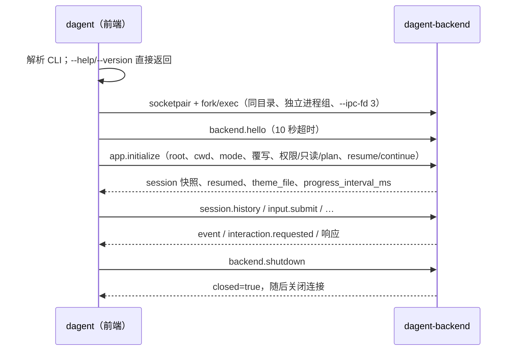

# protocol：前后端进程与私有协议

`dagent` 是前端进程，负责命令行、终端界面和输出格式；每个前端启动一个只属于自己的 `dagent-backend`，后端读取配置、
执行模型与工具、写会话记录。两者经私有 socketpair 上的 JSON-RPC 2.0 通信。本文描述相关的四个模块：

| 模块 / 库 | 头文件 | 职责 |
| --- | --- | --- |
| `protocol` / `dagent_protocol` | `protocol/rpc.hpp`、`protocol/dto.hpp` | JSON-RPC 编解码、固定错误码与业务错误 kind；纯数据 DTO；只依赖 base |
| `ipc` / `dagent_ipc` | `ipc/channel.hpp` | socketpair 端点、LF 分帧与短写、后端进程启动/宽限回收 |
| `client` / `dagent_client` | `client/client.hpp` | 前端 RPC：请求 id 匹配、同步/异步调用、事件与交互转交、连接结束一次性失败 |
| `backend` / `dagent_backend` | `backend/backend.hpp`、`publisher.hpp`、`convert.hpp` | 后端 RPC 方法分发、核心值 → DTO 转换、单一有序发送队列；依赖 runtime/protocol/ipc/base |

后端可执行入口在 `app/backend_main.cpp`：它把 `app::assemble_backend` 作为 `runtime::Assembler` 注入 `backend::Backend`，
因此 backend 库不包含任何 app 头。会话控制见 [runtime](runtime.md)。

这是现有功能的进程间适配：没有监听 socket、共享后端、发现文件、自动重连、事件补发或后台继续执行。

## 1. 进程与传输

- `spawn_backend` 在前端安装根同目录找 `dagent-backend`，先关闭父端再 `dup2` 到 fd 3 并清除 CLOEXEC，其余 FD 用 `close_range` 关闭；
  不经 shell，argv 不带密钥或提示词。后端启动后把 IPC FD 设回 CLOEXEC，工具和 MCP 子进程不会继承它。
- 后端新建独立进程组，终端 SIGINT 只由前端转成取消请求，不广播到其他后端。
- 一行一个完整 JSON 对象（UTF-8 JSON Lines），读取处理半帧/多帧，写入处理短写；不支持 batch。
- socket EOF 表示前端结束：后端走与 `backend.shutdown` 相同的清理入口，清队列、取消执行、同步记录后退出。
- 前端拥有后端 PID：正常退出等待 10 秒宽限，超时 SIGTERM/SIGKILL 自己创建的后端。后端意外退出时前端报告
  `the backend connection was closed`，不自动拉起新后端、不重发输入。

只有后端读取 models.json、凭据、提示词和业务配置；前端只读取初始化返回的主题文件路径指向的 UI 主题。

## 2. 身份与版本

业务协议版本 major=1、minor=1（与 JSON-RPC 的 `jsonrpc:"2.0"` 分开），两端不等直接返回 `version_mismatch`。

| 身份 | 作用 |
| --- | --- |
| request id | 一次连接内的请求匹配；不作持久去重，有副作用的请求不重试 |
| session_id | 持久会话 ID |
| session_generation | new/resume/切模型成功后递增；会话修改请求必须携带当前值，迟到请求得到 `stale_session` |
| input_id / run_id / interaction_id | 后端实例内的队列输入、一次 turn/compact、一次待回答交互 |
| event seq | 本连接已发布事件的递增序号，与 SQLite `events.seq` 无关 |
| model_call_id | 模型原有的 tool_call id，写记录和兼容 JSONL 时保持 |

## 3. 请求方法

会话修改请求带 `{session_id, session_generation}`（SessionTarget）。只读查询明确目标 session_id，可以查询历史子会话。

| 方法 | 执行位置 | 结果 |
| --- | --- | --- |
| `backend.hello` | 读线程 | 协议版本、后端版本、backend_instance_id |
| `app.initialize` | 命令线程，只允许一次 | mode、session 快照或 null（查询模式）、resumed、`ui.theme_file`、progress_interval_ms |
| `backend.shutdown` | 读线程 | 实际收尾后返回 closed=true；重复关闭幂等 |
| `session.snapshot` | 读线程 | SessionSnapshot |
| `input.submit` / `input.recall_last` | 读线程 | input_id（仅表示入队）/ 取回的最后一条排队输入或 null |
| `run.cancel` | 读线程 | cancel_requested 或 already_finished；不是运行终态 |
| `interaction.answer` | 读线程 | accepted；已关闭返回 `interaction_closed` |
| `session.cycle_permission` / `toggle_planning` / `grants` | 读线程 | 生效后的快照 / 授权列表 |
| `session.revoke_grant` | 读线程校验后走即时控制路径 | 提交撤销记录、终止使用旧授权的活跃执行后返回 removed（运行中也可用） |
| `model.list` | 读线程 | 公开模型、provider 种类、default_name、selected_name |
| `session.new` / `resume` / `select_model`、`model.add`、`session.compact` | 命令线程 | 成功返回快照；`model.add` 返回 model/selected/selection_error；compact 返回 operation_id，完成走 `operation.finished` |
| `session.list` / `children` / `history` / `history_close`、`workspace.info` / `complete` | 查询线程 | 会话列表、子会话、HistoryItem 页与游标、项目信息、文件候选 |

读线程只做校验与即时操作，不会被模型调用阻塞；耗时命令与只读查询各有一个工作线程，查询失败不影响执行中的 Run。

`session.history` 首次调用捕获高水位，返回不透明游标；每页最多扫描 100 条记录，读完、`history_close` 或连接关闭时释放，
每页分配连接内唯一、单次消费且绑定 session_id 的游标。跨会话、已消费或已释放游标返回 `invalid_state`。历史查询不取写锁、不恢复会话、不构造模型或 MCP（记录路线 L22）。

## 4. 事件与快照

通知方法为 `event`，信封字段：seq、session_id、session_generation、kind、data，以及可选的 parent_session_id、model_call_id、agent。子 Agent 事件在后端展平身份，不再嵌套。

| kind | 来源 |
| --- | --- |
| `turn_started` `step_started` `text` `reasoning` `stream_reset` `retrying` | 核心执行事件 |
| `tool_pending` `tool_started` `tool_output` `tool_finished` | 工具事件；data 与原实时 JSON 形状一致，工具展示数据保持 View JSON |
| `context` `compacted` `model_changed` `mode_changed` `notice` `turn_ended` | 核心状态变化 |
| `session.changed` | new/resume/切模型安装完成；data 为 replace_transcript、resumed，前端随后用 `session.snapshot` 取权威状态 |
| `operation.finished` | 手动压缩结束 |
| `interaction.requested` / `interaction.closed` | 审批/问答的激活（data 为 InteractionRequest：id、approval/question、载荷）与关闭 |

Publisher 在捕获快照前后比较已发布 seq，并在同一短锁边界分配序号与入队；事件有 seq，快照带 state_seq。
前端拒绝旧 generation 或低于已应用状态水位的快照；已被快照覆盖的状态事件不再覆盖快照。
快照不包含正文，正文/工具展示仍按顺序投影到所属会话文档，与当前选中的页面无关。
context 显式携带 used/limit/window/trigger_percent；删除空的 phase、children、context.usage 与未使用事件身份字段。

`tool_output` 的原始字节可能截断 UTF-8 字符：backend 按调用 id 暂存不完整的尾部字节，在 JSON 编码前与下一块拼接，
`tool_finished` 前补发剩余部分。

## 5. 背压与发送

所有输出经一个有序发送队列，由单一发送线程写 socket。队列软上限 8 MiB：生产者在锁外等待容量，关闭时被唤醒并放弃投递；
超过上限的单条消息只在队列空时单独发送。RPC 响应与错误走控制通道直接入队，不等待容量，保证取消/关闭不被慢消费者阻塞。
快照响应在等待容量后才取值，若其间有新事件入队则重取，避免旧快照携带新 state_seq。

## 6. 错误

JSON-RPC 标准错误使用标准码（-32700/-32600/-32601/-32602/-32603）。业务错误 code=-32000，`data.kind` 固定为
busy、stale_session、not_found、session_in_use、interaction_closed、invalid_state、config_error、query_failed、startup_failed、
version_mismatch、closing；前端只按 kind 分支，不解析文案。模型/工具失败属于 Run 结果或 ToolResult，不包装成 RPC 错误。

前端退出码：成功 0，参数/配置错误 2（包括后端返回的 `config_error`），执行/启动/通信失败 1，中断 130。

## 7. 前端使用方式

- **交互**：`app::BackendSession` 启动后端并完成握手，`ui::run_interactive` 只持 `client::Client`、初始化快照与页面状态，
  业务命令都发 RPC（见 [ui](ui.md)）。`FrontendBridge` 把读线程上的事件/交互 post 到渲染线程。
- **run**：`app::run_backend` 以 mode=run 初始化，按原格式输出首条 session 数据后 `input.submit` 提示词，消费事件直到本 Run 的
  `turn_ended`（忽略带 parent_session_id 的子 Agent 结束事件），再 shutdown。`LegacyOutputCodec` 把协议事件还原成原
  text/json/jsonl 输出，子事件恢复原 `sub_event` 包装；协议新增的会话/操作/交互通知不进入公开输出（见 [app](app.md#6-run-输出)）。
- **sessions / --list-models**：以查询模式初始化（不创建会话、不启动 MCP、不收集 git 环境），调用 `session.list` / `model.list` 后退出。

## Skill queries

`skills.list` is a read-only query returning `skills: [{name, description, path}]` and `diagnostics: [{path, message}]`. `input.submit` remains text-only. Tool presentation adds `kind: "skill"` with `name` and `path`. See [skills](skills.md).
