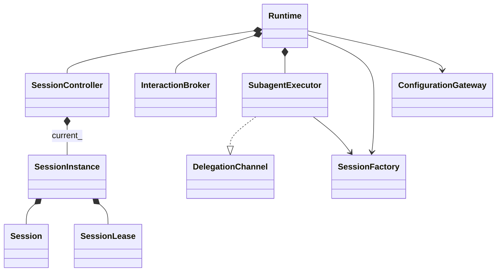
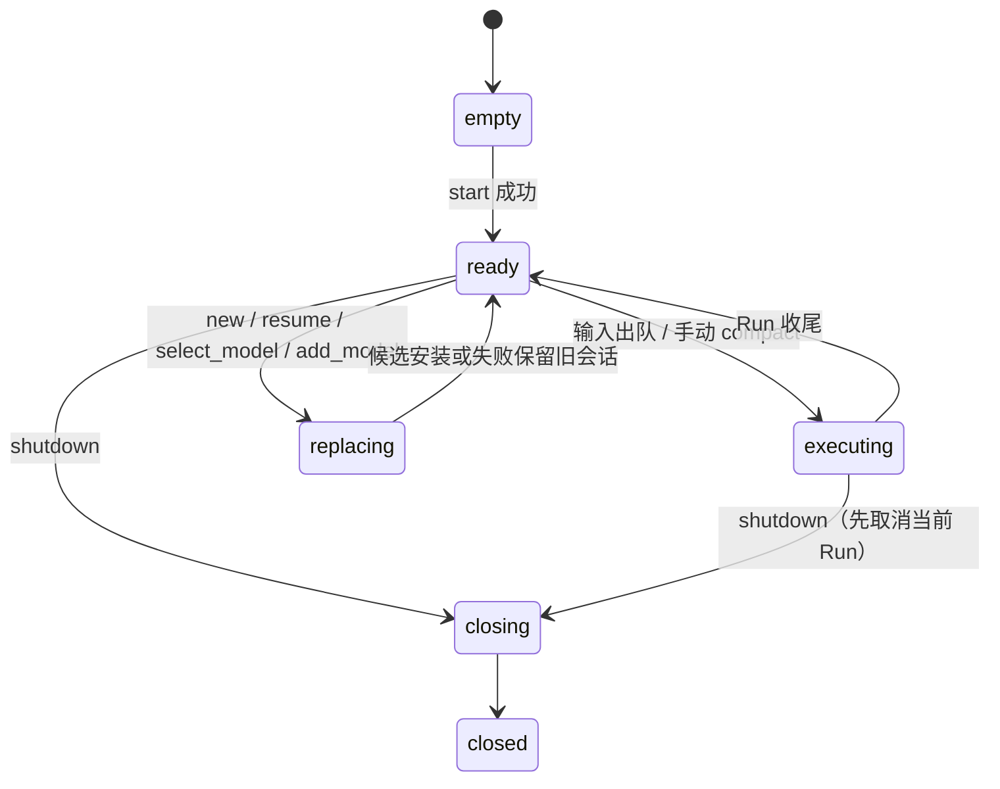

# runtime：会话控制、交互与子执行

runtime 位于后端进程内，负责「哪个会话在执行、下一条输入何时开始、审批/问答怎样等待、子 Agent 怎样创建与回收」。
头文件在 `src/public/runtime/`，实现在 `src/private/runtime/`，命名空间 `dagent::runtime`，库为 `dagent_runtime`，
只依赖 `dagent_agent`。具体的配置、存储、模型与工具由 app 装配经端口注入；协议编解码由 [protocol](protocol.md)
的 backend 适配负责。核心业务对象（Session、Run、TurnRunner）见 [agent](agent.md)。

## 1. 对象与所有权

| 对象 | 拥有 | 职责 |
| --- | --- | --- |
| `Runtime` | 控制器、交互代理、子执行器、工厂 | backend 看到的外观：快照、控制操作、交互回答、关闭 |
| `SessionController` | 当前 `SessionInstance`、普通输入队列、命令队列、当前操作、generation、发布快照 | 所有可写操作经一个串行执行线程决定先后 |
| `InteractionBroker` | pending 表、单模态激活队列 | 审批/问答一次性终结；回答与取消走即时路径 |
| `SubagentExecutor` | 本次委派组的子实例（调用栈内） | 实现核心 `DelegationChannel`：创建子会话、跑一轮、收集 `TaskView`、销毁 |

`SessionInstance` 是一个已装配会话：核心 `Session` 与其工具目录、MCP 资源、记录写入器和写租约同寿。
runtime 只看到核心类型；`tools::Context`、`Registry`、`SqliteJournal` 等具体对象留在 app 装配内部。

### 装配端口（`runtime/factory.hpp`）

| 端口 | 操作 | 实现 |
| --- | --- | --- |
| `SessionFactory` | `create_new`（L01）、`resume`（L20）、`prepare_switch_model`（L21，复用 lease）、`create_child`（L02）、`resolve_session`、`find_subagent` | `app::SessionAssembly` |
| `ConfigurationGateway` | 公开模型列表、provider 种类元数据、添加模型、主题文件路径 | `app::Configuration` |
| `QueryGateway` / `HistoryReader` | 会话列表、子会话、历史分页、项目信息、文件补全 | `app::QueryGatewayImpl` |
| `Assembler` | `BootstrapOptions` → `Assembled{configuration, queries, factory, default_model, progress_interval_ms}` | `app::assemble_backend`，由后端入口注入 backend |

凭据只在 `ConfigurationGateway` 与 app 内部的 `llm::ProviderConfig` 之间转换，公开返回值只有 `PublicModel`。
只读查询失败以中立 `QueryError{not_found, invalid_state, query_failed}` 抛出，backend 按类别映射协议错误。

## 2. 会话控制状态机

- **普通输入**：`submit` 只加入内存 FIFO 并返回 `input_id`，不代表开始执行。`accepted` 回调在入队后、执行线程可取出前调用，
  backend 借此保证 `input.submit` 的响应先于该输入的 `turn_started` 进入发送队列。执行线程只取队首 `ready` 的输入，
  取出时才创建 Run（`run-N`）。
- **取回**：`recall_last` 原子移除最后一条仍排队的输入，空输入框按 ↑ 时使用（B04）。
- **命令**：new/resume/select_model/add_model/compact/revoke_grant 只在空闲时接受；命令从接受到结束占用空闲入口，普通输入不能越过它。
  busy 时返回 `RuntimeError::busy`（B07）。
- **即时操作**：`cycle_permission`（运行中也可，对之后的决策生效）、`toggle_planning`（要求空闲）、`cancel`
  不进命令队列（B08）。`cancel(run_id)` 只取消身份仍匹配的当前 Run，旧 id 返回 false。取消句柄只由 `CurrentRun` 保存；cancel/shutdown 在锁内取得局部共享引用，在锁外触发停止。
- **drain**：Run 收尾时先把状态置回 ready 再发布 `TurnEnded`；无论 status 为何都继续出队下一条。手动压缩完成发
  `operation_finished` 后同样继续（B06）。

### 替换会话

new/resume/切模型先在旧会话空闲时准备候选（`PendingReplace`），失败时旧会话保持并发 `failed` 控制事件；成功后在一个锁边界内
替换 `current_`、递增 generation、刷新快照并发 `session_replaced`。

| 操作 | 保留 | 重置 |
| --- | --- | --- |
| `/new` | 当前权限档 | planning、对话、计划 |
| resume | 当前权限档 | planning；按记录重建对话与计划 |
| 切模型（同 session_id） | 模式、planning、Transcript、WorkPlan 显示 | 临时授权、FileTracker、token 校准；从持久记录重建对话并写新 system（B13/B14） |

切模型把当前 lease 交给候选，不再次 flock 同一会话。添加模型先原子保存 models.json，再按切模型路径切换；保存成功但切换失败时
回调返回已保存的公开模型与 `selection_error`，不回滚文件（B27）。

## 3. 快照与事件发布

`RuntimeSnapshot` 是面向前端的只读状态：session_id、generation、公开模型、权限档/planning/read_only、busy 与当前操作
（turn/compact/replacing + run_id）、排队输入、上下文用量与窗口、项目路径、WorkPlan、MCP 状态、记录 broken、会话授权。

控制器用一把发布锁完成「应用事件到快照、交给 `EventSink`」。线上 seq/state_seq 仅由 backend Publisher 分配；
runtime 不维护重复计数。事件载荷是核心 `agent::Event` 或 runtime 自己的 `ControlEvent`：

| ControlEvent | 含义 |
| --- | --- |
| `session_replaced` | new/resume/切模型安装完成；`replace_transcript` 指出前端是否清空对话（切模型为 false），`resumed` 表示显式恢复 |
| `operation_finished` | 手动压缩结束，带 status/error |
| `failed` | 控制命令失败，`operation` 指出动作 |

`EventSink` 必须在锁内快速入队，不得阻塞；背压与发送在 backend 的 Publisher 里处理。

## 4. 交互代理

核心的 `Approver` / `Asker` 由 runtime 接到 `InteractionBroker`：

1. 执行线程调用 `request_approval` / `request_answer`，生成 `interaction-N`，进入等待队列；同一时刻只有队首激活，
   经 `InteractionOutlet::interaction_requested` 通知前端（并发子 Agent 的审批因此串行显示）。
2. 任意线程的 `answer_*` 把 pending 一次性终结，唤醒等待方，再激活下一个。已结束的交互返回 false（协议 `interaction_closed`）。
3. stop 触发时 pending 立即以取消结束（审批返回 deny、问答返回 cancelled），核心按取消处理而不是普通拒绝，并通知前端关闭对话框。
4. 等待期间不持有控制器锁、Policy 锁或队列锁。

非交互装配（`run`）向核心传空 Approver/Asker：需要审批的调用得到 T7「no interactive approver」，ask/exit_plan 返回原有非交互文本，
不生成永远等不到的对话框（B09）。

## 5. 子执行

`SubagentExecutor::delegate` 在 task 组线程上执行一次委派：

1. 从 `DelegationContext`（父 session/run/call、执行时权限快照、父工具名单、模型名、父 Sink/Approver、stop）和子定义派生权限，
   `SessionFactory::create_child` 创建子实例；子会话自己取得写租约，Meta 带 `parent_id` / `agent_name`。
2. 子 Run 用父的 stop；`may_ask` 时把父 Approver 包装为带 `agent` / `origin_call_id` 的审批出口，子 Asker 恒空。
3. 子事件包成 `SubEvent` 交给父 Sink，只实时展示，不写进父历史。
4. 跑完一轮后收集最终文本与逐条工具摘要为 `TaskView`，子实例在函数返回前销毁；不留可再运行的句柄或 detached 线程。

子工具默认不含 task/ask/exit_plan 和未显式允许的 `mcp__*`；子只用创建时的 MCP 快照（B18–B20）。

## 6. 线程与关闭

| 线程 | 工作 |
| --- | --- |
| 控制器执行线程 | 命令、输入出队、`TurnRunner` 的整轮与手动压缩；唯一推进当前 Session 的线程 |
| 核心工具/task 组线程 | 由 ActionDispatcher 在一轮内创建并 join（见 [agent](agent.md#6-工具调度)） |
| 调用方线程（backend 读线程/命令线程） | submit/recall/取消/回答/权限切换等即时操作；只持短锁 |

`shutdown` 的顺序：停止接受输入并清空队列 → 取消当前 Run（父子共享 stop）→ `InteractionBroker::cancel_all` 唤醒等待 →
join 执行线程 → 释放当前实例。实例析构顺序为同步记录 → 销毁会话与工具/MCP 引用 → 释放 SessionWriteLease。
runtime 不根据 PID 杀进程，也不在关闭后继续后台执行。
