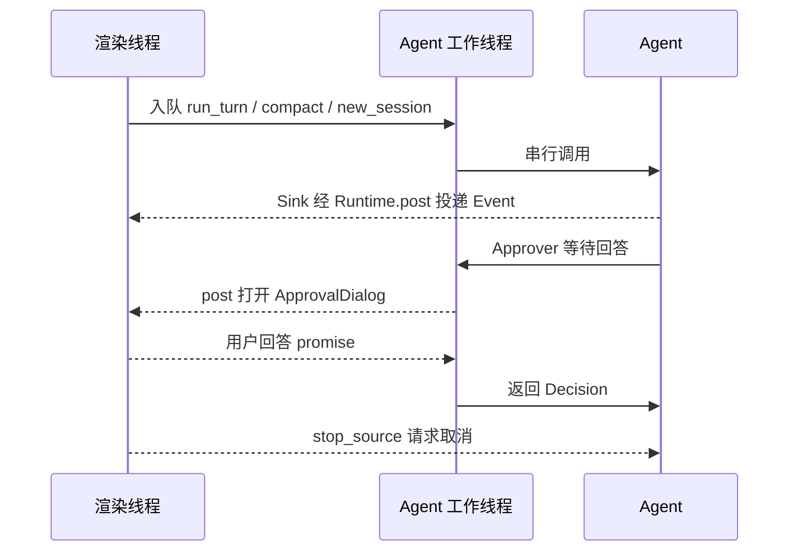

# ui：应用层交互界面

`dagent` 不带子命令时进入的全屏终端前端。头文件在 `src/public/ui/`，实现在 `src/private/ui/`，
命名空间 `dagent::ui`，库为 `dagent_ui`。它使用 [tui 框架](tui-framework.md) 的冻结原语，
通过 [agent](agent.md) 的事件和权限接口完成交互，不负责模型循环、工具执行或权限规则。

## 1. 入口与组成

公开入口是 `run_interactive(agent::Setup, InteractiveOptions, agent::Interrupts&)`，阻塞到用户退出并返回退出码。
`InteractiveOptions` 支持初始提示词、恢复 id、继续最近会话和可选主题文件。

| 部件 | 文件 | 职责 |
| --- | --- | --- |
| 内部 `Shell` | `shell.cpp`；公开入口在 `ui/shell.hpp` | 控件寿命、Agent 工作线程、任务与输入队列、事件分派、退出 |
| `Transcript` | `ui/transcript.hpp`、`transcript.cpp` | 把 agent Event 映射成 Document 块 |
| 内部 `ChatRenderer` | `transcript.cpp` | 按块标签选择样式和前缀，保留源文本的选择映射 |
| `ApprovalDialog`、`approve` | `ui/approval.hpp`、`approval.cpp` | 模态确认、预览、反馈输入及跨线程回答 |
| `PromptInput` | `ui/prompt_input.hpp`、`prompt_input.cpp` | 发送、换行、取回排队输入；其他编辑交给框架 |
| `StatusLine` | `ui/status_line.hpp`、`status_line.cpp` | 模型、上下文、权限、MCP 和会话 id |
| `ThemeSet`、`load_theme` | `ui/theme_config.hpp`、`theme_config.cpp` | JSON 主题加载与明暗主题选择 |

创建流程先加载主题、新建或恢复 Agent，再创建全屏 Shell；启动失败仍能直接在普通终端报错。
恢复产生的事件暂存在值类型列表，Shell 初始化后交给同一个 Transcript 重画。Agent 随后交由工作线程串行使用。
初始提示词在 Runtime 开始时提交；交互权限从 ask 开始，不使用 run 模式的 auto / deny 配置。

## 2. 布局与主题

```text
LayerStack
├─ Container（纵向）
│  ├─ Scrollback       占剩余空间，持有对话 Document
│  ├─ Activity         忙碌动作与耗时，空闲不占位
│  ├─ Notice           临时提示，5 秒后清除
│  ├─ QueueLabel       排队输入的首行，最多 3 行
│  ├─ InputBox         多行输入，3–8 行
│  └─ StatusLine       固定 1 行
└─ ApprovalDialog      居中模态浮层，包含预览滚动区与反馈输入
```

`ui.theme_file` 由 app 按配置文件所在目录解析；未设置时使用框架内置主题。
[config/themes/dagent.json](../../config/themes/dagent.json) 提供现成的主题文件。
`load_theme` 在内置 dark / light 令牌上覆盖 JSON 的 `dark`、`light` 配置；可用 `defs` 定义颜色名。
颜色接受 `#RRGGBB`、索引色整数或 `default`；样式可直接写颜色，也可使用 `fg`、`bg`、`attrs` 对象。

Runtime 的能力握手完成后，Shell 根据终端背景选择明暗主题，递增 `epoch` 并更新控件和对话框。
这会使框架缓存的排版、绘制样式失效。主题文件打不开或格式错误会使启动失败。

滚动区绑定 `ScrollbackMouse`，支持滚轮、拖选、双击选词和复制。装饰前缀不放进源文本，选择复制保留原始内容。

## 3. 线程、任务与对象寿命



控件、Document、事件处理器只在渲染线程使用。工作线程的 Sink 按值捕获事件后调用 `Runtime::post`，不直接改界面；
工具线程发出的 `ToolOutput` 也走同一路径。Runtime 自行合帧，不需要 Shell 再合并模型 delta。

工作队列在空闲时阻塞等待，任务按序执行；关闭后不再接收并丢弃尚未执行的任务。
每个新轮次和手动压缩各建一个 `stop_source`，渲染线程保留它以响应 Esc / Ctrl+C。

Agent 的跨线程操作只有权限切换和 MCP 状态快照。Shell 用同一把锁保护这些调用及会话切换中的 Agent 寿命。
`/new` 在工作线程创建新 Agent，锁内交换指针，锁外销毁旧 Agent，避免 MCP 退出清理阻塞渲染线程读取状态。
新会话保留当前 ask / 自动编辑模式，但不继承旧历史、文件读取状态和会话授权。

## 4. 输入、排队与命令

输入框只提交含非空白字符的内容。普通输入和斜杠命令都进入同一个先进先出队列；空闲时立即处理，忙时显示排队提示。
收到 `TurnEnded` 或手动压缩完成回调后继续处理队列。中断当前轮不会清空排队输入；退出才清空。

| 按键 | 行为 |
| --- | --- |
| Enter | 发送；忙时排队 |
| Shift+Enter / Alt+Enter | 插入换行；Shift+Enter 需要终端支持区分该组合，传统终端用 Alt+Enter |
| ↑，输入框为空 | 取回最近一条排队输入编辑，不是检索已发送历史 |
| Esc | 忙时取消当前任务，空闲无动作；审批浮层有独立语义 |
| Ctrl+C | 忙时中断；空闲且有输入时清空；输入为空时提示，1 秒内再次按下退出 |
| Shift+Tab | ask 与 accept_edits（显示「自动编辑」）之间切换，下一次权限决策生效 |
| Ctrl+O | 全部工具主体展开 / 折叠 |
| PgUp / PgDn | 对话翻页；审批时滚动预览 |

`PromptInput` 处理发送、换行、取回，其余交给 `tui::InputBoxHandler`；全局快捷键由 `tui::Keymap` 注册。

| 斜杠命令 | 行为 |
| --- | --- |
| `/compact` | 工作线程调用 `Agent::compact`；可取消，显示结果与上下文变化 |
| `/new` | 新建 Agent，清空对话并更新会话 id |
| `/help` | 在对话中显示按键和命令说明 |
| `/exit` | 请求退出 |

命令按完整字符串识别；未知命令显示 Notice，不提交给模型。忙时命令同样排队，包括 `/exit`。

## 5. Event 到对话文档

Transcript 只处理对话内容，Shell 另负责活动行、提示条、状态栏与队列推进。
assistant 正文进入 `MarkdownStream`；思考用文本块，默认折叠到 3 行；工具使用标题和主体成对的块。

| 事件 | Transcript 行为 |
| --- | --- |
| `TurnStarted` | 完成上一条消息，追加用户块 |
| `StepStarted` | 记录本步起点，创建新的 MarkdownStream |
| `TextDelta` / `ReasoningDelta` | 追加正文 / 思考；回放没有 StepStarted 时按需创建块 |
| `StreamReset` | 删除本步起点以后的内容，重建流式正文 |
| `ToolStarted` | 结束正文和思考，建立工具标题与空主体，按调用 id 记住位置 |
| `ToolOutput` | 追加到对应调用的主体 |
| `ToolFinished` | 没有开始事件时先补块，再用 Result / View 定稿标题和主体 |
| `Compacted` | 追加压缩前后 token 数的提示块 |
| `Notice(error)` | 追加永久错误块；info / warn 只由 Shell 放到临时提示条 |
| `TurnEnded` | 结束流；按状态显示中断、拒绝、达到上限或错误，done 不额外追加状态块 |

并行工具在开始时就建好各自的主体，输出按 id 追加，因此交错到达也不会混在一起。
工具成功用 ✓，错误用 ✗，中断、拒绝和未执行用 ◌，进行中用 ●；正文颜色引用 ThemeTokens。

### View 的显示

| View | 主体与完成信息 | 默认折叠行数 |
| --- | --- | --- |
| `ReadView` | 只显示路径和行范围，目录单独标明；错误时可显示结果文本 | 无普通正文 |
| `FileChangeView` | 路径、增删统计和 diff | 20 |
| `BashView` | 完整截断版 output；标题带命令、退出码 / 信号 / 超时 / 中断、耗时、可写与联网标记 | 10 |
| `GrepView` | 搜索式、匹配数；每行 `path:line: text` | 5 |
| `GlobView` | 查找式、文件数和路径列表 | 5 |
| `McpView` | `server.tool`；text 内容块原文，其他块显示类型说明 | 5 |
| `monostate` | 工具摘要和 Result 文本，用于参数错误、拒绝等 | 3 |

主体超过对应行数才标「已折叠」；Ctrl+O 改变所有已完成工具主体的折叠状态。
实时 bash 输出在完成时由 `BashView::output` 替换。给界面的 View 和给模型的预算文本是两份数据，界面不解析模型文本
来重建 diff 或进程信息；缺少结构化 View 的未执行结果通过核心统一的状态文本识别。

### 重试、中断与恢复

重试收到 StreamReset 时清除本次尝试显示，不清除自动压缩提示。实时回复中断时清掉未完成思考，正文补上统一的
中断标记；回放中的正文已经包含标记，不再次追加。

恢复与实时使用同一个 `Transcript::apply`。回放没有 ToolStarted，ToolFinished 自行补齐块；也不回放实时输出分片、
重试、活动计时或压缩动画。旧工具原始记录仍可显示，有效模型历史则由核心按压缩记录重建。

## 6. 权限对话框

Approver 在工作线程创建一次性回答状态，post 打开模态浮层后等待 future。
用户回答和 stop 回调争用同一个原子完成标志，只有第一次回答生效。取消立即唤醒工作线程，再 post 关闭浮层，
不会让 agent 线程卡在等待用户输入上；已取消但尚未执行的打开操作也不会再弹框。

对话框显示 `Approval::reason`、Intent 摘要，以及按意图选择的预览：写入用 diff，bash 用完整命令，读取列路径，
外部工具显示参数预览。浮层最大宽度约 100 列，高度约终端的 60%，预览可滚动、选择。

| 回答 | Decision 与效果 |
| --- | --- |
| `y` | 单次允许 |
| `a` | 本会话允许；只在 session_rule 非空时出现，并显示实际记住的规则 |
| `w` | 单次允许并联网；只在 can_network 为真时出现 |
| `n` / Esc | 拒绝当前调用，核心停止这一轮并等待新指示 |
| `e`，再 Enter | 输入拒绝说明，核心继续本轮；说明输入中的 Esc 返回选项 |
| Ctrl+C | 取消本轮，返回 interrupted，与普通拒绝不同 |

浮层接管按键和焦点，下面的输入框不会收到这些回答。权限规则由 Policy 决定，界面只展示可用选项并返回 Decision。

## 7. 活动与状态

Activity 显示思考、生成、准备调用、最早开始且尚未完成的工具、等待确认或手动压缩，以及经过时间。
忙时每 100 ms 更新动画和计时，空闲时取消定时器。

StatusLine 显示当前模型、上下文百分比和 used / limit、权限模式、MCP、会话 id 前 8 位。
上下文来自 `ContextUpdate`，达到触发百分比使用警告色；自动编辑模式用 accent 色。新建会话清零上下文和 MCP 显示。

MCP 状态通过 `Agent::mcp_states()` 获取，连接中或任务忙碌时每 200 ms 更新；稳定空闲后停止轮询，不为失败或断开状态
保留常驻定时唤醒。显示 ready / 总数，连接中、重连中注明服务名，failed / disconnected 用警告色。
请求前等待连接的 Notice 说明在等谁；空闲时可先看到失败状态，失败事件在核心下一安全点交付。

临时 Notice 的 5 秒清除也是一次性定时器。忙碌、连接等待及临时提示结束后，Shell 不再周期唤醒，沿用框架的静止原则。

## 8. 退出与失败

退出时停止当前轮，清空输入和工作队列，通知工作线程停止并调用 Runtime::quit。
Runtime 返回后**先还原终端，再 join 工作线程**，然后析构 Agent 同步记录并关闭 MCP，最后在普通终端打印恢复命令。

全屏期间启用进程级 graceful 中断；SIGINT / SIGTERM 经 stop 回调投递到渲染线程，走相同退出路径。
raw 模式 Ctrl+C 按键由第 4、6 节处理，取消一轮不等于退出程序。

工作线程最外层捕获未预期异常，记录日志并 post 错误和退出操作，避免界面继续等待已终止的工作线程。
正常用户退出返回 0，进程中断退出返回 130，工作线程异常返回 1；单轮 failed / denied / limit 留在界面中，
用户仍可继续输入。
