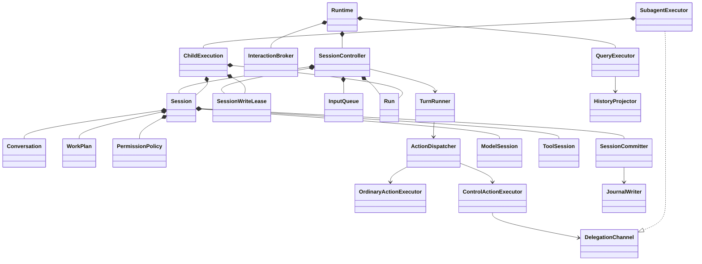

# 核心对象、接口与依赖设计

状态：待实施。前置阅读：[范围与 B 保持清单](frontend-backend-migration.md)。
本文确定结构，不增加产品能力。状态规则见 [执行状态机](execution-state-machines.md)，接口传输见 [协议](frontend-backend-protocol.md)。

## 1. 统一术语

| 术语 | 唯一含义 | 不可混用 |
| --- | --- | --- |
| Session | 一份对话的长期业务状态及 session_id | 数据库连接、当前页面、后台任务 |
| Run | 当前会话的一次 turn 或 compact；对象只在本次后端中有效 | 持久 Task、RPC 请求 |
| Invocation | 一次模型工具/控制动作调用 | 一个步骤的全部调用 |
| Step | 一次主模型逻辑步骤，含其重试和动作批次 | HTTP 单次尝试、完整 Run |
| Interaction | 一次审批或问答等待 | 前端模态控件 |
| Delegation | 现有 task 工具的一次父子委派 | 可再次发送消息的长期子 Agent |
| WorkPlan | 当前 todo 整份计划 | 执行调度队列 |
| Record | 已持久化的历史事实 | 实时 token 增量、UI 控件 |
| Event | 当前执行的通知 | RPC 操作指令、数据库 schema |
| Projection | 为显示生成的数据 | 可执行会话状态 |

不新增 AgentInstance、TaskManager、WorkflowEngine 等与上述概念重叠的身份或总括对象。

## 2. 面向对象约束

| 原则 | 必须落实的结构 | 违反示例 |
| --- | --- | --- |
| 封装 | Session/Run/Interaction 通过业务操作维护私有状态 | 任意调用方写 busy、state、messages 容器 |
| 单一职责 | 类的修改原因明确；算法与长期资源归属分开 | Shell 同时创建模型、恢复数据库、渲染控件 |
| 开闭原则 | 新普通工具按普通 Tool 契约注册 | 为每种文件工具在核心循环增加名称判断 |
| 替换原则 | 每个 PreparedTool 都有正常可调用的 execute 行为 | ask 实现 do_run 但只能返回“由 dispatcher 处理” |
| 接口隔离 | 模型、工具、记录、交互只接收所需参数 | 传完整 Setup、Agent&、任意服务定位器 |
| 依赖倒置 | 业务核心定义能力契约，外层实现 | Conversation 包含 net/http.hpp 或 sqlite3 |
| 组合优先 | Session 组合 Conversation/Policy/Plan；策略无需继承 Session | MainAgent/SubAgent 继承树覆盖各类生命周期 |
| RAII | 线程、FD、执行上下文和连接有唯一所有者 | 工具持父 Agent 指针并假定 turn_ 一直有效 |

只有实际存在替换需求或 IO 依赖倒置的边界用抽象接口。Run、Conversation、WorkPlan、PermissionPolicy、ActionDispatcher
是具体业务类，不为它们创建一组同形 I* 包装。共享值数据使用 struct；具有不变式和状态转换的对象使用封装类。

## 3. 对象图与所有权

图中的 ModelSession、ToolSession、JournalWriter 是核心契约的实现对象，由入口/工厂构造后把所有权交给 Session。
SubagentExecutor 只拥有当前委派组的 ChildExecution；子会话记录保存后，执行对象随这一组结束销毁。
UI 永远不进入这个对象图。

### 3.1 主要类的接口契约

以下方法名作为实现命名基准；签名按现有 C++ 风格实现，但输入输出语义与可调用线程不变。

| 类 | 私有状态/所有物 | 业务操作及结果 |
| --- | --- | --- |
| Session | Conversation、WorkPlan、Policy、模型/工具环境、记录提交器、有效会话配置 | build_request、commit_user/assistant/tool、apply_compaction、replace_plan、snapshot；不返回可写内部容器 |
| Run | run_id、kind、阶段、steps/calls/usage、取消源、一次性结束标志 | begin、enter_phase、request_cancel、finish；finish 返回唯一 RunOutcome |
| TurnRunner | 本轮算法，无跨会话状态 | run(Session&, Run&, RunServices)；compact 使用同一运行收尾约束 |
| ActionCatalog | 稳定有序描述和准备入口 | specs、prepare(name,args,invocation_context)；返回 PreparedAction 或准备失败结果 |
| ActionDispatcher | 当前批次的槽位、并行组、有序提交位置 | dispatch(batch,budget)；返回已计数调用及 stop/limit 信息 |
| OrdinaryActionExecutor | Policy/交互接口的借用能力 | authorize_and_execute(PreparedTool)；不决定下一次模型调用 |
| ControlActionExecutor | 固定控制动作的处理器 | execute(ControlRequest)；处理 ask、exit_plan、todo、task 的具体规则 |
| SessionCommitter | Session 内部状态的受限访问、JournalWriter、通知出口 | 提交一种 SessionChange；维护内存/记录/通知的顺序和 broken 状态 |
| SessionController | 当前顶层 Session、InputQueue、一个当前操作、session_generation | submit、recall_last、new_session、resume、switch_model、compact、cancel、close |
| InteractionBroker | pending 表、激活队列、当前一次性交互 | request、answer、cancel；等待不持有队列锁 |
| SubagentExecutor | 只读定义表、当前 ChildExecution 组 | execute(DelegationContext,request)；阻塞返回原有 task Result |
| HistoryProjector | 记录解码器的只读消费端 | project(records)；只产生历史条目，不持有 Model 或 MCP |
| SessionRecovery | 记录解码器和 Conversation 状态规则 | restore(records)；返回恢复状态与需要补闭合的调用，不直接启动工具 |

SessionCommitter 是 Session 的内部协作者，使用私有实现/受限友元完成状态修改；不把整份 Session 暴露给普通工具。
不同时保留 session 内修改和外部修改两条入口。TurnRunner 使用 Session 的提交方法，不能直接写 Conversation 再补写记录。

### 3.2 RunServices 与配置

RunServices 只包含本轮所需的事件接收、交互请求、委派执行能力及 stop_token；这些对象的寿命覆盖整个 Run。
不含 app::Config、终端、数据库路径、密钥目录或查找任意对象的方法。

| 输入 | 生命周期与内容 |
| --- | --- |
| BootstrapOptions | 后端启动模式、安装根、cwd、按序覆写、CLI 选择；只在装配层读取 |
| SessionConfig | 已解析的会话选项、模型公开描述、只读初值、提示词内容、工具白名单；不可自行读配置文件 |
| RunOptions | 现有模型/工具调用上限、重试设置等本轮值；不额外增加预算种类 |
| ModelSession | 已配置的模型客户端；密钥封装在外层 llm 实现中，核心执行对象和前端只读 DTO 不持有原始密钥；模型表单的 write-only 输入只作转交 |
| ToolSession | 工作区上下文、FileTracker、当前工具目录与 MCP 引用的会话级所有物 |
| SessionResources | 父子共享的环境事实与 MCP 生命周期；只由后端装配，不能扩展成万能 Host |

从 Setup 迁出的每个字段必须明确落到上述某处或 app 配置中；删除重复 permission_mode/read_only 副本，
保留启动只读初值与当前 planning/permission 的区别，保证退出 plan 后恢复正确的只读约束。

## 4. 模块和编译依赖

### 4.1 固定目标

| 源目录 / CMake 目标 | 内容 | 允许的直接项目依赖 |
| --- | --- | --- |
| `agent` / `dagent_agent` | 中立消息、业务对象、控制动作契约、循环/调度/策略/上下文规则、记录语义 | base |
| `runtime` / `dagent_runtime` | SessionController、交互代理、子执行装配、查询协调、生命周期 | agent、base；通过核心端口访问具体实现 |
| `llm` / `dagent_llm` | Model 实际请求、重试、provider 编解码、HTTP/SSE 适配 | agent、net、base |
| `tools` / 现有 `tools` | 普通工具、参数解析、工作区与 MCP 适配 | agent、base、workspace、exec、mcp |
| `storage` / `dagent_storage` | 现有 SQLite Writer/list/replay、只读分页、会话写锁 | agent、base；SQLite 私有 |
| `protocol` / `dagent_protocol` | 线上的 DTO/编解码/错误码，纯数据 | base |
| `ipc` / `dagent_ipc` | socketpair FD 包装、JSON 行收发、关闭与背压 | base |
| `client` / `dagent_client` | RPC 匹配、DTO 状态、请求与事件转交 | protocol、ipc、base |
| `backend` / `dagent_backend` | RPC 方法适配、事件 DTO 转换 | runtime、protocol、ipc、base |
| `ui` / `dagent_ui` | UI 投影、控件、输入与局部页面状态 | client、protocol、tui、base |
| `app` / `dagent_app_cli` | 参数、安装根路径、前端启动和输出适配 | client、protocol、base；CLI11 私有 |
| `app` / `dagent_app_config` | 后端配置和具体适配对象装配 | runtime、llm、tools、storage、workspace、exec、mcp、base |

`net / exec / workspace / mcp / base / tui` 保持现有职责。
`dagent` 可执行文件只链接前端所需目标；`dagent-backend` 只链接后端、配置和具体适配目标，不链接 UI/TUI。
当前 tools 禁止依赖“庞大的 agent”的原因，在 agent 收敛为纯业务契约后消除；禁止形成反向 `agent -> tools`。

### 4.2 接口放置与值类型

核心端口放在 `src/public/agent/ports.hpp`；消息、动作、事实、只读快照按业务分为窄头文件。
本次不新增通用 domain/common/services 命名空间来转移耦合。

核心值类型不含 net::HttpRequest、exec::Analysis、workspace::Resolved、mcp::Client、sqlite3、tui::Widget。
底层分析细节留在 PreparedTool 的具体实现中；对核心只提供决定权限所需的中立 ResourceIntent/CommandIntent 摘要。
现有策略所需的语义信息必须完整映射，不能因去掉 exec 类型而降低沙箱/权限判断精度。

CommandIntent 至少保留原命令、分析版本、语法状态及错误说明、dynamic、known_readonly、dangerous、
已解析路径/网络影响和不确定影响。dangerous/known_readonly 继续由原 exec 分析函数计算，不能在核心重写简化白名单。
ResourceIntent 保留规范化路径、读写方向、工作区内外关系与当前策略分类所需事实；
沙箱支持能力转为中立值，在 tools/exec 适配处映射回现有 backend/profile，不更改选型规则。

使用一个中立 ToolSpec，避免当前 tools::Spec 与 agent::ToolDef 同字段往返复制。
JSON Schema 可作为不可变 JSON 值保留；业务状态不能改成任意 JSON 属性袋。
工具结果包含 model_text、现有 is_error/interrupted 语义、结构化 ToolData 和执行信号。
MCP 断连是执行信号，不由 McpView 的显示分支判定；授权审计数据也有明确类型。

协议 DTO 与核心值类型允许有必要转换，但集中在 backend 的 adapter 中。UI 和 CLI 只包含 protocol 头文件。
UI 主题配置文件读取可以留在 UI；总括 config/models/db 的读取都在后端。

### 4.3 跨模块端口清单

| 契约及定义位置 | 必需操作/数据 | 具体实现与调用方 |
| --- | --- | --- |
| ModelSession，agent | complete：中立请求、流/重试接收器、取消 → Reply/现有分类错误 | llm 实现，TurnRunner/压缩调用 |
| ToolSession，agent | specs、prepare、工具目录边界刷新、只读快照、清空本会话跟踪状态 | tools 实现，ActionCatalog/Session调用 |
| JournalWriter，agent | meta、append 已编码 Record、sync；失败抛 RecordError | storage 实现，SessionCommitter调用并唯一持有 broken/error；RecordCodec仍在核心 |
| SessionStore，agent | create/resume Writer、list/list_children、按高水位读取记录、取得写入lease | storage 实现，恢复/历史与 Runtime调用 |
| SessionFactory，runtime | 从已解析 SessionConfig 创建 Session；从 DelegationContext 创建子 Session；准备模型替换候选 | app 装配实现，SessionController/SubagentExecutor调用 |
| ConfigurationGateway，runtime | 初始化配置、按原顺序覆写、公开模型列表、添加模型、选择模型解析 | app_config实现；凭据不进入公开返回值 |
| WorkspaceQueries，runtime | 当前项目/git 信息和文件候选查询 | app 装配的 workspace适配实现，QueryExecutor调用 |
| InteractionChannel / DelegationChannel，agent | 现有审批/问答及单次委派请求 → 一次性结果 | runtime实现，核心控制动作调用 |

端口按业务拆到窄头文件；ports.hpp 仅作前向声明/导航，不能成为包含所有外层配置的总头。
SessionFactory 只负责构造与候选准备，不负责运行、输入队列、权限判断或存储回放算法。
Runtime的入口按上表显式注入依赖，不允许靠 include app/config.hpp 绕过依赖方向。
SessionStore返回的 Writer/lease采用独占所有权；只读查询使用独立存储连接，不借用执行线程的 Writer。

返回和错误方式固定：prepare 返回 `expected<PreparedAction, ToolResult>`；普通 execute 返回 ToolResult，预计工具失败不向外抛；
ModelSession.complete 返回 Reply 或抛原分类的 ModelError；JournalWriter/SessionStore 使用中立 RecordError，类别保持 io/not_found/corrupt。
RecordError 只在核心提交/恢复边界转换，不能由 Backend 把失败记录误当成协议格式错误。
DispatchOutcome 固定包含 stop=none/interrupted/denied、handled、hit_limit；RunOutcome 保留 kind、原 TurnStatus、error、steps/tool_calls/Usage。
SessionRecovery 返回 Conversation、WorkPlan、最近模型、next_ordinal、unfinished、open_calls、读取高水位，不直接返回可执行Session。

## 5. 普通工具与控制动作

### 5.1 普通工具端口

保留 `Tool` 与准备后对象这两个实际多态变化点，统一为：

- Tool 的 spec 是不可变描述；prepare 解析并读取必要事实，不产生外部写入。
- PreparedTool 构造时分配 invocation_id，拥有其参数/分析/资源引用，公开只读 intent。
- execute 接收决定好的授权、输出接收器和 stop_token，返回 ToolResult。
- 所有普通 PreparedTool 均可正常执行；预计环境失败转换为结果，取消保持部分输出。
- core 看不到实际 shell 分析树、Client 指针或工作区实现对象。

FileTracker 的具体实现仍在 ToolSession 内，由 Session 拥有其寿命；保留并行读取时的同步和写入前 stale 检查。
不借重构增加全局文件锁、自动冲突合并或新的资源调度策略。

### 5.2 控制动作是封闭和类型安全的集合

PreparedAction 为 `普通 PreparedTool` 或 `ControlRequest` 的和类型。
ControlRequest 只包括现有 AskRequest、PlanConfirmation、PlanReplacement、DelegationRequest。
固定控制动作解析与 Schema 从 ask/todo/subagent 工具文件迁入 agent 的控制动作实现；模型看到的名称与 Schema 不变。

ControlActionExecutor 内按类型分派到具有业务名称的处理函数/小对象。允许一处 variant 分派，
不允许在权限层、循环、调度器和 UI 四处重复判断工具名称。
ask/exit_plan 的等待由交互端口完成；todo 调 Session 的计划替换；task 调委派端口。

ActionCatalog 保持现有注册顺序：read、write、edit、bash、grep、glob、todo、ask、exit_plan，
主 Agent 的 task 按原位置加入，动态 MCP 依旧稳定追加/替换。子工具集保留 B18 的收窄规则。

### 5.3 准备与调度的边界

ActionDispatcher 保留当前先准备、分组、必要时刷新准备、按槽位提交的算法。
当此前组执行会改变准备依赖的状态时，后续动作在执行前重新准备；新的 intent 必须重新走权限决定。
不复用已经与执行内容不匹配的授权。并行判定保持 B15，不额外把 MCP、写入或审批动作并行化。

## 6. 会话、策略与模型切换

Session 只在所属执行线程推进对话、工具目录、模型和记录；跨线程只开放取消、权限档改变和快照等明确控制路径。
PermissionPolicy 内部为规则容器和模式快照建立一致同步，不能暴露 grant 容器供 UI 读写。
持有策略锁时不调用用户交互、模型、存储或 socket；审批等待返回后再完成授权。

模型切换由 SessionController 管理，当前会话引用与公开状态在提交点一起替换：

1. 检查空闲，保存当前 session_id、模式和 planning。
2. 通过配置端口解析目标模型，并准备新的 ModelSession 与预算。
3. 按 B13 从持久对话建立候选状态，重新生成当前 system prompt；保持原有恢复记录语义。
4. 按 B13 重置临时授权、FileTracker 和 token 校准，保留 UI 对应的 WorkPlan 展示状态。
5. 准备失败保留旧 Session；准备成功后按记录路线 §8.2 提交，再替换内部模型/执行状态并发布权威状态。记录写入 broken 按 B23 继续，不能把已写历史当作可回滚事务。

写锁复用、候选 Writer 的打开时机和失败边界以 [记录路线 §8](record-routes.md#8-恢复写锁和候选替换) 为准。
该方法属于后端业务操作，UI 无需创建或交换 Agent。若要改变 B13 的重置语义，另立功能请求，不在本次实施。

## 7. 子 Agent 所有权与 MCP

DelegationContext 是本次调用的不可变值/受限句柄：父 session_id、run_id、call_id、父当前权限快照、
子定义、允许工具、模型选择、环境与资源租约、取消 token、事件/审批出口。
不含父 Agent&、current_turn 指针或可写父 Session。

SubagentExecutor 在 task 组线程创建 ChildExecution，持有子 Session、子 Run 和记录写入所有权；
执行一次 TurnRunner，收集当前 TaskView 所需最终文本与工具摘要，返回原工具结果后销毁执行对象。
父线程等待组完成，禁止遗留 detached 线程。子对象不通过 shared_ptr 回指父对象。

共享 MCP 资源使用显式 lease 保证寿命；正在执行/被子快照引用的具体连接不能因主目录刷新而悬空。
工具列表仍只在原有边界更新：主模型步骤之间应用 Hub 更新，子只取创建时快照。
断连和重连政策保持 B20；lease 仅解决对象寿命，不增加子 Agent 动态刷新或重连能力。
MCPClient 的线程安全保证仍由适配层落实，不能把 shared_ptr 当作并发安全保证。

## 8. 事实提交、恢复与投影

SessionChange 至少包含 UserAdded、AssistantAccepted、ToolCompleted、PlanReplaced、ContextPruned、ContextCompacted。
工具开始、授权审计、system 和 turn_end 作为相应记录事实进入同一记录出口。
SessionCommitter 统一负责这些路线，但各种变化的具体顺序不同；必须按 [L01–L23 路线](record-routes.md#4-逐入口路线表) 处理，不能把审计/控制/恢复硬套成同一种通知。
它不是新事件溯源平台，不存储全部流式增量，不新增 runtime_* 表。

WorkPlan 的持久来源仍是现有 todo 工具结果；恢复适配从旧 ToolData/TodoView 重建，不新增 Plan 表或新的未知记录类型。
新的核心事件类型通过记录适配器映射回现有 type/payload。保持 `system.schema=1` 与现有各记录字段/版本。

全部10种记录的写入字段、读取兼容、三种序号、事务和失败边界见 [记录路线](record-routes.md)。

RecordDecoder 一次解释存储数据并产生类型化事实：

- SessionRecovery 消费事实，重建 Conversation、压缩结果和恢复报告。
- HistoryProjector 消费事实，生成可显示的用户/assistant/工具/模式/结束条目。
- 两者复用字段解析和错误分类，但历史投影不执行 Conversation 恢复或崩溃闭合。

恢复使用与实时提交相同的纯状态转换规则，跳过写入和实时副作用。只有显式恢复执行入口负责补闭合记录。
历史分页使用记录 seq 高水位；浏览不会追加 system、修改 updated、刷新 MCP 或重建模型客户端。

## 9. 跨进程写入所有权与清理

storage 的 SessionWriteLease 在创建/恢复可写 Session 前取得，使用安装根下 `.runtime/session-locks/<session_id>.lock` 的 flock。
顶层lease由SessionController持有，跨同session模型替换复用；子lease由ChildExecution持有。候选不能再次获取当前已经持有的同session锁。
新 UUID会话可直接建锁；恢复失败应释放锁。锁文件不在仍可能被其他进程持有时 unlink；FD 为 CLOEXEC。
只读历史查询不取写锁。锁的退出释放由 RAII 保证，不根据 PID 猜测并杀死进程。
各后端可写不同 session_id，继续使用 SQLite WAL。

模型文件更新保留现有校验与原子替换；额外用安装根的短期文件写锁包围重读/校验/写入，避免两个前端同时添加模型丢失另一项。
此锁只保护既有操作，不增加配置服务或热更新能力。

清理顺序：停止接受新输入 → 请求本轮及子组取消 → 唤醒交互 → join 执行组 → 同步记录 →
销毁工具/释放 lease → 关闭 MCP 资源 → 释放 SessionWriteLease → 关闭后端连接。
每个阶段只有一个所有者负责，不让 UI 和 backend 各自关闭同一执行资源。

## 10. 旧结构迁移对照

| 当前位置 | 最终位置/职责 |
| --- | --- |
| agent/agent.cpp 的 create/resume 与 UI Agent 替换 | runtime/SessionController 与 SessionFactory |
| agent/agent.cpp 的 run_turn/finish | agent/TurnRunner、Run 与 Session 提交方法 |
| agent/dispatch.cpp | agent/ActionDispatcher + 普通/控制动作执行器 |
| agent/model.cpp、provider*.cpp、llm 编解码 | llm 模块；中立消息与能力接口留 agent |
| tools/ask.cpp、tools/todo.cpp、agent/subagent.cpp 中控制解析 | agent 控制动作；子会话构造/生命周期在 runtime |
| agent/host.cpp、mcp_hub.cpp | runtime 管理业务生命周期；具体 MCP 操作经 tools 适配 |
| agent/record.cpp | agent 记录语义/解码/恢复；runtime 只读查询协调；storage 落盘 |
| session/session.cpp | storage 模块，保留 SQLite 内容与格式 |
| agent/headless.cpp、agent/main.cpp | app 前端输出与装配；后端专用入口在 app |
| ui/shell.cpp | 页面/输入/命令映射/客户端投影；无执行状态所有权 |
| ui/model_dialog 的 ProviderConfig | protocol::ModelInput/PublicModel；不引入 llm 实现依赖 |
| tools/View 与 UI 的共享业务事实 | agent::ToolData；后端转换 protocol DTO，存储适配保持旧 view JSON |

源文件移动与接口收敛按任务分步进行，不先整体改目录导致长期不可构建。
