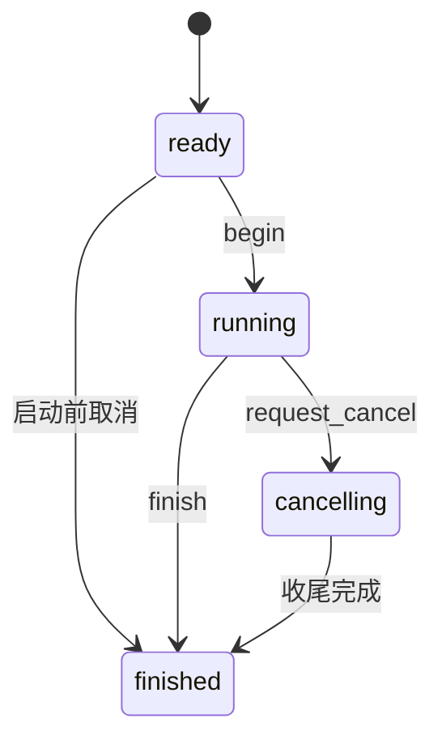
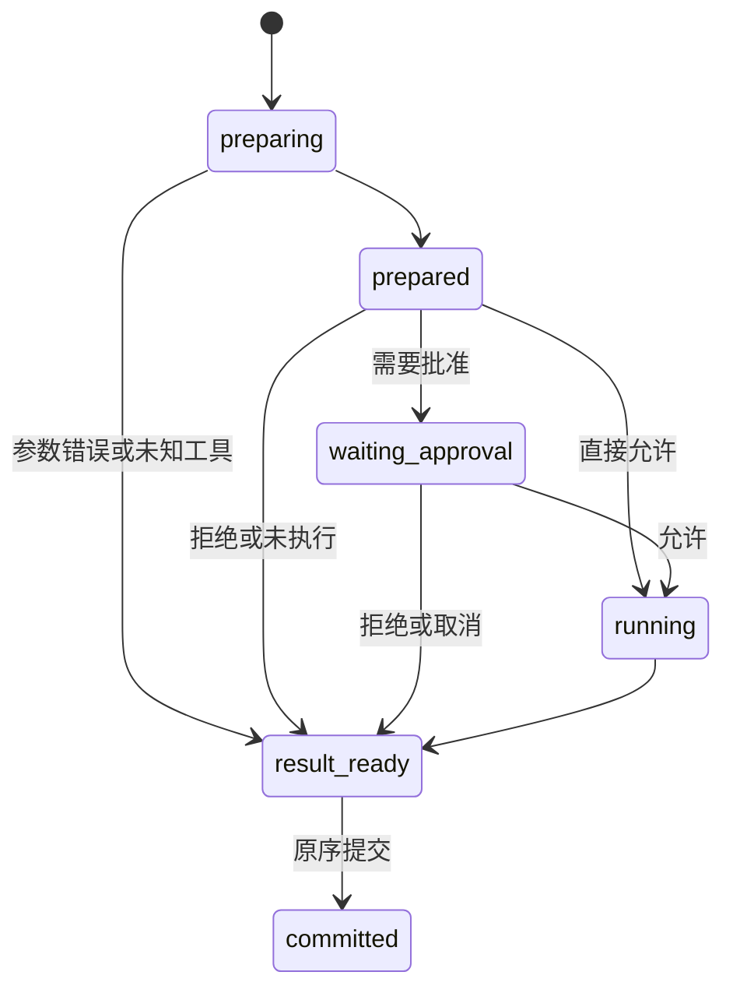

# 状态机、线程与完整执行过程

状态：已实施（R01–R14 真实验收，见 [执行记录](implementation-tasks.md#7-执行记录)）。以 [B01–B28](frontend-backend-migration.md#4-功能保持清单) 为行为约束，
使用 [对象设计](architecture-refactor.md) 中的对象名称。

## 1. 状态和事实的唯一来源

| 状态 | 所有者 | 其他对象如何读取 |
| --- | --- | --- |
| 当前顶层会话、替换操作、普通输入队列 | SessionController | 值快照/状态事件 |
| 对话、计划、模型绑定、策略、工具上下文 | Session | 构造请求、业务方法或只读快照 |
| 当前一轮阶段、计数、结束结果 | Run | 快照/事件 |
| 当前批次准备和有序结果 | ActionDispatcher | 最终 DispatchOutcome |
| 临时授权与权限模式 | PermissionPolicy | 受同步保护的策略快照 |
| 用户回答是否有效 | InteractionBroker | 一次性答复或取消结果 |
| 历史事实 | JournalWriter / storage | RecordDecoder 产生类型化事实 |
| 页面、滚动、草稿、折叠 | UI | 不反向推断业务状态 |

SessionController 不维护与 Run 重复的独立 busy 布尔变量；busy 从当前操作导出。
可以缓存面向 UI 的状态值，但更新必须由所有者在状态变更时发布，不让 UI 成为第二个写入点。

## 2. 会话控制状态机

状态是 `empty / ready / executing / replacing / closing / closed`。
executing 可以是普通 turn 或手动 compact；查询不是执行状态。

| 当前状态 | 输入 | 动作 | 下一状态 |
| --- | --- | --- | --- |
| empty | 启动创建/恢复 | 准备候选 Session，成功后发布初始快照 | ready |
| ready | 普通输入且队列可出队 | 弹出队首、分配 Run、启动执行 | executing |
| executing | 普通输入 | 追加内存 FIFO，发布队列摘要 | executing |
| ready/executing | 取回输入 | 原子取回最后一条仍排队输入；已出队则不能取回 | 不变 |
| ready | new/resume/switch_model | 保留旧对象至候选成功；暂停出队 | replacing |
| replacing | 成功 | 安装候选状态、更新 generation 和 UI 结果 | ready |
| replacing | 失败 | 保留旧会话、报告错误 | ready |
| ready | compact | 创建内部 compact Run | executing |
| executing | new/resume/model/plan/compact | 返回 busy，由 UI 保持当前提示/禁用行为 | executing |
| executing | Run结束 | 发布实际结果、释放当前操作、继续 drain | ready 或下一 executing |
| 非关闭状态 | 查询 | 投递只读查询工作；结果携带目标身份 | 不变 |
| 非关闭状态 | exit/连接断开 | 禁止新操作、清队列、请求取消、唤醒交互 | closing |
| closing | 执行与资源清理完成 | 发最终退出信息并关闭 | closed |

新建/恢复成功后仍保留当前前端已有 pending 普通输入的处理顺序；退出才清空队列。
不增加失败暂停队列规则：B06 的 done/denied/limit/failed/interrupted 都会触发后续 drain。
为避免 RPC 重构改变自然顺序，新的可写操作和队列出队通过 SessionController 同一串行入口决定先后。
旧会话查询响应晚到时，按 session_id/generation 路由或丢弃，不按已失效的 Pane 数组下标应用。

## 3. Run 状态机

Run 在输入真正出队时创建；仍在队列中的输入只有 input_id，没有持久 Run。

结束结果保留现有 TurnStatus：done / interrupted / denied / limit / failed。
内部 compact 使用同样的一次性完成机制，但外部旧 jsonl 不凭空新增 turn_started/turn_ended。

运行阶段：preparing_context、requesting_model、dispatching、waiting_approval、waiting_question、waiting_children、compacting、finalizing。
阶段只描述进度，不创建第二套结束状态机。子 Run 有自己的阶段，父等待组时为 waiting_children。

- `request_cancel` 幂等，只触发 stop_source，不伪造终态。
- `finish` 只能成功一次，调用后只允许读取结果/销毁。
- 完成与取消竞争，保留执行线程最终计算的现有结果；不能由 IPC 接收线程覆盖。
- 网络、工具、权限等待、摘要、子执行使用同一既有取消链。
- 关闭后端取消当前父 Run 并传播整个子组；不引入仅取消一个子 Agent 的新用户能力。

## 4. 核心循环算法

TurnRunner 继续采用阻塞式执行，由专门执行线程调用。状态是显式对象，不等于要引入协程/actor。

### 4.1 开始

1. 建立 RunContext：身份、限制、取消 token、事件出口、交互与委派能力；寿命覆盖当前调用。
2. 输入转为合法 UTF-8，通过 SessionCommitter 提交 user，产生既有 TurnStarted。
3. 初始化本轮 steps、tool_calls、Usage、question_count、grace 标记。
4. 进入步骤循环；沿用 B16/B17 对步骤和调用数的定义，不把 HTTP 重试或摘要随意改计成新主步骤。

### 4.2 每个模型步骤

1. 检查现有模型调用预算，按当前顺序增加步骤计数。
2. 主会话在步骤边界处理 MCP 等待/刷新/断连；子会话保持创建时目录快照。
3. ContextManager 计算预算，执行原自动裁剪/摘要策略；成功后通过提交器应用变化。
4. 构造中立请求：system prompt、Conversation、当前 ToolSpec、模型参数。
5. 发布 StepStarted/ContextUpdate，调用 ModelSession，处理其流式增量和原有重试。
6. 对同一步首次 context_too_long 按当前规则强制压缩并重发；不增加无限重试。
7. 累计本轮 Usage 与估算校准；处理空回复、长度截断和过滤 finish_reason，保持原提示。
8. 完整 assistant 回复通过提交器进入 Conversation/记录；流式未完成片段不提前当作正式消息提交。
9. 无工具调用则按原状态结束；有工具调用则执行下一节。

### 4.3 一批动作

1. 建立与模型 tool_calls 同顺序的结果槽；准备失败/未知工具也占槽并按原规则计数。
2. ActionCatalog 准备普通工具或类型化控制请求，生成 summary 和身份。
3. 普通工具走 PermissionPolicy；控制动作走原有规则，不伪造可执行普通 Call。
4. 按原分组规则累计连续可并行动作；遇到不能进入组/组类型变化，先执行此前组，必要时重新准备当前调用。
5. 只读组按 8 个一块；task 组按 max_parallel_tasks 一块；每块 join 完再起下一块，不改为无限线程或全局池。
6. 输出可交错，结果写各自槽；只有已就绪的连续前缀可以提交。
7. 提交工具结果到 Conversation 和记录，再发布对应完成通知；非执行调用保留原错误/拒绝/超限/中断文本。
8. 产生 DispatchOutcome：已计数调用数、stop 原因、hit_limit。核心循环根据它决定下一步，不让调度器直接结束整个会话。

Todo 控制动作仍具有当前无外部写入的调度待遇，可进入原只读组；工作线程只返回 PlanReplacement，
在该结果按序提交时更新 WorkPlan，不能从并行工具线程写 Session。
ask/exit_plan 是串行等待动作。task 组仍可以并发，父结果提交顺序保持。

### 4.4 结束

1. 对尚未闭合的调用使用现有收尾语义补结果，不实际执行它们。
2. 写 turn_end 并同步；保持现有存储 broken 提示，不把内存结果伪装成已持久化。
3. 主会话报告必要的 MCP 通知。
4. 发唯一 TurnEnded/RunOutcome，清空本轮借用上下文。
5. SessionController 再处理队列；执行线程与所创建的子组全部退出后才能释放会话所有权。

用户取消时，保留当前模型部分正文的规则和原中断标记。框架编程错误不能被统一伪装成工具业务失败；
已知模型/工具/存储错误按各自现有边界转换。

## 5. Invocation 状态与普通工具授权

- invocation_id 在构造时固定，不暴露 set_call_id 供运行中修改。
- 只有执行路径产生既有 ToolStarted；准备失败、拒绝等只提交 ToolFinished。
- ToolPending 仍只是模型参数传输提示，不用于判断实际执行。
- 并行组的 started 发送与分块执行时机保持现有算法；不能据一个 started 通知推断外部副作用已发生。
- 授权后执行的参数/意图必须与准备结果一致；重新准备导致意图变化时重走策略。
- 工具 expected 失败转 ToolResult；其 is_error 与 interrupted 字段保留原含义，不能强行合并成丢信息的单个布尔值。

## 6. 审批、问答与规划确认

InteractionBroker 状态为 pending → answered 或 cancelled；结束后保留本次 Run 所需结果，Run 收尾后释放。
不引入跨后端重启的交互恢复。

| 情形 | 行为 |
| --- | --- |
| 请求建立 | 分配 interaction_id，记录来源 session/run/invocation，发布类型化请求 |
| 多个子审批 | Broker 按当前单模态约束排队，只有一个激活；不阻塞其他子工具执行 |
| 回答到达 | 校验仍 pending 和选项形状，原子终结，再唤醒等待线程 |
| 取消到达 | 同一终结点取消，唤醒等待线程；晚到回答报告已关闭 |
| 重复回答 | 不再次授权/切模式；返回已结束状态 |
| 连接断开 | 后端关闭流程取消全部 pending/排队请求 |
| non-interactive | 声明无问答能力；使用现有无审批器/Asker 行为，不生成永远等不到的对话框 |

等待使用可取消条件变量/一次性完成对象，等待期间不持有 Broker 队列锁、Policy 锁或 SessionController 锁。
前端只提交选择，后端调用原 Policy::remember/grant_for；不接受前端发送执行范围、沙箱 profile 作为最终授权。

AskHandler 保留每轮 3 次限制、多选、其他文本和取消语义。
PlanConfirmationHandler 将显示选项转换为明确的内部枚举 accept_workspace / accept_ask / continue_planning；
模式变化、planning 关闭和基础 read_only 恢复属于该处理器，不属于 UI 或 ActionDispatcher。
内部枚举不改变模型工具参数和现有显示文案。

## 7. 子 Agent 的完整路径

1. ControlParser 校验现有 task 的 agent/prompt 参数。
2. 执行时读取父当前策略快照，按既有 derive_permission 规则创建 DelegationContext。
3. SubagentExecutor 按原定义决定模型、限制和工具名单；默认移除 task/ask/exit_plan 和未显式允许的 MCP。
4. 创建子 Session 与 Recorder，保存当前 parent_id/agent_name，不新增 Task 表。
5. 运行一次 TurnRunner；事件携带子 session 及 parent invocation 归属。
6. 子审批经同一个 Broker 串行显示；子 Asker 仍为空。
7. 收集现有 task 最终文本、工具摘要、计数、耗时和中断标志，形成与当前相同的结果/View。
8. 当前组 join 后回填父工具结果；销毁子执行对象，历史仍可只读浏览。

主取消传播子组。父会话在子组全部结束前不能销毁策略快照能力、资源 lease 或结果接收器。
不允许保存一个未来可再次运行的 ChildExecution 句柄，不开放子会话输入框。

## 8. 上下文与记录提交

### 8.1 压缩

ContextManager 负责预算与决策；CompactionPlanner 在副本上计算裁剪/摘要候选，
模型摘要调用仍经 ModelSession，成功且未取消后一次性提交 ConversationChange。
保留当前工具事实保留、safe_cuts、摘要前缀和退化策略；不把本次拆分变成新的压缩算法。
手动 compact 不生成 user/turn_end；其完成通过内部 OperationFinished 通知 UI 结束 busy 并 drain。

### 8.2 SessionCommitter

消息与计划变化的顺序为：验证可应用 → 修改会话内存 → 尝试写现有记录 → 根据既有通知规则发布事件。
工具开始/授权审计、控制动作、正常收尾和恢复补写有各自顺序；逐项采用 [记录路线L01–L23](record-routes.md#4-逐入口路线表)，不能笼统地先改内存再记录所有操作。
这与 B23 的“存储失败时当前回合继续”一致；本次不声称内存与数据库具有跨所有变化的强事务一致性。
写入失败后保留内存状态、标 broken、只发一次明确 Notice；不重试写入副作用，不自动清空数据库。
user/turn_end 的现有 SQLite 原子更新继续由 Writer 实现。

只有提交器可以推进模型历史与 WorkPlan；纯进度增量直接走 ProgressSink，不进入 JournalWriter。
实际记录 JSON 的序列化由一个 RecordCodec 完成；恢复和历史读取共用该 Codec。

压缩的“候选一次提交”只指内存安装；prune/compaction 仍按原方式顺序落盘，不新增跨记录事务。
ask/exit_plan 的实时 ToolStarted 不写普通 tool_started 记录；finish补调用与resume补调用的通知差异按L12/L17/L20保持。

### 8.3 恢复与历史

| 路径 | 可做 | 不可做 |
| --- | --- | --- |
| HistoryProjector | 解码记录、生成显示条目、识别末尾未闭合、固定高水位分页 | 构造模型、连接 MCP、写 system/turn_end、修改 updated |
| SessionRecovery | 按原规则恢复 Conversation/压缩、报告 open_calls | 执行工具、自动继续模型 |
| SessionController::resume | 获取可写锁、调用恢复、补原有中断闭合、渲染当前 prompt、安装新 Session | 与另一后端同时写同 session_id |

旧记录中的未知 display kind 沿用当前文本回退；未知核心记录的校验策略保持。
分页条目是 HistoryItem，不再把它们伪装成实时 TurnEnded 交给控制状态机，因此浏览历史不会触发 drain 或改变当前 Run。

## 9. 线程与锁归属

| 执行上下文 | 工作 | 禁止事项 |
| --- | --- | --- |
| 前端渲染线程 | 控件、Document、面板和用户输入 | 操作 Session/Policy/SQLite |
| 前端客户端 IO | 请求匹配、接收事件并 post UI | 直接访问控件 |
| 后端 RPC 接收 | 校验并投递命令；取消/回答走即时路径 | 运行模型、等审批、join 执行线程 |
| 后端串行执行线程 | 当前顶层操作与 TurnRunner | 持控制锁跨整轮执行 |
| 后端查询线程 | 历史、列表、项目/文件查询 | 修改会话或复用当前 Writer |
| 工具/子 Agent 组线程 | 现有分组执行 | 修改父 Conversation 或前端 |
| MCP 内部线程 | 既有连接/读取 | 直接改 UI/核心 Registry |
| 后端发送线程 | 顺序发出协议消息 | 调用业务操作 |

最少同步对象：控制队列锁、只读快照锁、Policy 状态锁、Broker 锁、传输队列锁。
任何线程都不能在这些锁内等待模型、子任务、用户或 socket。快照只复制值/稳定内容引用。
SessionController 的长操作在执行线程完成；RPC 取消只触发可存活的 RunControl 句柄，不访问会话内部对象。
权限档改变使用稳定的 PolicyControl 能力，替换会话期间先禁止新绑定，再切换句柄。

## 10. 退出与失败矩阵

| 触发 | 控制行为 | 输出/持久行为 |
| --- | --- | --- |
| Esc/Ctrl+C 当前中断 | 请求取消现有 Run，父子同链 | 现有 interrupted；结束后按 B06 drain |
| /exit 或正常前端退出 | 清队列、禁止新输入、取消整组、等后端收尾 | 同步原有记录，前端恢复终端 |
| jsonl stdout 断开 | 请求取消并退出本前后端对 | 保持退出码 1 |
| 私有 socket EOF | 后端进入 closing 并取消全部等待/执行 | 无后台继续；已保存历史保留 |
| 后端意外退出 | 前端标连接失败，不重发输入 | 下次显式 resume 走原崩溃闭合 |
| 记录写入失败 | broken + 一次 Notice，当前回合继续 | 明确本次后续内容不可保证恢复 |
| 当前模型配置无效 | 会话操作失败，旧对象仍有效 | 配置错误，不改变原会话 |
| 查询失败 | 返回该查询错误 | 当前 Run 不受影响 |

正常 shutdown 等待执行清理；默认 10 秒宽限后，前端可以终止自己创建的后端进程并报告未干净结束。
强制结束不能宣称已经清理所有外部后代；exec 保留现有进程组清理。禁止借此杀死模型服务或其他前后端对。
退出码及 text/json/jsonl 的具体规则以 B01/B25/B26 为准。
