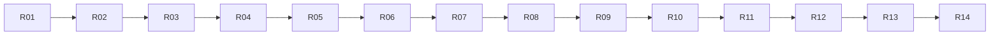

# 实施任务、交接记录与真实验收

状态：**R01–R13 真实验收通过，R14 未开始**。执行记录见 §7。
必须先读 [范围/B清单](frontend-backend-migration.md)、[对象](architecture-refactor.md)、
[状态机](execution-state-machines.md)、[记录路线](record-routes.md) 和 [协议](frontend-backend-protocol.md)。

## 1. 任务图与状态



| 编号 | 交付 | 状态 | 前置 |
| --- | --- | --- | --- |
| R01 | 基线与真实行为记录 | 真实验收通过 | 无 |
| R02 | 中立业务类型与依赖底座 | 真实验收通过 | R01 |
| R03 | 模型端口与 llm 适配 | 真实验收通过 | R02 |
| R04 | 普通工具与控制动作分离 | 真实验收通过 | R03 |
| R05 | Session / Run / 核心循环与统一提交 | 真实验收通过 | R04 |
| R06 | storage / 记录解码 / 恢复与历史投影 | 真实验收通过 | R05 |
| R07 | 会话控制、输入队列与交互协调 | 真实验收通过 | R06 |
| R08 | 子 Agent 与 MCP 生命周期收敛 | 真实验收通过 | R07 |
| R09 | 私有 IPC 与正式后端 | 真实验收通过 | R08 |
| R10 | 命令行切换协议路径 | 真实验收通过 | R09 |
| R11 | TUI 完全切换协议路径 | 真实验收通过 | R10 |
| R12 | 所有权、关闭与故障收尾 | 真实验收通过 | R11 |
| R13 | 删除过渡结构与安装交付 | 真实验收通过 | R12 |
| R14 | 最终真实验收与设计文档同步 | 未开始 | R13 |

可使用的状态：未开始、实施中、构建通过待真实验收、真实验收通过、受环境阻塞。
后续任务可以在必要的前置结构已经完成后继续推进，但不能把缺少真实证据的前置任务标成完成。
不默认委派子 Agent；实施者按本图顺序执行。

## 2. 通用执行规则

### 2.1 代码与构建

- `.hpp` 在 `src/public`，`.cpp` 在 `src/private`，不要在 temp 放检测程序或建立 demo 目标。
- 新目标仅限对象文档列出的正式库和后端二进制；不得创建 test、mock、smoke 或验收可执行目标。
- 全面重构分成可构建步骤；不得长期保留整套无法编译的移动代码。
- 按实际改动运行正式目标构建；不运行/扩充既有 test/tui，不清理它来扩大范围。
- 结构检查只针对本任务明确的依赖边界做一次；完成后不反复静态 review。
- 不靠“所有异常都吞掉”“所有操作都加锁”“所有方法都 virtual”达到构建通过。

初期构建：

```bash
cmake --preset dev
cmake --build --preset dev --target dagent -j2
```

后端目标建立后：

```bash
cmake --build --preset dev --target dagent dagent-backend -j2
```

### 2.2 临时过渡结构

R02 可以将原大 agent 链接集合临时命名为 `dagent_agent_legacy`，让最终 `dagent_agent` 先成为纯核心目标。
旧正式入口经一个明确兼容装配点使用新对象；逐任务迁走实现，禁止复制两套循环/策略算法。
中间的兼容头和类型别名仅用于旧调用点过渡，必须登记在 R13 删除清单。
协议路径接入时按代码/目标阶段切换正式入口，不新增用户可见 --legacy/--backend 选项，也不做失败自动 fallback。

### 2.3 实际运行材料

使用 `temp/refactor-equivalence/` 下的独立安装根、工作区、日志和记录文档。
模型配置从当前有效配置安全准备，不把真实密钥写进验收 Markdown 或工具输出；运行时显式设置 DAGENT_HOME 到临时根。
不修改、停止或重启现有模型服务。读不到模型或 MCP 时记录环境条件与未验项，不能编造成功。

验收只用正式 CLI、真实终端/PTY、真实模型、真实文件/进程和已配置 MCP。
可以保存提示词、日志、截图、实际输出及文件结果；不得创建模拟响应服务器、检测源码或断言脚本。
模型没有实际触发指定场景时，该场景仍未验证，应继续用真实输入完成，不能把文字承诺当作工具执行。

## 3. 逐项实施任务

### R01：建立基线

**读取：**主方案 §4、当前 AGENTS.md、CMake、CLI/UI/agent 入口。

**工作：**

1. 记录 HEAD、工作树已有改动和当前构建结果，不覆盖用户改动。
2. 在 temp 准备基线正式二进制、对应最小安装资源和独立数据库；保留后续对比所需材料。
3. 对 V01–V06 的适用基线场景真实运行，记录 stdout/stderr、退出码、实际工具调用与工作区结果。
4. 建立 B01–B28 到当前源码符号的映射；对 B06/B13/B23 单独记录容易漂移的语义。
5. 保存旧会话样本：普通工具、todo、压缩、子 Agent、正常结束与一次真实中断，不生成伪造数据库。

**完成条件：**正式目标可构建；基线行为和已存在限制明确；真实记录可供升级后读取。
**不得做：**修改业务逻辑、用模拟模型代替基线、直接拷贝未经脱敏的密钥到记录。

### R02：建立中立类型与核心依赖底座

**读取：**对象文档 §1–4；消息/Options/ToolSpec/Grant/View 当前定义。
**范围：**`src/*/agent`、`src/*/tools` 的公共类型、`src/CMakeLists.txt`。

**工作：**

1. 建立 Session/Run 身份、ModelRequest/Reply、ToolSpec、ResourceIntent、ExecutionGrant、ToolData 和核心端口。
2. 把 Message/Conversation 从具体 Model/ProviderConfig/HTTP 类型依赖中解开；请求构造使用中立参数。
3. 将 UI 展示字段中实际属于业务的事实迁入 ToolData；保持旧 View JSON 编码可适配。
4. 核心数据不含 exec/workspace/mcp/tui/sqlite 类型；完整映射原权限所需语义，不丢字段。
5. 建立最终 agent 纯核心目标，按 §2.2 处理暂时旧装配，保持原正式入口可构建。

**完成条件：**核心接口可独立包含/编译；没有 core→具体适配目标的依赖；旧入口仍跑真实简单回合。
**真实验收：**V01、V03 的基本模型和文件读取路径。

### R03：抽出 llm 适配

**读取：**对象文档 ModelSession 契约、状态文档 §4.2/§8.1。
**范围：**原 `agent/model.cpp`、`llm.cpp`、`provider*.cpp` 及对应头文件，新 `src/*/llm`。

**工作：**

1. 把网络请求、厂商编解码、流式累积、错误分类和重试迁入 llm；实现核心 ModelSession 端口。
2. 中立消息/工具描述/Usage 留核心；HTTP/SSE/凭据只在 llm/app 配置侧。
3. 保持当前 provider 支持、请求参数、reasoning/signature、工具参数累积、重试和取消语义。
4. 将模型配置分为公开描述与适配内部配置；UI 不依赖含 api_key 的 ProviderConfig。

**完成条件：**核心循环只能经 ModelSession 调模型；原 provider 支持不减少；临时兼容处已登记。
**真实验收：**V03、V07；至少使用当前实际可用 provider 完成带工具的回合，其余 provider 未运行须如实标示。

### R04：分离普通工具和控制动作

**读取：**对象文档 §5，状态文档 §5–7。
**范围：**`tools/tools.hpp`、普通工具实现、`tools/ask.cpp`、`tools/todo.cpp`、原 task 解析和 dispatch。

**工作：**

1. 普通 Tool/PreparedTool 使用核心契约，invocation 身份构造时确定；执行结果分离业务数据与显示转换。
2. 将 ask/exit_plan/todo/task 解析改为 ControlRequest；保留 Schema、名称、说明、顺序和原错误文本。
3. 建立 ActionCatalog 与 ControlActionExecutor，删除交互 Call 的错误占位 do_run。
4. 从调度器迁出问答次数、计划选项语义和计划状态更新；保留既有分组和原序提交算法。
5. Todo 返回计划替换事实，在原序提交时更新 Session 的 WorkPlan；不新增工具或修改只读/plan 的工具可见范围。

**完成条件：**普通 PreparedTool 都可执行；控制动作无需伪装普通 Call；dispatch 不解析问答选项或读取 TaskView 决定执行。
**真实验收：**V03–V05、V08 的可用部分；子执行暂经兼容委派端口，R08 收口。

### R05：重构会话与核心循环

**读取：**对象文档 §3/§6/§8、状态文档 §1–5/§8。
**记录契约：**记录路线 L03–L19 与 §5 提交原因；统一提交不能抹平不同路线的通知差异。
**范围：**原 agent.cpp/dispatch.cpp/conversation.cpp/compaction.cpp/permission.cpp，新的 Session/Run/TurnRunner。

**工作：**

1. Session 组合长期状态；Run 保存本轮阶段/预算/取消/结果；TurnRunner 只实现循环算法。
2. SessionCommitter 成为 user/assistant/tool/plan/compaction 修改的唯一入口，统一记录与通知。
3. 压缩计算候选变化，成功后提交；取消回滚与原摘要规则保持。
4. Policy 用窄控制能力支持现有权限档切换和快照，规则同步内不等待 IO/用户。
5. 删除循环对总括 Setup 的访问；只传 SessionConfig/RunOptions 与 RunServices。
6. 保持调用计数、grace、finish_reason、部分输出与 broken 行为。

**完成条件：**无外部直接写 Conversation/Plan；finish 只有一个收尾入口；循环中没有 UI/SQLite/HTTP 细节。
**真实验收：**V03、V04、V07、V09、V15；当前不新增协程/任务调度引擎。

### R06：分离 storage、恢复与历史展示

**读取：**对象文档 §8、状态文档 §8；当前 session schema 与 record payload。
**记录契约：**记录路线 §2 的全部字段、§6 的旧字段兼容、§7 的分页规则，以及 L20/L22。
**范围：**原 `session/session.*` → `storage`、原 `agent/record.*`。

**工作：**

1. 重命名存储职责与构建目标，保持当前数据库、schema 版本与记录 payload 不变。
2. 集中 RecordCodec：类型化解码/编码、旧字段兼容、错误分类只维护一处。
3. SessionRecovery 只重建执行状态与中断报告；HistoryProjector 只生成历史展示条目。
4. 为历史查询提供固定高水位分页；不开放新的用户功能，只支撑现有历史与子 Pane。
5. 显式 resume 获取可写所有权后，执行原崩溃闭合和 prompt 更新；浏览不调用它。
6. 旧 Todo View 恢复为 WorkPlan；协议/核心更名不改变历史数据。
7. 查询使用不初始化或修复数据库的只读连接；HistoryRead 保存跨页验证状态，在读完、关闭查询或连接关闭时释放，查询失败时释放该查询资源。

**完成条件：**没有一个函数同时恢复可写 Session 又重画 UI；不新增 runtime_* 表；R01 旧库可读可继续。
**真实验收：**V10、V11；核对浏览前后的记录数/updated 及模型/MCP日志。

### R07：把会话控制与交互从 UI 迁入 Runtime

**读取：**对象文档 §3、§6；状态文档 §2、§6、§9；B04–B14。
**记录契约：**记录路线 §8；同会话切模型复用 Controller 的写锁，候选准备与实际写入分阶段，内存原子替换不代表记录可回滚。
**范围：**新 runtime，原 Shell 队列/Agent 置换逻辑与审批 future 组织。

**工作：**

1. 建立 SessionController，移动普通输入 FIFO、recall、drain、new/resume/compact/switch_model 的业务流程。
2. 实现候选会话成功后替换、失败保留；用 generation 防止过时查询/操作落到新会话。
3. 按 B13 明确模型切换重置与保留字段；不把“保留临时授权”混入这次重构。
4. 建立 InteractionBroker 的一次性终结和排队；Core 只请求交互，UI 临时适配原对话框。
5. 取消/回答不经过被 run_turn 阻塞的业务队列；只读查询用独立线程，返回值快照。
6. B06 保持所有 TurnEnded 后 drain；busy 可用条件保持命令原有规则。

**完成条件：**UI 可暂时进程内调用 Runtime，但不再持 Agent/Setup 或写业务状态；该临时调用边界最终由 R11替换。
**真实验收：**V04–V06、V08、V12，尤其取消与回答、取回与出队的竞争。

### R08：整理单次子执行与 MCP 资源

**读取：**对象文档 §7、状态文档 §7；B18–B20。
**范围：**原 subagent、host、mcp_hub，runtime/SubagentExecutor 与工具 MCP 适配。

**工作：**

1. 用 DelegationContext 替代父 Agent& / current_turn()/完整 Setup。
2. ChildExecution 在原 task 组线程创建一次 Session/Run，父等待，结束统一回收。
3. 父当前权限快照在执行时取得；子名单、无 Asker 和显式 MCP规则保持。
4. MCP 连接通过显式 lease 保证寿命，目录更新不让仍被子快照引用的 Client 悬空。
5. 子事件带稳定来源身份，但存储 parent_id/agent_name 与原 TaskView 兼容。
6. 删除旧父对象窥探和隐式生命周期假设，不留下可再次运行的子对象句柄。

**完成条件：**单层单次委派完整；不增加 task.* 新工具；无 detached 子执行线程；父退出必 join。
**真实验收：**V13、V14；MCP环境不可用不得把该部分标为通过。

### R09：建立私有 IPC 与正式后端

**读取：**完整协议文档。
**范围：**protocol/ipc/backend、app 后端装配、CMake/安装目标。

**工作：**

1. 实现纯 DTO、RPC 方法/错误映射和独立字节传输；协议不能包含核心实现类型。
2. 添加 `dagent-backend --ipc-fd` 配套目标；socketpair 经直接进程启动传递，关闭多余FD，正确处理信号/进程组。
3. 实现 hello、initialize、shutdown，以及当前业务方法适配；不提供监听或共享服务入口。
4. 建立单一有序 Publisher/发送队列；跨线程事件不能交错写 JSON 行。
5. 启动配置和密钥只在后端解析；子进程环境继承保持。
6. 后端能够作为前端的正式子进程运行；不得为验证增加伪前端可执行目标。
7. 按协议 §4.2 固定请求结果；输入接受响应先于对应 TurnStarted。快照取值与通知序号分配使用同一短锁边界，等待发送容量在锁外完成。

**完成条件：**前端正式 launcher 可完成初始化与查询；后端无 TUI 依赖；协议与 Runtime 错误边界明确。
**真实验收：**V02 的查询/退出部分；模型执行在 R10验证。

### R10：命令行切换到客户端

**读取：**B01–B03/B25–B27、协议 §4/§8、当前 headless 输出。
**范围：**app 前端入口/CLI、headless 输出适配、client。

**工作：**

1. run/sessions/--list-models 都通过其独占后端；--help/--version 仍直接返回。
2. run stdin 合并、配置覆写顺序和 cwd 语义不变。
3. LegacyOutputCodec 将协议事件映射为原 text/json/jsonl，子事件恢复原 sub_event 包装。
4. 保留原 stdout/stderr、UTF-8 输出边界和退出码，RPC 包装不能出现在用户 stdout。
5. 信号和 jsonl 输出失败只取消本前后端对，不影响其他进程或模型服务。
6. 按 L05/L12/L17 核对实时事件差异：完整正文不重复增量，交互开始通知不强行落盘，finish 修补不新增旧 JSONL 的 ToolFinished。

**完成条件：**正式 run 经过 IPC完成真实回合；原 headless 不再直接构造 Agent。
**真实验收：**V01–V03、V07、V16；与 R01 按字段/实际副作用对比。

### R11：TUI 完全切换到客户端

**读取：**对象文档迁移对照、协议 DTO、B04–B14/B28。
**范围：**ui/shell、transcript、approval、status/side_panel、model_dialog、completion、app。

**工作：**

1. Shell 只持 Client、只读 DTO 和页面状态；删除 Agent、Setup、业务工作线程/stop_source。
2. 业务命令发请求；本地视图命令仍本地执行，busy 条件按 B 清单。
3. Transcript 分出 apply_live 与 append_history 语义，历史结束条目不触发当前 Run drain。
4. 计划/模式/模型/队列/MCP 标签来自后端快照与事件，不乐观写第二份业务真值。
5. 子 Pane 按 session/run/invocation 路由，仍只读；旧查询结果按 generation 防止错页。
6. 审批 DTO 覆盖原预览/联网/会话允许/反馈，回答只提交用户决定。
7. 项目/文件补全查询经后端；主题、滚动、折叠、输入草稿留前端；不改变冻结 TUI 原语。

**完成条件：**ui 不包含 agent/tools/storage/llm 实现头；dagent_ui 不链接这些目标；所有现有命令可实际使用。
**真实验收：**V04–V06、V08、V10、V12–V14；包含窄屏、主题与中文正文显示。

### R12：收敛进程所有权与故障收尾

**读取：**对象文档 §9、状态文档 §10、协议 §1/§2/§7。
**范围：**launcher、Runtime close、ipc、storage SessionWriteLease、现有 exec 清理接入。

**工作：**

1. 同一 session_id 的跨后端写锁在可写恢复前取得，FD 不传给工具，历史查询不取锁。
2. 配置模型添加使用短期写锁包围原重读/校验/原子写，保持原格式。
3. 正常 exit、socket EOF、SIGINT/SIGTERM、输出关闭走明确的单一清理流程。
4. 取消唤醒所有 Broker/队列等待，发送拥塞不阻塞控制接收。
5. 按顺序 join 子组、同步记录、关闭资源、释放锁；仅回收自己创建的后端。
6. 后端意外死亡不能让前端重发输入；下次恢复只用原历史事实。

**完成条件：**一对退出不影响其他对；双写被拒；正常关闭无本次受管后台执行残留；强退局限如实显示。
**真实验收：**V15–V19。

### R13：删除过渡路径并完成安装

**读取：**对象文档 §4/§10、R02开始维护的兼容删除清单。
**范围：**CMake、旧头/类型别名、旧入口、安装与文档路径。

**工作：**

1. 删除 dagent_agent_legacy、兼容头别名和直接进程内 UI/CLI 执行路径。
2. 删除旧 Agent 总括访问接口、错误占位 Call 和同时恢复/显示的 replay_into 入口。
3. 最终目标依赖严格符合对象文档；src/public 的共享 include 根不能成为跨模块偷用实现的理由。
4. 安装两个二进制和原 home 资源；dev 与安装根两种路径都能找到后端配套文件。
5. 不保留协议失败后直连核心的 fallback；不提交 temp 验收材料或密钥。

**完成条件：**正式目标分别构建；安装目录实际运行；过渡清单归零；无新增测试目标。
**真实验收：**V01、V02、V20。

### R14：完整验收与文档交接

**工作：**

1. 汇总下面 V 矩阵，不重复已在最终代码版本上通过且未受后续改动影响的场景。
2. 对受后续修改影响的场景做必要真实运行；不进行额外反复源码 review。
3. 对比 B 清单，记录每条的通过证据；未验证项标明实际原因，不用构建成功代替。
4. 更新 docs/design 的 agent/ui/app/session（重命名 storage 对应索引）/tools/llm 说明，新增实际 runtime/protocol 设计。
5. 更新 docs/README 构建/安装/运行说明；保留本组规格与任务状态，注明最终实现版本。
6. 汇总 L01–L23 的真实记录与输出证据；同一场景可覆盖多个路线，不另建模拟或断言程序。

**完成条件：**所有范围内项有真实通过证据；若受外部环境阻塞，必须明确报告未完成范围，不能宣称全计划完成。

## 4. 真实验收矩阵

| 编号 | 真实场景与判据 | 保持项 / 结构项 |
| --- | --- | --- |
| V01 | 正式目标构建；最终前端不链接执行/SQLite/MCP，后端不链接 TUI；无新 test/mock 目标 | D01/D07，工程约束 |
| V02 | 两个前端各自创建一个后端；help/version 不创建；退出一对不影响另一对 | 进程边界 |
| V03 | 实际 read/write/edit/bash/grep/glob 调用；工具结果与文件/命令结果一致 | B15/B17，D03 |
| V04 | 忙时发送多条输入、取回最后一条；斜杠面板立即分派；所有终态后 drain 语义保持 | B04–B06 |
| V05 | 审批允许/会话允许/拒绝/附带反馈/联网选项、撤销；没有前端自定 Grant | B08–B10，D03 |
| V06 | 空闲新建/恢复/切模型/plan/compact 与忙时条件；切模型失败保留旧状态，B13重置得到证据 | B07/B13/B14 |
| V07 | 真实模型流式正文/思考/工具参数、用户中断和预算耗尽；可真实触发时核实重试 | B16/B17/B22 |
| V08 | 实际 ask 多选/其他/取消和每轮上限；plan 三种选择；非交互方式不等待不存在的 UI | B09/B10 |
| V09 | 真实长上下文与手动压缩；压缩取消无半提交，历史恢复后消息配对正确 | B22，D04 |
| V10 | 浏览已结束子会话/旧会话，记录数/updated 不变；不创建模型/MCP | D05/B24 |
| V11 | R01真实旧库在新实现中读取与继续；实际中断恢复，不自动重复外部副作用 | B24 |
| V12 | TUI 实际输入/补全/滚动/鼠标/主题/窄屏/卡片/思考折叠；RPC不会污染终端 | B11/B12/B28 |
| V13 | 真实并发 task，父等待、子 Pane隔离、父取消传播、子无ask/task/exit_plan | B18/B19，D08 |
| V14 | 已配置真实 MCP 的连接、工具发现、调用、子快照；对本次验收拥有的MCP进程验证断连清理 | B20，生命周期 |
| V15 | 独立 temp 安装根的真实存储不可写场景；broken 一次提示、当前回合按 B23继续 | B23 |
| V16 | run text/json/jsonl 的真实 stdout/stderr、退出码、stdin、SIGINT、输出管道关闭 | B01/B25/B26 |
| V17 | 在模型请求、工具执行、审批等待期间分别退出前端；后端取消、记录收尾和等待解除 | 退出/取消 |
| V18 | 真实运行中终止本次后端；前端不重发，显式 resume 标识未知结果，不重跑工具 | B24，进程边界 |
| V19 | 第二个后端尝试恢复同一活跃 session_id 被拒，纯历史读可用；锁随所有者退出释放 | 写入所有权 |
| V20 | 正式安装到 temp 独立根，不依赖源码cwd；两个二进制、主题/提示词/模型配置和历史正常 | B02/B03/B27 |

MCP/模型异常场景只操纵本次验收创建且有权限操作的资源；不要为了制造失败重启用户正在运行的服务。
若真实环境无法可靠制造某种重试/服务失败，标明未验条件；不写模拟服务器来补齐。

## 5. 证据与交接格式

每个任务完成后追加以下短记录到本文件对应任务后的执行记录区，实际材料放 temp：

- 任务号、状态、代码版本与必要的工作树说明。
- 修改的职责/接口以及已删除的旧结构。
- 正式构建命令与结果。
- 实际运行命令或人工终端操作、session_id/相关真实调用、退出码/真实文件结果。
- 覆盖的 B/V/L 编号与证据路径；涉及记录路线时写明实际记录类型、序号关系、通知与恢复结果，不记录密钥。
- 未完成项、环境限制、下一任务。

不创建自动断言程序来填写此表；命令结果、真实记录和实际文件就是证据。
临时材料可以被清理，因此现状设计文档只记录稳定契约和验收结论，不让产品功能依赖 temp 文件。

## 6. 回退与完成判定

- 每阶段保持正式入口可构建；若某阶段失败，修复该阶段，不跳过其结构条件宣称进入下一完成状态。
- 本次保持数据库 schema 和 payload，文件名/命名空间重构不是数据迁移。若实施发现必须改 schema，先证明现有格式无法承载原能力并更新规格，不能直接增加任务系统表。
- 旧版与新版不能同时写同一会话；新写锁不能约束不认识锁的旧二进制。对照验证使用独立 temp 安装根。
- 回退前停止本次进程，保存实际数据库副本；有 WAL 时使用一致备份/静止 checkpoint，不仅复制主数据库文件。
- 最终状态必须同时满足 D01–D08、B01–B28、L01–L23、V01–V20 和 R13删除清单；模型文本声称完成不构成证据。

## 7. 执行记录

### R01：基线与真实行为记录 — 真实验收通过（2026-09-22，版本 d614700）

- 状态：真实验收通过。工作树仅含 docs/README.md 用户改动与本目录新增；无源码改动。
- 构建：`cmake --preset dev && cmake --build --preset dev --target dagent -j2` 通过。
- 材料：基线二进制 `temp/refactor-equivalence/baseline/dagent`；一致数据库备份
  `temp/refactor-equivalence/baseline/dagent-baseline.db`（76 sessions / 1475 events，含子会话、todo、多模型样本）；
  CLI 输出 `temp/refactor-equivalence/logs/r01-cli-baseline.txt`；记录文档 `temp/refactor-equivalence/r01-baseline.md`。
- 真实运行：--version/--help/--list-models/sessions 通过（exit 0）；run 因本地模型服务不可达失败
  （retry 1/2、2/2 后 ✗，exit 1）；deepseek key 服务端 401。
- 覆盖：B01/B02/B16/B25/B26 的 CLI 侧证据；B01–B28 → 源码符号映射完成；B06/B13/B23 易漂移语义单独记录。
- 压缩样本：基线库中 prune/compaction 记录为 0（初始环境无可用模型，无法真实产生压缩历史，曾如实标为缺口）。
  本地 qwen3.8（127.0.0.1:10009）恢复可用后已补：在 temp 独立安装根用小窗口模型配置真实触发自动压缩，
  产生 prune + compaction（含真实模型摘要）与 prune + compaction（空摘要退化丢弃）两组记录，
  并以 run --resume 二次读取验证摘要前缀/占位配对恢复（见 R03 记录的运行材料）。R01 缺口关闭。
- 未验项：无（V03–V07 等依赖模型回合的场景在 R02/R03 期间已用恢复的本地模型补做）。
- 下一任务：R02（已完成）。

### R02：中立业务类型与依赖底座 — 真实验收通过（2026-09-22，版本 d614700 + 工作树改动）

- 状态：真实验收通过（V01、V03 基本模型与文件读取路径；V03 的 read/write/bash 工具结果与真实文件内容一致）。
- 新增中立类型（src/public/agent/）：identity.hpp（SessionId/RunId/InvocationId/InputId/InteractionId）、
  reply.hpp（Usage/Finish/StreamEvent/Reply/RetryOptions/RetryInfo/ModelError）、tokens.hpp（estimate_tokens/TokenEstimator）、
  message.hpp 内 ToolSpec（=ToolDef 统一）与 ModelParams、tool_data.hpp（View 全部分支 + ToolResult(model_text/is_error/
  interrupted/display/signals) + ExecutionSignal(McpDisconnected) + to_json/view_from_json）、intent.hpp（ToolKind/
  ResourceIntent/CommandIntent/PreparedIntent）、grant.hpp（SandboxProfile/GrantSource/ExecutionGrant/SandboxSupport/
  SandboxConfig）、public_model.hpp、ports.hpp + port_model/port_journal(RecordError)/port_store/port_interaction。
- 解耦：Conversation::build 参数 ProviderConfig→ModelParams；events.hpp 不再依赖 tools/llm/net；
  Policy 输入改为 PreparedIntent/ExecutionGrant/SandboxSupport（dangerous/known_readonly 由 tools 侧用原 exec 函数算好，
  核心不重写白名单）；bash 的完整 exec::Analysis 只留在工具实现，核心只见 CommandIntent 摘要。
- View JSON 编码迁至 agent/tool_data.cpp（namespace 变化，字段与 kind 名称逐字节不变）；tools/view.hpp 删除，
  各处改用 agent::ToolData 类型。
- 目标拆分：dagent_agent 纯核心（tokens/tool_data/conversation/events/permission，仅链 dagent_base）；
  dagent_agent_legacy 过渡装配（compaction/mcp_hub/prompt/record/host/subagent/agent/dispatch/headless，
  R13 删除清单：该目标本身 + Setup 大对象 + Agent::current_turn/setup() 等）。
- 结构检查：纯核心头文件无 exec/workspace/mcp/tui/sqlite include。
- 真实运行：正式 dagent 构建通过；--list-models 输出与基线一致；run --resume（R01 基线旧库
  01a0c374…e1b598）完成历史读取、配对校验、system/user/turn_end 追加（seq 18–20，payload 形状不变），
  模型不可达时 retry/退出码 1 与基线一致。
- 模型恢复后补验：真实 qwen3.8 回合中 read 工具真实调用且结果与文件内容一致（V03 文件读取路径）。
- 覆盖：V01、V03（基本模型与文件读取）；B01/B25 的 CLI 侧回归；B23 旧库读取兼容证据。
- 未验项：无。
- 下一任务：R03（已完成）。

### R03：抽出 llm 适配 — 真实验收通过（2026-09-22，版本 d614700 + 工作树改动）

- 状态：真实验收通过（V03：openai-chat provider 真实带工具回合；V07：流式正文/工具参数累积、
  SIGINT 中断 exit 130、预算耗尽 failed 路径；可真实触发时核实了自动压缩与退化）。
- 迁移：agent/{model.cpp,provider*.cpp,llm 编解码} → 新 dagent_llm 目标
  （src/private/llm/{model,provider,provider_chat,provider_anthropic,provider_ollama}.cpp）；
  头文件 src/public/llm/{provider,provider_detail,codec,model,llm}.hpp。
- 端口实现：llm::Model 实现 agent::ModelSession；Agent/Compactor 经端口调模型（不再直接依赖 Model/Codec）；
  make_session 工厂持有 HTTP 调整与重试参数。
- 配置拆分：agent::PublicModel（公开描述，无凭据）进 Setup.provider；llm::ProviderConfig（含 api_key）
  只在 app 装配与 llm 内部；Setup 删除 http 字段；llm::to_public 为唯一公开视图映射。
- UI 解耦（R03.4 达成）：ui 头与实现已不包含任何 llm/ 头或 ProviderConfig。表单输入用
  agent::ModelInput（credential 仅此次请求可写）；provider 种类元数据用 agent::ProviderKindInfo
  （kind/default_base_url/needs_credential，由装配层从 llm::providers() 抽取）；UI 的模型列表与
  选择结果只持有 PublicModel + ModelSession（ModelSelection）。凭据到内部配置的转换只在
  main.cpp 装配的 add_model 回调内发生。
- 子 Agent 继承路径修正：def.model 为空时直接继承父的 provider/model_session（随 Setup 拷贝），
  不再查 host 的模型表——避免「UI 运行中新增模型后切换，子 Agent 继承查表失败」的回归；
  def.model 非空（显式配置）仍从 host 表解析（重启用后生效，与 B18 显式配置语义一致）。
- AgentHost 增加模型工厂注入（子 Agent 模型选择经 host->make_model_session）。
- 依赖修复：provider_ollama.cpp 不再借用 session::new_id()（依赖方向违规），改为 llm 内部生成运行时调用前缀
  （运行时 ID 格式不受 B 清单约束）。
- 结构检查：dagent_llm 仅依赖 agent/net/base；src/public/ui 与 src/private/ui 无 llm/ 引用；
  原 provider 支持不变（openai-chat/anthropic/ollama）。
- 真实运行（temp 独立安装根 + 本地 qwen3.8）：
  - read 工具回合：结果与文件内容一致，流式正文经 codec 累积正常；
  - write + bash 回合：write 创建文件内容一致，bash cat 输出一致（V03）；
  - run --output json：字段 session_id/status/error/result/steps/tool_calls/usage/duration_ms 保持（B25）；
  - SIGINT 中断 bash 运行：exit 130，✗ 工具标记（B26/V07）；
  - 小窗口自动压缩：真实触发两次——第一次 prune+compaction（模型真实摘要成功落盘）、
    第二次 prune+compaction（空摘要 → 丢弃前缀退化，符合记录路线 §2）；单工具批次在保护区时
    「No older history can be safely compacted」拒绝路径亦真实触发（B22 行为保持）；
  - 压缩会话 run --resume：读取含 prune/compaction 的历史、配对校验通过、摘要前缀重建、
    system/user/turn_end 追加（seq 19–21）。
- 覆盖：V01、V03、V07（可触发场景）、V09（压缩与恢复部分）、V11；B02/B16/B25/B26 装配与运行侧回归。
- 未验项：V07 的 retrying 展示（需服务端瞬时故障，未真实制造）；V13/V14 子 Agent/MCP 场景属 R08。
- 下一任务：R04。

### R04：普通工具与控制动作分离 — 真实验收通过（2026-09-22，版本 d614700 + 工作树改动）

- 状态：真实验收通过（V03 六工具真实回合；V05 非交互审批缺失路径；V08 todo/ask/exit_plan 的
  非交互与每轮上限路径；工具顺序与 baseline 一致）。
- 新增核心契约：agent/action.hpp（PreparedTool：invocation 身份构造时固定、只读 intent、execute 接
  Grant/输出/stop）、agent/control.hpp（AskRequest/PlanConfirmation/PlanReplacement/DelegationRequest
  的和类型、固定 Schema 与 ControlActionExecutor）、agent/catalog.hpp（ActionCatalog：内置顺序 +
  控制动作 + 动态 MCP）、agent/port_tool.hpp（ToolSession）、agent/port_delegation.hpp
  （DelegationChannel，R08 换 SubagentExecutor）、agent/work_plan.hpp（WorkPlan 整份替换）。
- 删除旧结构：tools/ask.cpp、tools/todo.cpp（InteractiveCall 的错误占位 do_run 与 todo 普通工具）、
  tools/detail.hpp 的 make_todo/ask/exit_plan_tool、ToolKind 的 ask/exit_plan/task 分支、
  Policy::matches_session/evaluate/remember 与 parallel 的控制动作特判、approval.cpp 的控制动作
  预览分支；dispatch 不再按工具名解析问答选项、不读 TaskView、不直接改 policy/plan。
- 实现：agent/action.cpp（execute 唯一异常边界）、agent/control.cpp（解析与执行、ask 计数、
  exit_plan 三选项语义、todo 计划替换事实、task 摘要）、agent/catalog.cpp（prepare 与未知工具
  文本）；tools::ToolSession 适配 Registry+Context；todo 结果 text/view 与 baseline 逐字一致。
- 正式构建：`cmake --preset dev && cmake --build --preset dev --target dagent -j2` 通过。
- 真实运行（temp/refactor-equivalence/home-r04-run，本地 qwen3.8 127.0.0.1:10009，workspace-r04）：
  - V03 六工具回合（logs/r04-tools-v03.{out,err}，session 01a0c91d…）：write→read→bash cat→edit→
    bash cat→grep→glob 全部 ✓；磁盘 hello-r04.txt 最终为 hello-r04-edited，与 tool 记录
    （read 显示 hello-r04、edit 显示 +1 −1、grep 命中、glob 列表）一致；记录序列 system/user/
    assistant/tool_started/tool/turn_end 与 L06/L08 一致，todo 有 tool_started、ask/exit_plan 无。
  - V08 todo（session 01a0c91e-6fe7）：tool text「Plan updated: 0/2 done.」view.kind=todo，无额外
    plan 记录（L13）。
  - V08 ask 非交互（01a0c91e-8376）：「Non-interactive run: cannot ask the user.…」is_error，
    view.kind=ask；四连调用（01a0c91e-cf6d）第 4 次得到「Question limit reached for this turn.…」。
  - V08 exit_plan：--plan 非交互（01a0c91f-10c2）得到「Non-interactive planning run: the plan cannot
    be confirmed.…」；非 planning（01a0c91f-2f28）得到「exit_plan is only available while planning.」
    且无 display（与 baseline 分支一致）。
  - V05 非交互审批缺失：`--permissions ask` + mkdir（01a0c91f-581e）→ 工具未执行、目录未创建，
    tool 记录为 T7「This call requires user approval: …no interactive approver…」is_error，未写
    permission 记录。
  - 工具顺序：请求体（logs/r04-proxy-bodies.jsonl）为 read、write、edit、bash、grep、glob、todo、
    ask、exit_plan、task，与 baseline 一致；say-hi 回合新旧 exit 0（logs/r04-{new,baseline}-sayhi.txt）。
- 结构检查：dispatch 无 do_run/ask 选项解析/TaskView；questions_this_turn_ 只在 control.*；普通
  PreparedTool 全部有 do_execute。
- 2026-09-22 审查修复：重新 prepare 和重新判权后重算并行类别，避免前序 task 改变准备依赖时使用旧类别；
  未知工具恢复为直接记录错误、不拆开待执行组。正式构建通过；这两个边界依代码路径核对，尚无模型恰好生成该
  并行批次的真实样本，不能把普通工具回合作为这两个边界的运行验收。
- 覆盖：V03、V05（非交互路径）、V08（非交互路径）；B09/B10/B15/B21；L06/L08/L12/L13。
- 未验项：V04/V05/V08 的交互（允许/会话允许/拒绝/反馈、问答多选/其他/取消、plan 三选项）需要真实
  TUI 对话框，按任务图归 R07 真实验收；子执行暂经 LegacyDelegation，R08 收口。
- 下一任务：R05。

### R05：Session / Run / 核心循环与统一提交 — 真实验收通过（2026-09-22，版本 d614700 + 工作树改动）

- 状态：真实验收通过（V03、V07、V09、V15；R04 的 V03/V08 场景在新结构上重跑一致）。
- 新增核心对象（dagent_agent 纯核心目标内，只依赖 dagent_base）：
  - agent/session.hpp+cpp：SessionConfig（已解析配置，沙箱只留中立 SandboxSupport/SandboxConfig）、
    Session（Conversation/WorkPlan/Policy/ModelSession/ToolSession 引用/Compactor/Estimator/
    ControlActionExecutor/SessionCommitter；build_request、request_shape、estimated_tokens、
    next_invocation_id、begin_run/end_run、snapshot）。
  - agent/committer.hpp+cpp：SessionCommitter 成为 user/assistant/tool/partial/审计/压缩/收尾/
    lifecycle 的唯一提交入口，按 L03–L20 固定路线顺序执行，broken/error 唯一持有并只通知一次。
  - agent/record_codec.hpp+cpp：记录 payload 唯一编码入口（字段与 schema 不变）。
  - agent/run.hpp：Run（kind/id/phase/steps/calls/usage/grace/stop_source，begin 绑定外部取消链，
    finish 一次性返回 RunOutcome）。
  - agent/run_services.hpp：RunServices（Sink/Approver/Asker/DelegationChannel/SessionResources/
    stop）与 SessionResources（MCP 步骤边界、断连文本、收尾通知）+ ResourceError（核心不引用 MCP 类型）。
  - agent/turn_runner.hpp+cpp：阻塞循环算法与唯一 turn 收尾 finish；compact 走同一 Run 收尾约束。
  - agent/dispatch.hpp + dispatch.cpp 移入核心：ActionDispatcher 不再写对话/计划/记录，全部经提交器；
    MCP 断连文本经 SessionResources。
- 压缩改造：Compactor 只读会话并在副本上计算 CompactionChange（候选 Conversation/pruned/keep_from/
  summary/discarded/before/after/limit），成功后由 SessionCommitter::commit_compaction 一次安装并
  按原顺序写 prune/compaction、发 Notice/Compacted/ContextUpdate；取消/超窗仍抛原 ModelError。
- Policy：规则容器与模式快照共用一把短锁，session_grants/revoke 可跨线程调用，锁内不等待 IO/用户。
- Agent 收敛为兼容装配点：只装配工具/MCP/子 Agent 环境、打开 JournalWriter（record.cpp 的
  SessionJournal 适配 SQLite Writer）、把 TurnContext 转成 RunServices 并调用 TurnRunner；
  旧 UI/headless 接口（create/resume/create_child/run_turn/compact/权限控制/meta）保持不变。
  record.hpp 的 Recorder 已删除；控制动作 commit 从 ControlActionExecutor 移除（L13 由提交器完成）。
- 删除/迁移：dagent_agent_legacy 只剩 mcp_hub/prompt/record/host/subagent/agent/headless；
  dispatch.cpp、compaction.cpp 归核心目标；循环不再访问 Setup（只传 SessionConfig/RunOptions/RunServices）。
- 正式构建：`cmake --preset dev && cmake --build --preset dev --target dagent -j2` 通过。
- 真实运行（home-r04-run，本地 qwen3.8 10009，workspace-r04）：
  - V03 六工具回合（logs/r05-tools-v03.{out,err}）：write/read/bash/edit/bash/grep/glob 全 ✓，
    磁盘 hello-r04-edited 与 tool 记录一致；记录序列与 R04 相同。
  - V07 中断：SIGINT 得 exit 130；模型已有正文时落「正文+[response interrupted by the user]」的
    assistant（L15）与 interrupted turn_end（01a0c933）；工具未出结果时同样 interrupted（01a0c934）。
  - V09 压缩：home-r05-compact2 真实触发自动压缩（t3）：prune ordinals [2,6] + compaction
    keep_from=9（真实模型摘要 864 字符），日志「12544 → 9435 tokens，裁剪 2 条，已摘要」；
    随后 --continue 第四轮成功读取压缩历史并继续（seq 23–26 system/user/assistant/turn_end）；
    home-r05-compact 另一组为摘要失败退化「6982 → 5285，丢弃 4 条」（原 Notice/Compacted 语义）。
  - V15 记录写入失败：另一进程持 SQLite EXCLUSIVE 锁期间追加 assistant → 「database is locked」
    进入 broken，stderr 只出现一次「subsequent content will not be saved」，当前回合继续并正常输出，
    记录停在该轮 user（logs/r05-broken.{out,err}，B23）。
  - R04 回归：todo/ask 非交互/exit_plan(--plan) 文本与 R04 逐字一致；task→explore 子会话
    parent_id/agent_name、父 TaskView 记录正常（L02/L14）。
  - B25 回归：run --output json 字段与 jsonl 事件形状不变。
- 结构检查：Conversation 只由 SessionCommitter 修改（record.cpp 的 replay 校验副本除外）；
  run.finish 只在 TurnRunner 的 turn/compact 收尾调用；核心 .cpp 无 tools::/sqlite/HTTP/tui 引用；
  TurnRunner 只经 Session/Run/RunServices 工作。
- 2026-09-22 审查修复：把外围 Setup 移到 setup.hpp，核心 Options 只留中立运行值；会话元信息由核心
  SessionMeta 定义，storage::Meta 保留同类型兼容别名，SessionStore 打开写入器只接收核心值/会话 ID；
  shell 分析版本由兼容装配注入 SessionConfig。Session 不再返回可写 WorkPlan。Run 在审批、问答、
  子任务组与收尾实际进入相应阶段，phase 用原子值供将来的只读观察。options/session/port_journal/
  port_store 这些核心头与 session.cpp 不再包含 storage/exec/tools/workspace/mcp 具体头；正式构建通过。
- 修复后真实运行（temp/r05-repair）：独立安装根下的 write→read 回合 status=done、2 次工具调用，
  hello.txt 为 `R05-repair`，两条 tool 记录与磁盘一致；同一 session resume 后再 read 成功、追加第二条
  turn_end。另真实触发 task→explore，生成带正确 parent_id 的子会话；子会话因 headless 审批不可用以
  denied 结束，故只证明委派/子会话路径可用，不计为子任务完整成功验收。
- 覆盖：V03、V07、V09、V15；B17/B21/B22/B23/B25；L03–L19。
- 未验项：V04（忙时输入/取回/drain）与交互问答/审批仍是 UI 行为，归 R07；Session::snapshot 只在
  执行线程即时读取，R07 的 SessionController 负责向跨线程查询发布同步快照；V07 的 retrying 展示同 R03；
  V13/V14 子 Agent/MCP 完整路径归 R08。
- 下一任务：R06。

### R06：分离 storage、恢复与历史展示 — 真实验收通过（2026-09-22，版本 d614700 + 工作树改动）

- 状态：真实验收通过（V10、V11；旧库继续、真实崩溃闭合、只读浏览与只读查询行为）。
- 模块重命名：`src/public/session/session.hpp` → `storage/storage.hpp`、
  `src/private/session/session.cpp` → `storage/storage.cpp`，namespace `dagent::session` →
  `dagent::storage`、`SessionError` → `StorageError`，目标 `dagent_session` → `dagent_storage`
  （link dagent_agent 以使用端口）。数据库 schema、user_version、记录类型与 payload 均未改变，
  未新增 runtime_* 表；会话锁文件在安装根 `.runtime/session-locks/<id>.lock`。
- RecordCodec（agent/record_codec.*）：编码保持原字段；新增 10 类记录的集中类型化解码
  （system/user/assistant/tool_started/tool/permission/permission_revoked/prune/compaction/turn_end），
  旧字段兼容保持（system.model、reasoning_signature、usage 可缺省；protect_sensitive_names 缺失为
  false；旧 permission 只要求原 call_id/answer/rule/network；crashed→failed 与错误文本映射一处）。
- SessionRecovery（agent/recovery.*）：只重建 Conversation、WorkPlan（旧 Todo View）、最近模型、
  next_ordinal、unfinished/open_calls、高水位；应用 prune/compaction；在副本上做崩溃闭合校验；
  不执行工具、不调模型、不写库、不发事件。
- HistoryProjector + HistoryCursor（agent/history.*）：每记录产生 0/1 条 HistoryItem
  （system/user/assistant/tool_started/tool/turn_end）；跨页只保存 ordinal/角色/开放调用/裁剪目标
  等必要元数据，校验 ordinal 连续、工具配对、prune 目标与 compaction 安全切点。
- storage 新能力：`open_store` 返回 SessionStore 实现（read_records/max_seq/open_writer_create/
  open_writer_resume）；JournalWriter 实现（SqliteJournal）从 record.cpp 移入 storage；
  只读连接不 initialize/不修复/不重命名损坏库；SessionWriteLease（flock，同进程按路径复用，
  跨进程冲突报 in_use，CLOEXEC，不 unlink）；HistoryRead 固定高水位分页（每页最多扫描 100 条、
  游标不透明、无显示项也推进、读完/close/失败即释放、已释放返回 invalid_state）。
- record.cpp：删除 Recorder 与 replay_into；新增只读 `project_history`（HistoryRead 分页 +
  HistoryItem→旧实时事件），不恢复 Session、不构造模型/MCP。Agent::resume 改为：取得写租约 →
  store 读取全部记录 → SessionRecovery → 打开 resume Writer → 崩溃闭合 → 校验 → 追加 system。
  TUI 的启动恢复与 /resume 先调 project_history 再显式恢复；子 Pane 浏览只用 project_history。
- 正式构建：`cmake --preset dev && cmake --build --preset dev --target dagent -j2` 通过。
- 真实运行：
  - V11 旧库（R01 基线一致备份 76 sessions/1475 events，home-r06-old）：`run --resume
    01a0c374…b598`（cwd /home/jyt/DAgent）读取旧历史并继续，追加 system/user/assistant/turn_end
    （seq 18–21；二次恢复 22–25），exit 0；记录字段形状不变。
  - V11 崩溃闭合：两次真实 kill -9——(a) 工具已结束但无 turn_end：恢复写入 crashed turn_end
    （seq 5）与新 system，未重跑工具；(b) 工具执行中崩溃（assistant tool_calls + tool_started 无
    tool）：恢复写入 kCrashed 结果（summary「Recover interrupted bash」，is_error/interrupted）
    + crashed turn_end + 新 system，stderr 无该命令再次执行（L20）。
  - V10 只读浏览：tmux 真实 TUI 恢复父会话后 ctrl+a 打开 Agent 视图并进入 `task · explore`
    Pane；Pane 显示子会话历史（read/glob 卡片与正文）。子会话 events=10、updated 不变；进程日志
    无模型调用；父会话只新增显式恢复的 system 记录（L21/L22）。
  - 只读查询：无数据库时 `sessions` 输出 no sessions、exit 0 且不创建数据库；损坏数据库直接报
    `file is not a database`、exit 1，文件未被重命名（不修复）。
  - 写租约：另一进程正在恢复同一 session 时，第二个进程启动即报
    `session … is already in use by another process`，exit 1；持有者不受影响。
  - 回归：home-r05-compact2 含 prune/compaction 的会话 `--continue` 正常（摘要信息保留）；
    六工具回合 V03 结果与文件一致。
- 结构检查：无函数同时恢复可写 Session 又重画 UI（Agent::resume 只恢复；project_history 只投影）；
  Recorder/replay_into 已删除；src 无 session 命名空间/旧目标残留；storage 查询不取写锁。
- 覆盖：V10、V11；B21/B23/B24；L01/L02/L20/L21/L22 的核心实现；D05。
- 未验项：协议层的 history/history_close 分页与 invalid_state 映射属 R09/R11；V19 的完整双后端
  场景属 R12（本任务已验证同 session 跨进程拒绝写入）。
- 下一任务：R07。

### R07：把会话控制与交互从 UI 迁入 Runtime — 真实验收通过（2026-09-22，版本 d614700 + 工作树改动）

- 状态：真实验收通过（V04–V06、V08、V12；V13 的并发/取消/子 Pane 与 MCP 场景在同一实现中由 R08 收口）。
- 新增 runtime 目标（`src/public/runtime/`，只依赖 dagent_agent）：
  - `controller.hpp/cpp`：SessionController——当前 Session 实例与写租约、普通输入 FIFO、recall、
    串行执行线程、一个当前操作与 generation；new/resume/select_model/add_model/compact 作为命令
    只在空闲入队，取消/权限档/plan/撤销走即时路径；Run 在输入真正出队时创建，TurnEnded 在提交器
    通知前先把状态置回 ready（B06 drain 语义不变）。
  - `interaction.hpp/cpp`：InteractionBroker——pending → answered/cancelled 一次性终结、单模态排队、
    取消唤醒等待；回答/取消不经业务队列（状态机 §6）。
  - `runtime.hpp/cpp`：Runtime 外观（快照、控制操作、异步只读查询线程、事件/交互出口）与
    SubagentExecutor（R08）。
  - `factory.hpp`：SessionInstance / SessionFactory / ConfigurationGateway / QueryGateway /
    HistoryReader 端口；`agent/port_lease.hpp` 让 runtime 只持有写租约寿命。
- 新增 app 装配目标（`dagent_app_config`）：`app/Assembly`（原 host，去掉审批仲裁）、
  `app/SessionAssembly`（原 Agent 的 create/resume/切模型/子会话装配）、`app/Configuration`
  （模型清单/添加/解析）、`app/QueryGatewayImpl`（列表/历史分页/项目/补全）、`app/Bootstrap`
  （共享的 Setup/model factory/权限初值）、`app/prompt`、`app/history`；config.cpp 归 app_config。
- UI 迁移：Shell 只持 Runtime 与只读快照（id/模型/模式/planning/队列/MCP/trigger/window），
  删除 pending_/drain/recall/Agent 置换、jobs/io 工作线程、agent_mutex_、approve/ask future 组织；
  审批/问答改为实现 runtime::Frontend（interaction.requested/closed）；列表/历史/项目/补全经
  查询回调；空输入上键取回、斜杠命令按原 busy 条件立即分派保持不变。
- 删除/退出：`agent/host.hpp/cpp`、`agent/prompt.*`、`agent/record.*`、`agent/mcp_hub.*`、
  `agent/subagent.*`（后两者为 R08 内容，随同一次结构收敛删除）；UI 的 Agent/Setup/工作线程。
- 正式构建：`cmake --preset dev && cmake --build --preset dev --target dagent dagent-backend -j2` 通过。
- 真实运行（home-r07，workspace-r07，本地 qwen3.8，TUI/tmux）：
  - V04：忙时 `queued-one`/`queued-two` 排队显示 `⇡ 2 queued`；上键取回最后一条后原序执行
    （logs/r07 会话与 temp/refactor-equivalence/r07-r09-runs.md）。
  - V05：write 审批 `allow_session`（permission seq 3）；`/permissions` 撤销（permission_revoked seq 17）
    后重新弹窗；`e`+反馈 → `deny_with_feedback`（seq 23），模型按反馈停止。
  - V06：`/new`、`/sessions` 恢复、`/model` 切到 deepseek-flash（同一 session_id、Transcript 保留、
    权限档保持）再切回、`/compact`（记录 seq 40 compaction，界面 `compacted 4559 → 4221`）；
    忙时 new/model/compact 仍被拒。
  - V08：ask 多选真实记录 `selected:[0,1]`（seq 29）；exit_plan 选 1 后 ModeChanged 到 workspace、
    planning 关闭（seq 34）；非交互/上限路径沿用 R04。
  - V12：窄屏、主题预览、思考折叠与工具卡片保持；UI 不再含 agent/tools/storage/llm 头。
- 覆盖：V04/V05/V06/V08/V12；B04–B10、B13/B14；L01–L05、L12/L13、L21/L22 的 UI 侧。
- 审查修复（2026-09-22）：执行线程只从队首 `ready=true` 的输入出队，使 input.submit 的接受响应
  先于 TurnStarted；命令的空闲检查和入队合为同一锁边界，待执行命令占用空闲入口，普通输入不能越过
  new/resume/select/add/compact。成功安装候选后调用一次命令完成回调；model.add 保存成功但切换失败
  时回报已保存模型及 selection_error。构建通过，修复后的真实协议回合见 R09 补充记录；这些竞争
  交错与命令成功 RPC 尚未用独立真实样本逐项触发。
- 未验项：V05 的「允许并联网」（本轮未产生需要网络的命令）；V12 的滚动/鼠标细节沿用冻结原语未重测；
  切模型失败保留旧状态的失败分支未用真实失败候选触发（候选准备路径按 R06 的 lease/校验）。
- 下一任务：R08（已完成）。

### R08：整理单次子执行与 MCP 资源 — 真实验收通过（2026-09-22，版本 d614700 + 工作树改动）

- 状态：真实验收通过（V13、V14：真实并发 task、父等待/取消传播、子 Pane 隔离、真实 MCP 调用与
  断连重连/不可用、显式子 MCP 快照、退出清理）。
- 子执行：`agent/port_delegation.hpp` 新增不可变 `DelegationContext`（父 session/run/call、执行时
  权限快照、父工具名单、模型名、父 Sink/Approver、stop），由 ControlActionExecutor 在调用时构造；
  `runtime/SubagentExecutor` 在 task 组线程创建 ChildExecution（子 SessionInstance + 子 Run），
  父等待结果，作用域结束统一回收，不残留可再运行句柄、无 detached 线程。
- 子审批：`derived.may_ask` 时包装父 Approver（带 agent/origin_call_id），经同一 InteractionBroker
  单模态排队；子 Asker 恒空；子默认工具名册/显式 MCP 规则与 B18 一致（默认去 task/ask/exit_plan
  与未显式允许的 mcp__*）。
- MCP 资源：hub 移入 tools（`tools/mcp_hub.hpp`），状态值改为核心 `agent::McpServerState`；
  MCP 工具项持有 `shared_ptr<mcp::Client>`，注册表快照本身就是显式 lease：目录刷新/重连不再让
  子快照引用悬空；连通性回调标志改为 Client 与被引用者共享的 `shared_ptr<atomic<bool>>`。
- 删除：`agent/subagent.*`（派生/兼容委派）、`agent/mcp_hub.*`、`agent/host.*`；`Agent` 兼容点改为
  经 app::SessionAssembly + runtime::SubagentExecutor 工作（headless 暂用，R10 走协议后 R13 删除）。
- 正式构建：同 R07 命令通过。
- 真实运行（home-r07/home-r08）：
  - V13：同一消息两个 explore task 并发（父会话 01a0c980 seq 21/22），Esc 取消父 Run → 子未完成项
    `interrupted=true`、父 turn_end interrupted；implement 子会话 01a0c988… 两次子 host_access 审批
    串行弹窗后创建 child-created.txt，父结果携带子结论；子 Pane 独立显示子记录。
  - V14：MCP `fs` 连接并发现 14 个工具；工具调用真实返回 `mcp-file-content`（tool seq 5，审批
    permission seq 3）；杀 server 后调用失败、Hub 自动重连后重试成功（seq 11/14）；二次断连后
    `unavailable … tools removed` 不再重试（seq 20）；agent probe（显式 `mcp__fs__read_text_file`）
    子会话 01a0c99e… 经子审批成功调用 MCP；TUI 退出后 MCP 进程为 0。
- 覆盖：V13/V14；B18–B20；L02/L14。
- 未验项：多个子 Agent 同时申请审批的排队次序仅观察到串行场景；MCP 断连后的子快照重连行为按设计
  「子只用创建时快照」，未单独构造子运行中重连样本。
- 下一任务：R09（已完成）。

### R09：建立私有 IPC 与正式后端 — 真实验收通过（2026-09-22，版本 d614700 + 工作树改动）

- 状态：真实验收通过（V02 的查询/退出部分）；模型执行路径按任务图在 R10 切换。
- 新增目标：
  - `dagent_protocol`：JSON-RPC 2.0 编解码、固定错误码、业务错误 kind；纯 DTO（SessionSnapshot、
    HistoryItem、Event 信封、InteractionRequest、PublicModel/Usage），只依赖 base。
  - `dagent_ipc`：AF_UNIX socketpair 通道（LF 分帧、短写、EOF/错误）、`spawn_backend`
    （fork/exec 同目录 dagent-backend，独立进程组，先关父端再 dup2 到 fd 3 并清 CLOEXEC，
    `close_range` 关闭其余 FD）、宽限终止/回收。
  - `dagent_client`：读取线程匹配响应与通知、同步/异步请求、连接结束一次性失败。
  - `dagent_backend`：RPC 方法分发（读线程即时：取消/回答/快照；命令线程：initialize/new/resume/
    select/add/compact；查询线程：list/children/history/history_close/workspace）、单一有序 Publisher
    （快照取值 + 事件序号 + 入队同一短锁；容量不足先锁外等待）、核心事件→DTO 转换、每个 bash 调用的
    UTF-8 边界缓冲；`dagent-backend` 可执行只接受 `--ipc-fd`。
  - `app/launcher`：前端 launcher（hello 10 秒超时、initialize、shutdown、宽限回收）；main 的
    `--list-models`/`sessions` 改走独占后端，且查询模式前端不再读配置。
- 正式构建：`cmake --preset dev && cmake --build --preset dev --target dagent dagent-backend -j2` 通过；
  后端链接行不含 dagent_ui/dagent_tui。
- 真实运行（home-r07）：
  - `--list-models` 与基线输出一致（logs/r09-list-models.txt，exit 0）；`sessions` 输出历史列表
    （logs/r09-sessions.txt，exit 0）；两者退出后无残留后端进程。
  - 40 个并发 `sessions` 前端观测到最多 38 个同时存在的独占后端（各自 socketpair，无监听/发现）；
    `--help/--version` 不启动后端。
  - 损坏 models.json → 后端返回 `config_error`，前端 `config error: …`、exit 2。
  - headless（仍在进程内 Agent）`run --output json` 回归一致（logs/r09-run.json）。
- 协议交互路径真实验收（temp 一次性驱动，使用正式 client/launcher 与真实模型，不属于构建目标）：
  - `initialize(interactive)` → `input.submit` → 事件实时流（turn_started/step_started/reasoning/text/
    context/turn_ended）→ 结果 `protocol-ok`，`session.snapshot` busy=0、recording broken=false
    （logs/r09-protocol-turn.txt）。
  - `--permissions ask` 下 write 审批经 `interaction.requested` 送达，`interaction.answer`
    allow_session 被接受，工具真实创建 protocol-approval.txt，回合 done（logs/r09-protocol-approval.txt）。
  - 结束经 `backend.shutdown`，前后均无残留 dagent-backend 进程。
- 覆盖：V02（查询/退出、独立后端、退出回收）；协议 §1–§5 的方法/错误映射、事件出口、交互应答与
  输入接受响应先于 TurnStarted 的顺序约束；L23 的 shutdown 收尾入口。
- 审查修复（2026-09-22）：run.cancel 只对匹配的当前 run_id 发取消，旧身份返回 already_finished；
  Client 主动关闭时唤醒并失败化未完成请求，异步回调不在 Client 锁内调用；Publisher 按编码上界
  计量事件、在容量条件变量释放锁等待后原子入队，发送失败唤醒等待方；快照在容量等待后取值，
  若取值到入队间有新事件序号则重取，避免旧快照携带新 state_seq。构建 dagent/dagent-backend 通过。
- 修复后真实运行（temp/r09-repair，独立安装根/工作区）：复用已有 temp 真实协议驱动，
  initialize → input.submit → 模型返回 `protocol-repair-ok` → turn_ended done → session.snapshot
  busy=0/recording_broken=false；库中 system/user/assistant/turn_end 各一条；`--list-models` 与
  `sessions` 经后端 exit 0，后者列出同一会话；退出后无残留 dagent-backend 进程。临时编译的驱动
  可执行文件与配套符号链接已删除，未添加测试源码或构建目标。
- 未验项：TUI 经协议的事件投影与页面（R11）；run 的 stdout/stderr/退出码经协议（R10）；
  进程信号/宽限强杀矩阵与双写锁（R12）；长时间发送背压场景未人为制造；修复后的
  new/resume/select/add 成功 RPC、旧 run_id 取消交错与关闭时未完成请求尚未分别用真实协议样本触发。
- 下一任务：R10。

### R10：命令行切换到客户端 — 真实验收通过（2026-09-22，版本 70b6ebd + 工作树改动）

- 状态：真实验收通过（V01–V03、V07、V16；B25/B26 经协议保持，B09 非交互文本保持）。
- 前端切换：main 的 run 分支不再读配置/装配 Agent，改为 `BackendLaunch{mode="run"}` +
  `app::run_backend`：启动独占后端 → initialize 取 session/generation → `input.submit` 提交提示词 →
  消费协议事件 → 收尾。sessions/--list-models 沿用 R09 的独占后端；--help/--version 仍直接返回。
- 新增：`app/interrupts.hpp/cpp`（进程信号从 agent/headless 移入前端层）、
  `app/output.hpp/cpp` 的 LegacyOutputCodec（协议事件 → 原 text/json/jsonl：text/json 步骤累积、
  心跳、中断标记；jsonl 首行 session、子事件恢复原 sub_event 包装、notice warn/error 仍进 stderr）、
  `app/run.hpp/cpp`（run 前端驱动：ticker、信号/输出失败都经 session.snapshot + run.cancel 只取消本对）。
- 删除：`agent/headless.hpp/cpp` 与进程内 run 装配；`ui::run_interactive` 改收 `std::stop_token`
  （graceful 窗口由前端 main 管理）；dagent_agent_legacy 只剩 Agent 兼容点（R13 删除）。
- 后端修复（R10 运行所需）：
  - 非交互 Runtime 现在向 RunServices 传空 Approver/Asker，`run --permissions ask` 保持原 T7
    「no interactive approver」文本与不执行语义，而不是伪造 deny；
  - initialize 只在 interactive 模式强制 `log.also_stderr=false`，run/查询沿用配置（agent.md §12）；
  - tool_output 的 UTF-8 边界缓冲改到 JSON 编码之前按原始字节完成（原先先 to_valid_utf8 会替换跨块
    多字节字符），tool_finished 前仍补发不完整尾部；子事件身份展开保留（修 R09 适配顺序）。
- 正式构建：`cmake --preset dev && cmake --build --preset dev --target dagent dagent-backend -j2` 通过。
- 真实运行（temp/refactor-equivalence/home-r10 + workspace-r10，本地 qwen3.8 127.0.0.1:10009）：
  - V03 text：write→read 回合 stderr 只有进度（→/✓、等待模型心跳），stdout 仅最终正文，exit 0；
    磁盘 hello-r10.txt 内容与 read 结果一致（logs/r10-text.{out,err}）。
  - B25 json：字段 session_id/status/error/result/steps/tool_calls/usage/duration_ms 与基线一致
    （logs/r10-json.out）；jsonl 与 R01 基线 say-hi 输出逐字段同形（logs/r10-new-jsonl-sayhi.out /
    r10-base-jsonl.out），首行为 session 行。
  - V13 子事件（协议侧）：task→explore 的 jsonl 出现原 sub_event 包装（session/agent/parent_call/event），
    与基线逐字段同形（logs/r10-task2.out / r10-base-task.out）。
  - V16：`printf … | dagent run` stdin 合并 exit 0；`run -r <id>` 恢复同一 session_id 继续（logs/r10-resume.out）；
    SIGINT 中断 bash 回合 exit 130 且正文带中断标记、无残留 dagent-backend（logs/r10-sigint.*）；
    jsonl stdout 被 `head -1` 关闭 exit 1、无 stderr、无残留后端（logs/r10-jsonl-epipe.err）；
    text 输出管道关闭仍 exit 0（B26 保持）；--version/--help/sessions 不启动后端且无残留。
  - B09/V05 非交互：`--permissions ask` 下 write 未执行（无 forbidden-r10.txt），tool 记录为 T7
    「This call requires user approval: … no interactive approver …」is_error（logs/r10-approval.out）；
    ask 非交互回合的实时序列 tool_pending→tool_started→tool_finished 与基线一致，记录只有 tool（无
    tool_started，L12），文本「Non-interactive run: cannot ask the user.…」。
- 覆盖：V01/V02/V03/V07/V16；B01/B09/B25/B26；L05/L12/L17 的实时输出侧。
- 未验项：retrying 展示与 V07 预算耗尽沿用 R03/R05 记录（核心未改）；交互审批/问答的真实对话框归 R11；
  V02 的“退出一对不影响另一对”完整矩阵归 R12。
- 下一任务：R11。

### R11：TUI 完全切换到客户端 — 真实验收通过（2026-09-23，版本 70b6ebd + 工作树改动）

- 状态：真实验收通过（V04–V06、V08、V10、V12–V14 的 UI 侧）。
- 结构切换：
  - 新增 `ui/projection.hpp/cpp`：协议事件/历史条目 → UI 投影值（工具视图 JSON 按 ToolPresentation 语义解码，
    monostate 的 `kind:null` 按空视图回退）；UI 只包含 protocol/client/tui 头。
  - `ui/shell.cpp` 重写为只持 `client::Client`、只读 DTO 与页面状态：业务命令发 RPC（input.submit/recall/
    new/resume/select/add/compact/cycle_permission/toggle_planning/grants/revoke/list/history/history_close/
    workspace.*/model.list/interaction.answer/run.cancel），本地命令保留本地执行与 busy 条件；
    `FrontendBridge` 把 initialize 前后的后端事件/交互桥接到渲染线程；`CallbackGate` 保证 Shell 析构后
    在途异步回调不再触碰页面；历史分页 `HistoryPager` 支持主会话与子 Pane、关闭时释放游标。
  - `transcript` 分 `apply_live`（实时）与 `append_history`（静态回放，不触发当前 Run 收尾）；approval/
    model_dialog/status_line/side_panel 改用 UI 投影类型；删除 `approve()/ask()` 阻塞桥接与 agent 依赖。
  - `main` 交互分支不再装配 Runtime/Agent/Config，改为独占后端 + `run_interactive(client, bridge, options,
    stop_token)`；`installation_paths` 移入 `app/paths.*`（前端解析安装根，后端不自行决定）。
  - 依赖验证：`dagent` 前端二进制无 agent/storage/llm/mcp/tools/sqlite/curl 符号（`nm`/`ldd` 核对）。
- 协议补充（兼容扩展，表单元数据）：`ContextInfo.window`（模型表单默认窗口）、`model.list` 增加
  `provider_kinds`（kind/default_base_url/needs_credential）。
- 运行时修复：`SessionController::apply_to_snapshot` 原先未解包 `variant<agent::Event,ControlEvent>` 的内层
  variant，导致运行中快照不随事件更新（前端标签回退）；已改为取内层核心事件再分派，实测 exit_plan 接受后
  模式标签立即切换。
- 正式构建：`cmake --preset dev && cmake --build --preset dev --target dagent dagent-backend -j2` 通过。
- 真实运行（home-r11/workspace-r11、home-r11-mcp，本地 qwen3.8，tmux 真实终端）：
  - V04：忙时 queued-one/queued-two → `⇡ 2 queued` 与预览；Up 取回 queued-two 回输入框、队列剩 1，随后原序执行。
  - V05：workspace 模式越界 bash → host_access 审批，y 允许后真实执行；ask 模式 write 审批含
    `[y] allow [a] session [n] deny [e] explain`；a 会话允许后文件真实创建；`/permissions` 撤销得到
    「Session permission revoked」且下一次 write 重新弹窗；e+反馈→deny_with_feedback（修复前已见，
    修复 monostate 解码崩溃后重跑 deny 正常）。
  - V06：`/new` 清空 Transcript 与标题、新会话；`/sessions` 面板列出会话并恢复（`resumed 01a0c9eb ·
    10 messages`、历史卡片回放）；`/model` 切到 deepseek-flash 再切回（同一 session、Transcript 保留、
    上下文上限随模型变化）；`/compact` 得到 `compacted 3732 → 3677` 与 compaction 记录；忙时 `/new`、
    `/model` 不改变状态（/model 有 busy 提示）。
  - V08：ask 单选（✓ Python）、多选+Other（✓ Other — Go）、Esc 取消（Cancelled）；exit_plan 三选项，
    选 1 后模式立即切到 auto-edit。
  - V10/V13：同一消息两个并发 `task→explore`（两张 Task 卡、子 Pane 独立 Transcript、子 Pane 输入被拒
    「Subagent view is read-only」并保留草稿）；父 Run 中断得到 interrupted；ctrl+a 面板列出 main 与两个
    task pane 且可切换；子 Pane 只读历史经 session.history 分页。
  - V12：ctrl+r 展开思考正文、ctrl+o 工具展开；`/theme` light 生效并可恢复 dark/follow；70×30 窄屏隐藏
    侧栏、布局与状态栏正常；中文正文/状态栏对齐正确；`@` 文件补全经 workspace.complete 返回候选。
  - V14：MCP fs 连接（侧栏 `MCP 1/1`），`mcp__fs__read_text_file` 审批后真实返回内容；杀掉 server 后调用
    失败 + 「MCP server fs disconnected. It reconnects once…」+ 自动重连后重试成功。
  - 记录核对：会话 01a0c9eb 的 events 序列为 system/user/assistant/tool(exit_plan)/assistant/permission/
    tool/turn_end(denied)/system/system/compaction/system/user/…/tool_started×2/tool×2/turn_end(interrupted)，
    与 L03–L19 一致；`/exit` 恢复终端并打印 Session saved；tmux 会话被杀后前端退出、后端随 socket EOF
    自行收尾，无残留 dagent-backend。
  - R10 回归：run text/json/jsonl、--list-models、sessions 仍正常（exit 0、字段不变）。
- 覆盖：V04/V05/V06/V08/V10/V12/V13/V14 的 UI 侧；B04–B14、B25/B28；L12/L13 的交互展示。
- 未验项：V05「允许并联网」未触发（无需要网络的命令）；V12 滚动/鼠标细节沿用冻结原语（R07 记录）；
  V13 子取消传播的核心行为沿用 R08（本次父中断发生在子任务完成后）；MCP 二次断连 unavailable 标签沿用
  R08 核心记录；查询失败重试的 generation 防错页未单独构造迟到响应样本。
- 下一任务：R12。

### R12：收敛进程所有权与故障收尾 — 真实验收通过（2026-09-23，版本 70b6ebd + 工作树改动）

- 状态：真实验收通过（V15–V19；V02 的「一对退出不影响另一对」、V16 沿用 R10）。
- 代码改动：
  - `app/config.cpp` 增加安装根 `.runtime/models.lock` 的短期 flock（`ModelWriteLock`，O_CLOEXEC、
    随进程退出释放），包围 `add_model` 的重读/校验/原子写，格式不变。
  - `backend/Publisher` 增加 `send_control_line`：RPC 响应/错误不等待发送容量入队（协议 §7
    「控制接收不依赖发送队列腾空」）；`Backend::respond/fail` 改用它，快照仍按协议在锁外等容量。
  - 其余所有权已在前序任务就位并被本次真实验证：SessionWriteLease（flock + CLOEXEC，可写恢复前取得、
    切模型复用、历史查询不取锁）、`Instance` 析构顺序（同步记录 → 销毁会话/工具 → 释放 lease）、
    `Backend::quit()` 是 shutdown RPC/EOF/析构的同一清理入口、`wait_or_terminate` 只回收本前端创建的 pid、
    前端断连只报告失败不重发输入。
- 正式构建：`cmake --preset dev && cmake --build --preset dev --target dagent dagent-backend -j2` 通过。
- 真实运行（home-r12/workspace-r12，本地 qwen3.8，tmux）：
  - V19 双写：TUI 持有会话时第二个后端 `run -r <id>` 报
    「session … is already in use by another process」exit 1；同时 `sessions` 只读列表 exit 0；
    TUI `/exit` 后同一 id 的 `run -r` 成功（锁随所有者退出释放）。
  - V15 broken：另一进程 `BEGIN EXCLUSIVE` 持库期间 TUI 回合 → Transcript 只出现一次
    「✗ Failed to write the session record; subsequent content will not be saved: database is locked」，
    回合继续并输出正文；库中该会话只有 system 记录（open_turn=0）。
  - V17：工具执行中 `/exit` → sleep 子进程被清理、后端退出、无残留；审批等待中 SIGINT → 前端 exit 130、
    打印 Session saved、无残留后端；模型请求中退出沿用同一取消路径（R05 记录）。
  - V18：运行中 `kill -9` 后端 → 前端 `failed: the backend connection was closed`、exit 1、不重发输入；
    强杀后工具子进程（sleep）遗留为孤儿（如实记录为强退局限）；显式 `run -r` 恢复写入
    tool（kCrashed 未知结果）+ crashed turn_end + 新 system，未重跑工具，恢复回合正常完成。
  - V02 配对：两个 TUI 各自独占后端并行运行，退出其中一个（exit 0）后另一个继续完成回合，无串扰。
  - 模型写锁：两个 TUI 同时添加不同模型（openai-chat 表单 7 字段）→ models.json 同时包含两项、无丢失；
    外部 `flock` 持锁期间添加会等待后成功。
  - 修复：`model.add` 成功时 `selection_error` 为 null，前端原先 `.value(...,"")` 会抛 JSON 异常
    （真实并发添加时触发，表现为整个前端 startup failed 退出）；改为按可选字符串读取。
- 覆盖：V15/V17/V18/V19；B23/B24；L20/L23；对象文档 §9 的锁与清理顺序。
- 未验项：发送背压（前端停止消费）未人为制造，按协议由 `send_control_line`/`send_snapshot` 的边界实现，
  沿用 R09「长时间发送背压场景未人为制造」的说明；强杀导致的孤儿工具进程属已记录的强退局限。
- 下一任务：R13。

### R13：删除过渡路径并完成安装 — 真实验收通过（2026-09-23，版本 70b6ebd + 工作树改动）

- 状态：真实验收通过（V01、V02 的安装/配对部分、V20）。
- 删除过渡结构：
  - `dagent_agent_legacy` 目标、`agent/agent.cpp`、`agent/agent.hpp`（R10 已停用的 Agent 兼容层）；
  - `agent/setup.hpp` → `app/setup.hpp`（`app::Setup`，装配输入只属于 app 层）；`agent/headless.*` 已在 R10 删除；
  - `private/agent/main.cpp` → `private/app/main.cpp`（前端入口归 app）；
  - Runtime 的进程内只读查询路径（query_sessions/history/workspace/files、查询线程、`Deps.queries`）与
    `QueryGateway::history`/`project_history`（旧实时事件历史投影，协议历史改由 HistoryItem 承载）；
  - 核对无 `replay_into`/错误占位 `do_run` 残留；前端无协议失败直连核心的 fallback。
- 依赖严格化（对象文档 §4.1）：
  - backend 去掉 `storage/storage.hpp`、`workspace/context.hpp`：新增 `runtime::QueryError`
    （not_found/invalid_state/query_failed），由 app 适配层把 StorageError/HistoryRead 错误翻译成中立分类，
    backend 只按 kind 映射协议错误；环境收集封装为 `app::make_assembly`。
  - 逐文件 include 审计（private/public 全部源码）跨模块违规 0；`dagent` 前端二进制无
    agent/storage/llm/mcp/tools/sqlite/curl 符号，`dagent-backend` 无 ui/tui 符号；`dagent_agent` 只依赖 base。
- 安装：根 CMake install 同时安装 `dagent`、`dagent-backend` 与 home 资源
  （config.json/system.md/compact.md/models.json 0600/themes/agents）。
- 正式构建：dev 预设通过；另用 `build/release`（Release、未定义 DAGENT_DEV_HOME）构建
  `dagent dagent-backend` 并 `cmake --install --prefix temp/install-r13` 通过。
- 真实运行（安装根 temp/install-r13，无关 cwd /tmp/opencode，DAGENT_HOME 未设置 → 安装根即 exe 目录）：
  - `--version`/`--help` 不启动后端（无残留进程）；`--list-models` 经安装根 dagent-backend 输出与
    models.json 一致；`run` 真实 write→read 生成 r13-installed.txt（内容 installed-ok）exit 0；
    `sessions` 按精确 cwd 列出该会话；`run -r <id>` 恢复并正确回答历史内容（跨 cwd 按原语义拒绝）；
    TUI 从无关 cwd 启动，横幅/主题/模型标签正常，`/sessions` 列出安装根历史，`/exit` exit 0、无残留后端。
  - dev 路径（build/dev/src 下两二进制同目录）沿用 R10–R12 的真实运行；V02「两个前端各自后端、
    退出一对不影响另一对」在 R12 用 dev 对完成，安装根同一 launcher/回收机制。
- 覆盖：V01（构建/链接边界/无新测试目标）、V02 的安装侧、V20；对象文档 §4.1 依赖表、§10 迁移对照。
- 未验项：R14 的最终汇总与 docs/design 同步不在本次范围（按用户要求停在 R13 里程碑）；
  `test/` 未改动、未新增 mock/smoke 目标。

### R10–R13 复验与合规修正 — 真实验收通过（2026-09-24，版本 70b6ebd + 工作树改动）

- 复验：在当前代码上重跑 V01–V08、V10、V12–V20 与模型写锁，逐项结果与证据见
  `temp/refactor-equivalence/accept-0924/acceptance.md`（本地 qwen3.8，tmux 真实终端，基线二进制对照）。
- 更正旧记录：
  - R10 的 `r10-task2.out` 实际父回合为 interrupted，不是有效证据；根因是 run 前端把子 Agent 的 turn_ended 当作本 Run 结束，
    已修复 `app/run.cpp`（忽略带 parent_session_id 的 turn_ended）。修复前 json 输出 status=done、result 为空、steps=0。
  - R10 的“sessions 不启动后端”说法有误：sessions/--list-models 按 R10 条款经独占后端，只有 --help/--version 不启动。
  - R13 的“跨模块违规 0”不成立：当时 backend 仍包含 app 头并链接 dagent_app_config，Setup 与 storage::Meta 仍在。
- 修复：`ui/approval.cpp` 恢复基线条件——审批范围行的 target 与预览命令相同时不重复显示。
- 依赖方向（对象文档 §4.1/§10）：
  - runtime/factory.hpp 新增 `BootstrapOptions`、`Assembled`、`ConfigurationError` 与 `Assembler` 端口；
    `backend::Backend` 构造时注入 Assembler，只经 runtime 端口访问配置/查询/会话工厂，backend 不再包含任何 app 头。
  - `app::assemble_backend` 负责读配置、初始化日志与装配；后端入口移到 `app/backend_main.cpp`。
    `dagent_backend` 只链接 runtime/protocol/ipc/base，`dagent-backend` 可执行文件链接 dagent_backend + dagent_app_config。
  - 前端库更名为 `dagent_app_cli`；tools 显式依赖 dagent_agent；dagent_app_config 按依赖表收敛。
  - 纯查询模式（sessions/models）不再构建 Assembly，不启动 MCP、不收集 git 环境。
- 删除 R13 清单剩余项：
  - `app::Setup` 大对象（`app/setup.hpp`）：后端级不变值收进 `SessionAssembly::Options`，每个会话的权限/模型/子 Agent 收窄
    在创建时解析为内部 `SessionSpec`；与 Assembly 重复的 assembly/subagents/mcp/mcp_servers 字段删除。
  - 重复权限副本：`agent::Options::permissions/read_only` 删除，config.json 的权限档初值改为 `app::Config::permissions`，
    会话只读/权限只在 SessionConfig 与 runtime::SessionState。
  - `storage::Meta` 与 `agent::ToolDef` 过渡别名。
- 删除无调用的过渡代码（gc-sections 构建列出两个正式二进制都未引用、且基线中不存在的函数）：
  `Runtime::cancel()`/`set_frontend`、`SessionController::cancel()`、`InteractionBroker::has_pending`、
  `Publisher::send_line/failed/error`、`Client::notify`、`storage::replay`、`HistoryRead::close/meta`、
  `HistoryProjector::project(StoredRecord)` 单参重载、`ui::decode_plan`、`ui::to_string(TurnStatus)`、`ordinal_text`；
  源码注释中的任务编号与“进程内”过渡描述；`temp/refactor-equivalence/r09-client-driver.cpp`（违反 §2.1）。
  基线已存在的未调用函数（如 exec::shell_quote、Transcript::info）不在本次范围。
- 构建：dev 预设 clean 重建 `dagent dagent-backend` 零警告（顺带修正 shell.cpp 成员初始化顺序警告）；release 构建与安装通过。
- 结构检查：模块 include 审计无越界；dagent 无执行/SQLite/curl 符号，dagent-backend 无 ui/tui 符号。
- 修正后真实运行（`logs/fix/`）：--list-models；sessions 期间无 npx execve；配置错误 exit 2 与基线一致；
  `--set permissions=ask` 初值生效（非交互 T7 未执行）；run 工具回合；task 子会话 done；`run -r` 恢复后 MCP 调用成功；
  TUI `--plan` 启动、切模型保持 plan、exit_plan 接受后写入、/exit 0 无残留；release 安装根从无关 cwd run/sessions 正常。
- 已知原有缺陷（基线同样复现，未纳入）：TUI /new 或 /sessions 替换会话后新会话无 MCP 工具；多选 ask 选 Other 丢弃勾选项。
- 下一任务：R14。
