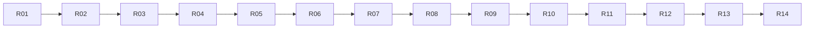

# 实施任务、交接记录与真实验收

状态：**所有任务未开始**。本文是实施执行顺序，不是已完成记录。
必须先读 [范围/B清单](frontend-backend-migration.md)、[对象](architecture-refactor.md)、
[状态机](execution-state-machines.md)、[记录路线](record-routes.md) 和 [协议](frontend-backend-protocol.md)。

## 1. 任务图与状态



| 编号 | 交付 | 状态 | 前置 |
| --- | --- | --- | --- |
| R01 | 基线与真实行为记录 | 真实验收通过 | 无 |
| R02 | 中立业务类型与依赖底座 | 真实验收通过 | R01 |
| R03 | 模型端口与 llm 适配 | 真实验收通过 | R02 |
| R04 | 普通工具与控制动作分离 | 未开始 | R03 |
| R05 | Session / Run / 核心循环与统一提交 | 未开始 | R04 |
| R06 | storage / 记录解码 / 恢复与历史投影 | 未开始 | R05 |
| R07 | 会话控制、输入队列与交互协调 | 未开始 | R06 |
| R08 | 子 Agent 与 MCP 生命周期收敛 | 未开始 | R07 |
| R09 | 私有 IPC 与正式后端 | 未开始 | R08 |
| R10 | 命令行切换协议路径 | 未开始 | R09 |
| R11 | TUI 完全切换协议路径 | 未开始 | R10 |
| R12 | 所有权、关闭与故障收尾 | 未开始 | R11 |
| R13 | 删除过渡结构与安装交付 | 未开始 | R12 |
| R14 | 最终真实验收与设计文档同步 | 未开始 | R13 |

可使用的状态：未开始、实施中、构建通过待真实验收、真实验收通过、受环境阻塞。
后续任务可以在必要的前置结构已经完成后继续推进，但不能把缺少真实证据的前置任务标成完成。
不默认委派子 Agent；实施者按本图顺序执行。

## 2. 通用执行规则

### 2.1 代码与构建

- `.hpp` 在 `src/public`，`.cpp` 在 `src/private`，不要在 temp 放检测程序或建立 demo 目标。
- 新目标仅限对象文档列出的正式库和后端二进制；不得创建 test、mock、smoke 或验收可执行目标。
- 全面重构分成可构建步骤；不得长期保留整套无法编译的移动代码。
- 按实际改动运行正式目标构建；不运行/扩充既有 test/tui，不清理它来扩大范围。
- 结构检查只针对本任务明确的依赖边界做一次；完成后不反复静态 review。
- 不靠“所有异常都吞掉”“所有操作都加锁”“所有方法都 virtual”达到构建通过。

初期构建：

```bash
cmake --preset dev
cmake --build --preset dev --target dagent -j2
```

后端目标建立后：

```bash
cmake --build --preset dev --target dagent dagent-backend -j2
```

### 2.2 临时过渡结构

R02 可以将原大 agent 链接集合临时命名为 `dagent_agent_legacy`，让最终 `dagent_agent` 先成为纯核心目标。
旧正式入口经一个明确兼容装配点使用新对象；逐任务迁走实现，禁止复制两套循环/策略算法。
中间的兼容头和类型别名仅用于旧调用点过渡，必须登记在 R13 删除清单。
协议路径接入时按代码/目标阶段切换正式入口，不新增用户可见 --legacy/--backend 选项，也不做失败自动 fallback。

### 2.3 实际运行材料

使用 `temp/refactor-equivalence/` 下的独立安装根、工作区、日志和记录文档。
模型配置从当前有效配置安全准备，不把真实密钥写进验收 Markdown 或工具输出；运行时显式设置 DAGENT_HOME 到临时根。
不修改、停止或重启现有模型服务。读不到模型或 MCP 时记录环境条件与未验项，不能编造成功。

验收只用正式 CLI、真实终端/PTY、真实模型、真实文件/进程和已配置 MCP。
可以保存提示词、日志、截图、实际输出及文件结果；不得创建模拟响应服务器、检测源码或断言脚本。
模型没有实际触发指定场景时，该场景仍未验证，应继续用真实输入完成，不能把文字承诺当作工具执行。

## 3. 逐项实施任务

### R01：建立基线

**读取：**主方案 §4、当前 AGENTS.md、CMake、CLI/UI/agent 入口。

**工作：**

1. 记录 HEAD、工作树已有改动和当前构建结果，不覆盖用户改动。
2. 在 temp 准备基线正式二进制、对应最小安装资源和独立数据库；保留后续对比所需材料。
3. 对 V01–V06 的适用基线场景真实运行，记录 stdout/stderr、退出码、实际工具调用与工作区结果。
4. 建立 B01–B28 到当前源码符号的映射；对 B06/B13/B23 单独记录容易漂移的语义。
5. 保存旧会话样本：普通工具、todo、压缩、子 Agent、正常结束与一次真实中断，不生成伪造数据库。

**完成条件：**正式目标可构建；基线行为和已存在限制明确；真实记录可供升级后读取。
**不得做：**修改业务逻辑、用模拟模型代替基线、直接拷贝未经脱敏的密钥到记录。

### R02：建立中立类型与核心依赖底座

**读取：**对象文档 §1–4；消息/Options/ToolSpec/Grant/View 当前定义。
**范围：**`src/*/agent`、`src/*/tools` 的公共类型、`src/CMakeLists.txt`。

**工作：**

1. 建立 Session/Run 身份、ModelRequest/Reply、ToolSpec、ResourceIntent、ExecutionGrant、ToolData 和核心端口。
2. 把 Message/Conversation 从具体 Model/ProviderConfig/HTTP 类型依赖中解开；请求构造使用中立参数。
3. 将 UI 展示字段中实际属于业务的事实迁入 ToolData；保持旧 View JSON 编码可适配。
4. 核心数据不含 exec/workspace/mcp/tui/sqlite 类型；完整映射原权限所需语义，不丢字段。
5. 建立最终 agent 纯核心目标，按 §2.2 处理暂时旧装配，保持原正式入口可构建。

**完成条件：**核心接口可独立包含/编译；没有 core→具体适配目标的依赖；旧入口仍跑真实简单回合。
**真实验收：**V01、V03 的基本模型和文件读取路径。

### R03：抽出 llm 适配

**读取：**对象文档 ModelSession 契约、状态文档 §4.2/§8.1。
**范围：**原 `agent/model.cpp`、`llm.cpp`、`provider*.cpp` 及对应头文件，新 `src/*/llm`。

**工作：**

1. 把网络请求、厂商编解码、流式累积、错误分类和重试迁入 llm；实现核心 ModelSession 端口。
2. 中立消息/工具描述/Usage 留核心；HTTP/SSE/凭据只在 llm/app 配置侧。
3. 保持当前 provider 支持、请求参数、reasoning/signature、工具参数累积、重试和取消语义。
4. 将模型配置分为公开描述与适配内部配置；UI 不依赖含 api_key 的 ProviderConfig。

**完成条件：**核心循环只能经 ModelSession 调模型；原 provider 支持不减少；临时兼容处已登记。
**真实验收：**V03、V07；至少使用当前实际可用 provider 完成带工具的回合，其余 provider 未运行须如实标示。

### R04：分离普通工具和控制动作

**读取：**对象文档 §5，状态文档 §5–7。
**范围：**`tools/tools.hpp`、普通工具实现、`tools/ask.cpp`、`tools/todo.cpp`、原 task 解析和 dispatch。

**工作：**

1. 普通 Tool/PreparedTool 使用核心契约，invocation 身份构造时确定；执行结果分离业务数据与显示转换。
2. 将 ask/exit_plan/todo/task 解析改为 ControlRequest；保留 Schema、名称、说明、顺序和原错误文本。
3. 建立 ActionCatalog 与 ControlActionExecutor，删除交互 Call 的错误占位 do_run。
4. 从调度器迁出问答次数、计划选项语义和计划状态更新；保留既有分组和原序提交算法。
5. Todo 返回计划替换事实，在原序提交时更新 Session 的 WorkPlan；不新增工具或修改只读/plan 的工具可见范围。

**完成条件：**普通 PreparedTool 都可执行；控制动作无需伪装普通 Call；dispatch 不解析问答选项或读取 TaskView 决定执行。
**真实验收：**V03–V05、V08 的可用部分；子执行暂经兼容委派端口，R08 收口。

### R05：重构会话与核心循环

**读取：**对象文档 §3/§6/§8、状态文档 §1–5/§8。
**记录契约：**记录路线 L03–L19 与 §5 提交原因；统一提交不能抹平不同路线的通知差异。
**范围：**原 agent.cpp/dispatch.cpp/conversation.cpp/compaction.cpp/permission.cpp，新的 Session/Run/TurnRunner。

**工作：**

1. Session 组合长期状态；Run 保存本轮阶段/预算/取消/结果；TurnRunner 只实现循环算法。
2. SessionCommitter 成为 user/assistant/tool/plan/compaction 修改的唯一入口，统一记录与通知。
3. 压缩计算候选变化，成功后提交；取消回滚与原摘要规则保持。
4. Policy 用窄控制能力支持现有权限档切换和快照，规则同步内不等待 IO/用户。
5. 删除循环对总括 Setup 的访问；只传 SessionConfig/RunOptions 与 RunServices。
6. 保持调用计数、grace、finish_reason、部分输出与 broken 行为。

**完成条件：**无外部直接写 Conversation/Plan；finish 只有一个收尾入口；循环中没有 UI/SQLite/HTTP 细节。
**真实验收：**V03、V04、V07、V09、V15；当前不新增协程/任务调度引擎。

### R06：分离 storage、恢复与历史展示

**读取：**对象文档 §8、状态文档 §8；当前 session schema 与 record payload。
**记录契约：**记录路线 §2 的全部字段、§6 的旧字段兼容、§7 的分页规则，以及 L20/L22。
**范围：**原 `session/session.*` → `storage`、原 `agent/record.*`。

**工作：**

1. 重命名存储职责与构建目标，保持当前数据库、schema 版本与记录 payload 不变。
2. 集中 RecordCodec：类型化解码/编码、旧字段兼容、错误分类只维护一处。
3. SessionRecovery 只重建执行状态与中断报告；HistoryProjector 只生成历史展示条目。
4. 为历史查询提供固定高水位分页；不开放新的用户功能，只支撑现有历史与子 Pane。
5. 显式 resume 获取可写所有权后，执行原崩溃闭合和 prompt 更新；浏览不调用它。
6. 旧 Todo View 恢复为 WorkPlan；协议/核心更名不改变历史数据。
7. 查询使用不初始化或修复数据库的只读连接；HistoryRead 保存跨页验证状态，在读完、关闭查询或连接关闭时释放，查询失败时释放该查询资源。

**完成条件：**没有一个函数同时恢复可写 Session 又重画 UI；不新增 runtime_* 表；R01 旧库可读可继续。
**真实验收：**V10、V11；核对浏览前后的记录数/updated 及模型/MCP日志。

### R07：把会话控制与交互从 UI 迁入 Runtime

**读取：**对象文档 §3、§6；状态文档 §2、§6、§9；B04–B14。
**记录契约：**记录路线 §8；同会话切模型复用 Controller 的写锁，候选准备与实际写入分阶段，内存原子替换不代表记录可回滚。
**范围：**新 runtime，原 Shell 队列/Agent 置换逻辑与审批 future 组织。

**工作：**

1. 建立 SessionController，移动普通输入 FIFO、recall、drain、new/resume/compact/switch_model 的业务流程。
2. 实现候选会话成功后替换、失败保留；用 generation 防止过时查询/操作落到新会话。
3. 按 B13 明确模型切换重置与保留字段；不把“保留临时授权”混入这次重构。
4. 建立 InteractionBroker 的一次性终结和排队；Core 只请求交互，UI 临时适配原对话框。
5. 取消/回答不经过被 run_turn 阻塞的业务队列；只读查询用独立线程，返回值快照。
6. B06 保持所有 TurnEnded 后 drain；busy 可用条件保持命令原有规则。

**完成条件：**UI 可暂时进程内调用 Runtime，但不再持 Agent/Setup 或写业务状态；该临时调用边界最终由 R11替换。
**真实验收：**V04–V06、V08、V12，尤其取消与回答、取回与出队的竞争。

### R08：整理单次子执行与 MCP 资源

**读取：**对象文档 §7、状态文档 §7；B18–B20。
**范围：**原 subagent、host、mcp_hub，runtime/SubagentExecutor 与工具 MCP 适配。

**工作：**

1. 用 DelegationContext 替代父 Agent& / current_turn()/完整 Setup。
2. ChildExecution 在原 task 组线程创建一次 Session/Run，父等待，结束统一回收。
3. 父当前权限快照在执行时取得；子名单、无 Asker 和显式 MCP规则保持。
4. MCP 连接通过显式 lease 保证寿命，目录更新不让仍被子快照引用的 Client 悬空。
5. 子事件带稳定来源身份，但存储 parent_id/agent_name 与原 TaskView 兼容。
6. 删除旧父对象窥探和隐式生命周期假设，不留下可再次运行的子对象句柄。

**完成条件：**单层单次委派完整；不增加 task.* 新工具；无 detached 子执行线程；父退出必 join。
**真实验收：**V13、V14；MCP环境不可用不得把该部分标为通过。

### R09：建立私有 IPC 与正式后端

**读取：**完整协议文档。
**范围：**protocol/ipc/backend、app 后端装配、CMake/安装目标。

**工作：**

1. 实现纯 DTO、RPC 方法/错误映射和独立字节传输；协议不能包含核心实现类型。
2. 添加 `dagent-backend --ipc-fd` 配套目标；socketpair 经直接进程启动传递，关闭多余FD，正确处理信号/进程组。
3. 实现 hello、initialize、shutdown，以及当前业务方法适配；不提供监听或共享服务入口。
4. 建立单一有序 Publisher/发送队列；跨线程事件不能交错写 JSON 行。
5. 启动配置和密钥只在后端解析；子进程环境继承保持。
6. 后端能够作为前端的正式子进程运行；不得为验证增加伪前端可执行目标。
7. 按协议 §4.2 固定请求结果；输入接受响应先于对应 TurnStarted。快照取值与通知序号分配使用同一短锁边界，等待发送容量在锁外完成。

**完成条件：**前端正式 launcher 可完成初始化与查询；后端无 TUI 依赖；协议与 Runtime 错误边界明确。
**真实验收：**V02 的查询/退出部分；模型执行在 R10验证。

### R10：命令行切换到客户端

**读取：**B01–B03/B25–B27、协议 §4/§8、当前 headless 输出。
**范围：**app 前端入口/CLI、headless 输出适配、client。

**工作：**

1. run/sessions/--list-models 都通过其独占后端；--help/--version 仍直接返回。
2. run stdin 合并、配置覆写顺序和 cwd 语义不变。
3. LegacyOutputCodec 将协议事件映射为原 text/json/jsonl，子事件恢复原 sub_event 包装。
4. 保留原 stdout/stderr、UTF-8 输出边界和退出码，RPC 包装不能出现在用户 stdout。
5. 信号和 jsonl 输出失败只取消本前后端对，不影响其他进程或模型服务。
6. 按 L05/L12/L17 核对实时事件差异：完整正文不重复增量，交互开始通知不强行落盘，finish 修补不新增旧 JSONL 的 ToolFinished。

**完成条件：**正式 run 经过 IPC完成真实回合；原 headless 不再直接构造 Agent。
**真实验收：**V01–V03、V07、V16；与 R01 按字段/实际副作用对比。

### R11：TUI 完全切换到客户端

**读取：**对象文档迁移对照、协议 DTO、B04–B14/B28。
**范围：**ui/shell、transcript、approval、status/side_panel、model_dialog、completion、app。

**工作：**

1. Shell 只持 Client、只读 DTO 和页面状态；删除 Agent、Setup、业务工作线程/stop_source。
2. 业务命令发请求；本地视图命令仍本地执行，busy 条件按 B 清单。
3. Transcript 分出 apply_live 与 append_history 语义，历史结束条目不触发当前 Run drain。
4. 计划/模式/模型/队列/MCP 标签来自后端快照与事件，不乐观写第二份业务真值。
5. 子 Pane 按 session/run/invocation 路由，仍只读；旧查询结果按 generation 防止错页。
6. 审批 DTO 覆盖原预览/联网/会话允许/反馈，回答只提交用户决定。
7. 项目/文件补全查询经后端；主题、滚动、折叠、输入草稿留前端；不改变冻结 TUI 原语。

**完成条件：**ui 不包含 agent/tools/storage/llm 实现头；dagent_ui 不链接这些目标；所有现有命令可实际使用。
**真实验收：**V04–V06、V08、V10、V12–V14；包含窄屏、主题与中文正文显示。

### R12：收敛进程所有权与故障收尾

**读取：**对象文档 §9、状态文档 §10、协议 §1/§2/§7。
**范围：**launcher、Runtime close、ipc、storage SessionWriteLease、现有 exec 清理接入。

**工作：**

1. 同一 session_id 的跨后端写锁在可写恢复前取得，FD 不传给工具，历史查询不取锁。
2. 配置模型添加使用短期写锁包围原重读/校验/原子写，保持原格式。
3. 正常 exit、socket EOF、SIGINT/SIGTERM、输出关闭走明确的单一清理流程。
4. 取消唤醒所有 Broker/队列等待，发送拥塞不阻塞控制接收。
5. 按顺序 join 子组、同步记录、关闭资源、释放锁；仅回收自己创建的后端。
6. 后端意外死亡不能让前端重发输入；下次恢复只用原历史事实。

**完成条件：**一对退出不影响其他对；双写被拒；正常关闭无本次受管后台执行残留；强退局限如实显示。
**真实验收：**V15–V19。

### R13：删除过渡路径并完成安装

**读取：**对象文档 §4/§10、R02开始维护的兼容删除清单。
**范围：**CMake、旧头/类型别名、旧入口、安装与文档路径。

**工作：**

1. 删除 dagent_agent_legacy、兼容头别名和直接进程内 UI/CLI 执行路径。
2. 删除旧 Agent 总括访问接口、错误占位 Call 和同时恢复/显示的 replay_into 入口。
3. 最终目标依赖严格符合对象文档；src/public 的共享 include 根不能成为跨模块偷用实现的理由。
4. 安装两个二进制和原 home 资源；dev 与安装根两种路径都能找到后端配套文件。
5. 不保留协议失败后直连核心的 fallback；不提交 temp 验收材料或密钥。

**完成条件：**正式目标分别构建；安装目录实际运行；过渡清单归零；无新增测试目标。
**真实验收：**V01、V02、V20。

### R14：完整验收与文档交接

**工作：**

1. 汇总下面 V 矩阵，不重复已在最终代码版本上通过且未受后续改动影响的场景。
2. 对受后续修改影响的场景做必要真实运行；不进行额外反复源码 review。
3. 对比 B 清单，记录每条的通过证据；未验证项标明实际原因，不用构建成功代替。
4. 更新 docs/design 的 agent/ui/app/session（重命名 storage 对应索引）/tools/llm 说明，新增实际 runtime/protocol 设计。
5. 更新 docs/README 构建/安装/运行说明；保留本组规格与任务状态，注明最终实现版本。
6. 汇总 L01–L23 的真实记录与输出证据；同一场景可覆盖多个路线，不另建模拟或断言程序。

**完成条件：**所有范围内项有真实通过证据；若受外部环境阻塞，必须明确报告未完成范围，不能宣称全计划完成。

## 4. 真实验收矩阵

| 编号 | 真实场景与判据 | 保持项 / 结构项 |
| --- | --- | --- |
| V01 | 正式目标构建；最终前端不链接执行/SQLite/MCP，后端不链接 TUI；无新 test/mock 目标 | D01/D07，工程约束 |
| V02 | 两个前端各自创建一个后端；help/version 不创建；退出一对不影响另一对 | 进程边界 |
| V03 | 实际 read/write/edit/bash/grep/glob 调用；工具结果与文件/命令结果一致 | B15/B17，D03 |
| V04 | 忙时发送多条输入、取回最后一条；斜杠面板立即分派；所有终态后 drain 语义保持 | B04–B06 |
| V05 | 审批允许/会话允许/拒绝/附带反馈/联网选项、撤销；没有前端自定 Grant | B08–B10，D03 |
| V06 | 空闲新建/恢复/切模型/plan/compact 与忙时条件；切模型失败保留旧状态，B13重置得到证据 | B07/B13/B14 |
| V07 | 真实模型流式正文/思考/工具参数、用户中断和预算耗尽；可真实触发时核实重试 | B16/B17/B22 |
| V08 | 实际 ask 多选/其他/取消和每轮上限；plan 三种选择；非交互方式不等待不存在的 UI | B09/B10 |
| V09 | 真实长上下文与手动压缩；压缩取消无半提交，历史恢复后消息配对正确 | B22，D04 |
| V10 | 浏览已结束子会话/旧会话，记录数/updated 不变；不创建模型/MCP | D05/B24 |
| V11 | R01真实旧库在新实现中读取与继续；实际中断恢复，不自动重复外部副作用 | B24 |
| V12 | TUI 实际输入/补全/滚动/鼠标/主题/窄屏/卡片/思考折叠；RPC不会污染终端 | B11/B12/B28 |
| V13 | 真实并发 task，父等待、子 Pane隔离、父取消传播、子无ask/task/exit_plan | B18/B19，D08 |
| V14 | 已配置真实 MCP 的连接、工具发现、调用、子快照；对本次验收拥有的MCP进程验证断连清理 | B20，生命周期 |
| V15 | 独立 temp 安装根的真实存储不可写场景；broken 一次提示、当前回合按 B23继续 | B23 |
| V16 | run text/json/jsonl 的真实 stdout/stderr、退出码、stdin、SIGINT、输出管道关闭 | B01/B25/B26 |
| V17 | 在模型请求、工具执行、审批等待期间分别退出前端；后端取消、记录收尾和等待解除 | 退出/取消 |
| V18 | 真实运行中终止本次后端；前端不重发，显式 resume 标识未知结果，不重跑工具 | B24，进程边界 |
| V19 | 第二个后端尝试恢复同一活跃 session_id 被拒，纯历史读可用；锁随所有者退出释放 | 写入所有权 |
| V20 | 正式安装到 temp 独立根，不依赖源码cwd；两个二进制、主题/提示词/模型配置和历史正常 | B02/B03/B27 |

MCP/模型异常场景只操纵本次验收创建且有权限操作的资源；不要为了制造失败重启用户正在运行的服务。
若真实环境无法可靠制造某种重试/服务失败，标明未验条件；不写模拟服务器来补齐。

## 5. 证据与交接格式

每个任务完成后追加以下短记录到本文件对应任务后的执行记录区，实际材料放 temp：

- 任务号、状态、代码版本与必要的工作树说明。
- 修改的职责/接口以及已删除的旧结构。
- 正式构建命令与结果。
- 实际运行命令或人工终端操作、session_id/相关真实调用、退出码/真实文件结果。
- 覆盖的 B/V/L 编号与证据路径；涉及记录路线时写明实际记录类型、序号关系、通知与恢复结果，不记录密钥。
- 未完成项、环境限制、下一任务。

不创建自动断言程序来填写此表；命令结果、真实记录和实际文件就是证据。
临时材料可以被清理，因此现状设计文档只记录稳定契约和验收结论，不让产品功能依赖 temp 文件。

## 6. 回退与完成判定

- 每阶段保持正式入口可构建；若某阶段失败，修复该阶段，不跳过其结构条件宣称进入下一完成状态。
- 本次保持数据库 schema 和 payload，文件名/命名空间重构不是数据迁移。若实施发现必须改 schema，先证明现有格式无法承载原能力并更新规格，不能直接增加任务系统表。
- 旧版与新版不能同时写同一会话；新写锁不能约束不认识锁的旧二进制。对照验证使用独立 temp 安装根。
- 回退前停止本次进程，保存实际数据库副本；有 WAL 时使用一致备份/静止 checkpoint，不仅复制主数据库文件。
- 最终状态必须同时满足 D01–D08、B01–B28、L01–L23、V01–V20 和 R13删除清单；模型文本声称完成不构成证据。

## 7. 执行记录

### R01：基线与真实行为记录 — 真实验收通过（2026-09-22，版本 d614700）

- 状态：真实验收通过。工作树仅含 docs/README.md 用户改动与本目录新增；无源码改动。
- 构建：`cmake --preset dev && cmake --build --preset dev --target dagent -j2` 通过。
- 材料：基线二进制 `temp/refactor-equivalence/baseline/dagent`；一致数据库备份
  `temp/refactor-equivalence/baseline/dagent-baseline.db`（76 sessions / 1475 events，含子会话、todo、多模型样本）；
  CLI 输出 `temp/refactor-equivalence/logs/r01-cli-baseline.txt`；记录文档 `temp/refactor-equivalence/r01-baseline.md`。
- 真实运行：--version/--help/--list-models/sessions 通过（exit 0）；run 因本地模型服务不可达失败
  （retry 1/2、2/2 后 ✗，exit 1）；deepseek key 服务端 401。
- 覆盖：B01/B02/B16/B25/B26 的 CLI 侧证据；B01–B28 → 源码符号映射完成；B06/B13/B23 易漂移语义单独记录。
- 压缩样本：基线库中 prune/compaction 记录为 0（初始环境无可用模型，无法真实产生压缩历史，曾如实标为缺口）。
  本地 qwen3.8（127.0.0.1:10009）恢复可用后已补：在 temp 独立安装根用小窗口模型配置真实触发自动压缩，
  产生 prune + compaction（含真实模型摘要）与 prune + compaction（空摘要退化丢弃）两组记录，
  并以 run --resume 二次读取验证摘要前缀/占位配对恢复（见 R03 记录的运行材料）。R01 缺口关闭。
- 未验项：无（V03–V07 等依赖模型回合的场景在 R02/R03 期间已用恢复的本地模型补做）。
- 下一任务：R02（已完成）。

### R02：中立业务类型与依赖底座 — 真实验收通过（2026-09-22，版本 d614700 + 工作树改动）

- 状态：真实验收通过（V01、V03 基本模型与文件读取路径；V03 的 read/write/bash 工具结果与真实文件内容一致）。
- 新增中立类型（src/public/agent/）：identity.hpp（SessionId/RunId/InvocationId/InputId/InteractionId）、
  reply.hpp（Usage/Finish/StreamEvent/Reply/RetryOptions/RetryInfo/ModelError）、tokens.hpp（estimate_tokens/TokenEstimator）、
  message.hpp 内 ToolSpec（=ToolDef 统一）与 ModelParams、tool_data.hpp（View 全部分支 + ToolResult(model_text/is_error/
  interrupted/display/signals) + ExecutionSignal(McpDisconnected) + to_json/view_from_json）、intent.hpp（ToolKind/
  ResourceIntent/CommandIntent/PreparedIntent）、grant.hpp（SandboxProfile/GrantSource/ExecutionGrant/SandboxSupport/
  SandboxConfig）、public_model.hpp、ports.hpp + port_model/port_journal(RecordError)/port_store/port_interaction。
- 解耦：Conversation::build 参数 ProviderConfig→ModelParams；events.hpp 不再依赖 tools/llm/net；
  Policy 输入改为 PreparedIntent/ExecutionGrant/SandboxSupport（dangerous/known_readonly 由 tools 侧用原 exec 函数算好，
  核心不重写白名单）；bash 的完整 exec::Analysis 只留在工具实现，核心只见 CommandIntent 摘要。
- View JSON 编码迁至 agent/tool_data.cpp（namespace 变化，字段与 kind 名称逐字节不变）；tools/view.hpp 删除，
  各处改用 agent::ToolData 类型。
- 目标拆分：dagent_agent 纯核心（tokens/tool_data/conversation/events/permission，仅链 dagent_base）；
  dagent_agent_legacy 过渡装配（compaction/mcp_hub/prompt/record/host/subagent/agent/dispatch/headless，
  R13 删除清单：该目标本身 + Setup 大对象 + Agent::current_turn/setup() 等）。
- 结构检查：纯核心头文件无 exec/workspace/mcp/tui/sqlite include。
- 真实运行：正式 dagent 构建通过；--list-models 输出与基线一致；run --resume（R01 基线旧库
  01a0c374…e1b598）完成历史读取、配对校验、system/user/turn_end 追加（seq 18–20，payload 形状不变），
  模型不可达时 retry/退出码 1 与基线一致。
- 模型恢复后补验：真实 qwen3.8 回合中 read 工具真实调用且结果与文件内容一致（V03 文件读取路径）。
- 覆盖：V01、V03（基本模型与文件读取）；B01/B25 的 CLI 侧回归；B23 旧库读取兼容证据。
- 未验项：无。
- 下一任务：R03（已完成）。

### R03：抽出 llm 适配 — 真实验收通过（2026-09-22，版本 d614700 + 工作树改动）

- 状态：真实验收通过（V03：openai-chat provider 真实带工具回合；V07：流式正文/工具参数累积、
  SIGINT 中断 exit 130、预算耗尽 failed 路径；可真实触发时核实了自动压缩与退化）。
- 迁移：agent/{model.cpp,provider*.cpp,llm 编解码} → 新 dagent_llm 目标
  （src/private/llm/{model,provider,provider_chat,provider_anthropic,provider_ollama}.cpp）；
  头文件 src/public/llm/{provider,provider_detail,codec,model,llm}.hpp。
- 端口实现：llm::Model 实现 agent::ModelSession；Agent/Compactor 经端口调模型（不再直接依赖 Model/Codec）；
  make_session 工厂持有 HTTP 调整与重试参数。
- 配置拆分：agent::PublicModel（公开描述，无凭据）进 Setup.provider；llm::ProviderConfig（含 api_key）
  只在 app 装配与 llm 内部；Setup 删除 http 字段；llm::to_public 为唯一公开视图映射。
- UI 解耦（R03.4 达成）：ui 头与实现已不包含任何 llm/ 头或 ProviderConfig。表单输入用
  agent::ModelInput（credential 仅此次请求可写）；provider 种类元数据用 agent::ProviderKindInfo
  （kind/default_base_url/needs_credential，由装配层从 llm::providers() 抽取）；UI 的模型列表与
  选择结果只持有 PublicModel + ModelSession（ModelSelection）。凭据到内部配置的转换只在
  main.cpp 装配的 add_model 回调内发生。
- 子 Agent 继承路径修正：def.model 为空时直接继承父的 provider/model_session（随 Setup 拷贝），
  不再查 host 的模型表——避免「UI 运行中新增模型后切换，子 Agent 继承查表失败」的回归；
  def.model 非空（显式配置）仍从 host 表解析（重启用后生效，与 B18 显式配置语义一致）。
- AgentHost 增加模型工厂注入（子 Agent 模型选择经 host->make_model_session）。
- 依赖修复：provider_ollama.cpp 不再借用 session::new_id()（依赖方向违规），改为 llm 内部生成运行时调用前缀
  （运行时 ID 格式不受 B 清单约束）。
- 结构检查：dagent_llm 仅依赖 agent/net/base；src/public/ui 与 src/private/ui 无 llm/ 引用；
  原 provider 支持不变（openai-chat/anthropic/ollama）。
- 真实运行（temp 独立安装根 + 本地 qwen3.8）：
  - read 工具回合：结果与文件内容一致，流式正文经 codec 累积正常；
  - write + bash 回合：write 创建文件内容一致，bash cat 输出一致（V03）；
  - run --output json：字段 session_id/status/error/result/steps/tool_calls/usage/duration_ms 保持（B25）；
  - SIGINT 中断 bash 运行：exit 130，✗ 工具标记（B26/V07）；
  - 小窗口自动压缩：真实触发两次——第一次 prune+compaction（模型真实摘要成功落盘）、
    第二次 prune+compaction（空摘要 → 丢弃前缀退化，符合记录路线 §2）；单工具批次在保护区时
    「No older history can be safely compacted」拒绝路径亦真实触发（B22 行为保持）；
  - 压缩会话 run --resume：读取含 prune/compaction 的历史、配对校验通过、摘要前缀重建、
    system/user/turn_end 追加（seq 19–21）。
- 覆盖：V01、V03、V07（可触发场景）、V09（压缩与恢复部分）、V11；B02/B16/B25/B26 装配与运行侧回归。
- 未验项：V07 的 retrying 展示（需服务端瞬时故障，未真实制造）；V13/V14 子 Agent/MCP 场景属 R08。
- 下一任务：R04。
