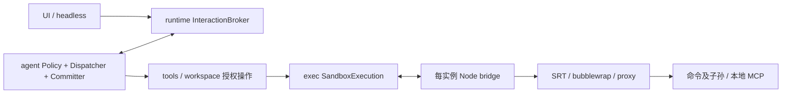

# SRT 适配与完整权限链路实施计划

日期：2026-09-29。状态：已实现至 S05 的主要链路，并完成本轮 S05 审查缺口修复与相关 S03/S04 补强。阶段证据与剩余项见 §10.1；尚未完成全部权限计划。S00 仅在指定 AppArmor profile 下通过，默认启动仍受主机限制。

## 1. 目标与完成条件

将 DAgent 的受限命令执行切换到 Anthropic Sandbox Runtime（SRT），把文件、网络、外部工具和宿主执行授权分别落实到对应执行边界。保留 `ask / workspace / unrestricted` 与正交的 `read_only / planning`，统一主会话、子 Agent、TUI、非交互运行的权限语义。

“全部权限正常工作”必须同时满足：决定正确、执行侧不越界、批准确实生效、撤销与降权能阻止旧授权继续使用、记录能说明实际边界、真实运行通过。仅安装 npm 包、构建通过或 `Support` 返回 true 都不算完成。

约束：不创建测试代码、模拟服务、演示入口或测试目标；仅构建和真实功能运行，检测材料位于 `temp/`。C++ 头文件与实现分别位于 `src/public`、`src/private`。UI 文案英文，模型回复继续跟随用户语言。

## 2. 实施前基线与问题

| 链路 | 当前实现 | 本次要补齐的内容 |
| --- | --- | --- |
| OS 后端 | `exec/sandbox.cpp` 的 Landlock + seccomp，嵌套保护固定为 false | SRT 的实际启动、路径覆盖与受控网络出口 |
| 网络授权 | `ExecutionGrant` 已有 network 字段，`Policy` 没有接通独立网络审批 | 域名和端口授权、运行时请求、一次/会话/配置范围 |
| 宿主访问 | workspace 后端缺失时请求 host access，批准后文件与网络全部放开 | 与普通命令/网络授权彻底区分，不自动降级 |
| 文件工具 | read/write/edit 执行忽略 grant；write/edit prepare 会读旧内容生成预览 | 授权后读取预览、执行侧消费文件范围、路径竞态处理 |
| 审批有效期 | 审批等待时可以切换模式，答复后缺少重新判定 | 权限修订号、旧审批失效、撤销即时路径 |
| MCP | `McpHub` 构造即连接，本地进程先于 tools/call 审批启动 | 启动权限、连接权限、调用权限分层 |
| 子 Agent | 创建时收窄模式，共享 Hub/Client lease | 活跃权限上限传播、隔离不匹配的进程与连接 |
| 审计 | 已有 permission/tool_started/revoke 记录 | 执行中权限变更、实际生效范围、来源与失效原因 |

设计阶段实测：bwrap 0.9.0 和 `unshare -Ur` 在 UID 映射阶段失败；AppArmor 非特权 user namespace 限制开启。只读 Bash 的 `pwd` 可启动，联网 `curl` 在 headless 下因需要宿主审批未执行。记录见 `temp/sandbox-diagnosis-20260929/`。未获得系统审计日志，不能把 AppArmor 写成已证明的唯一原因。

父 Agent 审批子 Agent 属于独立功能，另见 [父 Agent 审批计划](parent-agent-approval-plan.md)，不作为本计划的交付依赖。

## 3. 用户场景

1. 作为用户，我希望 workspace 下自动完成工作区编辑和构建，以减少无意义审批，同时保留外部路径和网络边界。
2. 作为用户，我希望 ask 下查看变更与命令再决定是否执行，以控制有副作用的操作。
3. 作为用户，我希望 read_only/planning 即使已有会话授权也不能写入，以可靠地进行研究与规划。
4. 作为用户，我希望批准访问一个网站后继续当前命令，以避免命令重跑带来重复写入。
5. 作为用户，我希望文件外部访问只开放明确路径，以免一次批准扩大到整个宿主。
6. 作为用户，我希望敏感文件的读取在内容进入预览或模型上下文前获得批准。
7. 作为用户，我希望一次、会话和持久配置授权有明确范围，并能撤销会话授权。
8. 作为用户，我希望降权或撤销后，等待中的审批与子 Agent 都遵守新限制。
9. 作为用户，我希望非交互运行使用明确预授权，缺少授权时返回准确原因。
10. 作为用户，我希望 MCP 的启动、连接与工具调用边界可见，远程服务的权限不被夸大为本机沙盒保证。
11. 作为用户，我希望取消、超时、崩溃后没有继续执行的命令或遗留代理。
12. 作为用户，我希望系统不具备沙盒能力时得到可操作诊断，而不是误报已经隔离。

## 4. 固定技术决策

### 4.1 SRT 版本与集成方式

- 首个适配基线固定为 `@anthropic-ai/sandbox-runtime@0.0.77`，锁定完整 npm 依赖及 integrity；不跟随 `latest`。Node 最低要求来自包元数据，当前项目托管 Node 版本满足要求。
- 使用 SRT library，增加一个随 DAgent 分发的 Node bridge；不以裸 `srt` CLI 的退出码、stderr 文本或单向 `--control-fd` 实现审批。
- 每个 Bash 执行实例一个 bridge；每个本地 MCP 进程一个长生命周期 bridge。SRT 的模块级单例状态不在多个并发实例之间共享。这里的“实例”不是整个 Agent turn。
- bridge 源码放 `src/private/exec/srt_bridge.mjs`；构建复制到后端可执行文件旁的 `libexec/`，安装同样布局。它是程序资源，正常版本升级覆盖，不经过“保留已有用户文件”的 Home 配置安装逻辑。
- SRT npm 清单和锁文件放 `home/config/sandbox/`，通过已有 `runtime sync` 准备内部环境 `internal/sandbox`。该环境不暴露为模型可选 Bash environment；所用 Node、bridge、SRT、bwrap 与 helper 均用已解析的绝对路径。
- 保留用户明确选择的 host/unrestricted 执行。完成 SRT 切换后移除旧 Landlock 后端、失效字段及无消费者依赖，不长期维护两套隐式兼容路径。

**并发与路径编译门槛：**v0.0.77 会为可写树内缺失的 denyWrite 路径创建宿主占位点；mandatory 路径也可能触发。占位点跟踪与活跃计数仅为 Node 进程内状态，不能让不同 bridge 清理彼此仍依赖的挂载点。因此首版采用以下源码支持、仍须 S00 真实验证的映射：

- bridge 自身 cwd 是已存在、每执行私有、位于所有 allowWrite 之外的控制目录；实际 child cwd 才是 workspace。所有策略路径使用绝对路径。私有 cwd 被上层可写根包含时，拒绝该 profile，不静默继续。
- 工作区保护使用启动时已存在路径快照；显式拒绝路径只传已存在 literal。控制面使用已存在父目录覆盖其未来子文件。不能安全表达的“允许父目录写、禁止创建尚不存在的某个子名称”返回 unsupported，不能悄悄丢掉 deny。
- bridge cwd 分离后，SRT 自动 mandatory 保护作用于 bridge cwd，不再代表工作区的保护；DAgent 必须自己收集工作区已有敏感路径、gitdir 与控制路径，生成明确规则。
- 不通过向用户工作区预建 `.env` 等 dummy 文件解决此问题，不给长期 MCP 持有整个工作区生命周期的互斥锁。若真实验收否定该映射，S03 暂停，另立固定上游修订决策，不能直接宣称并发安全。
- 读取策略以 `denyRead:["/"]` 配合必要系统路径、工作区和实例目录的显式 allowRead 表达。SRT 对 `/proc`、`/dev`、`/sys` 有固定处理：前两者使用新挂载，`/sys` 并非被根 deny 隐藏；必须如实列为平台例外。`/tmp` 只重开所需实例路径，不能整体开放。

上述规则的源码依据见 [Linux 路径与 mountpoint 实现](https://github.com/anthropics/sandbox-runtime/blob/v0.0.77/src/sandbox/linux-sandbox-utils.ts)：mandatory 路径生成、进程内 mountpoint 集合、缺失 denyWrite 占位、根读取屏蔽与 carve-out。不把 SRT 的启动快照保护扩写为动态敏感文件名策略。

### 4.2 文件、网络、执行模式分开

改造现有 `ExecutionGrant`，仍只有一个授权事实来源，不再增加平行权限系统：

| 授权维度 | 内容 |
| --- | --- |
| 文件 | 读取/写入范围、明确受保护路径、一次批准例外、操作种类 |
| 网络 | `blocked / proxy / host`；规范化 hostname + port；配置拒绝范围 |
| 外部工具 | MCP server 身份、endpoint、qualified tool、必要的进程 profile |
| 生命周期 | 调用/执行 ID、会话、来源、one-call/session/config、权限修订号 |
| 执行后端 | `srt` 或明确的 `host`，不是根据 stderr 推测 |

路径范围分为三类：普通用户数据、可一次审批的敏感用户数据、执行控制面。执行控制面包括凭据配置、数据库、运行中 IPC、bridge 与 runtime 安装内容；受限执行不得通过普通文件或网络审批修改它们。用户配置维护经显式宿主操作完成，不能由工作区泛写授权覆盖。

宿主全访问仅由明确 `unrestricted` 或明确的一次 host-access 决定产生。继续保留现有危险命令硬拒绝和语法拒绝，不因 unrestricted 绕过。

### 4.3 权限模式矩阵

| 行为 | ask | workspace | unrestricted | read_only / planning |
| --- | --- | --- | --- | --- |
| 普通范围读取、已知只读命令 | 自动，命令进 SRT | 自动，命令进 SRT | 宿主执行 | 普通读取与已知只读命令，SRT 只读 |
| 工作区文件修改 | 预览后审批 | 自动 | 自动 | 拒绝 |
| 工作区写入/动态 Bash | 执行前审批，仍受 SRT 限制 | 自动进入工作区 SRT | 宿主执行 | 拒绝 |
| 外部路径 | 配置已有范围或明确审批 | 同左 | 宿主可访问范围 | 仅可授权读取，不能写 |
| 用户敏感路径 | 明确一次授权 | 明确一次授权 | 宿主边界 | 仅允许一次读取审批 |
| 新网络目标 | 配置许可或运行时审批 | 同左 | 宿主网络 | 保留现有保守语义，不允许任意联网 Shell / MCP |
| 外部 MCP 工具 | 启动/连接已授权后，逐工具一次或会话审批 | 同左 | 依明确配置与模式执行 | 拒绝，不能信任服务自报 readonly 而扩大权限 |
| 系统能力不足 | 受限命令不启动；可明确请求一次 host access | 同左 | 不要求 SRT | 命令不启动，原生受控读取仍可用 |

`read_only / planning` 是上限，优先于 unrestricted、会话和持久允许项。子 Agent 继续不继承父 unrestricted；默认最多 workspace，且不能超过父当前上限。模式从 ask 切到 workspace 只改变自动批准规则，不增加外部路径或网络范围。

## 5. 模块职责与所有权

- `agent`：中立的访问请求、授权值、纯策略、会话规则和审计语义。不引用 SRT JSON、Node、bwrap 或 tools 实现。
- `tools`：解析模型参数、声明访问需求，把中立授权映射到执行层；不自己弹窗或记会话权限。
- `workspace`：受信任的原生文件操作执行端。执行必须消费已批准范围并使用受约束的文件句柄/目录句柄；不把整个控制进程套进 SRT，也不为 read/edit 重写 Node 文件服务。
- `exec`：SRT 配置转换、bridge IPC、启动/退出/输出/取消、临时目录与进程资源。只上报中立请求，不自行批准。现有 `Process/Child` 继续负责基础进程 I/O，增加组合式 `SandboxExecution` 持有其资源，不建立通用后端插件框架。
- `app::Toolchain`：包安装、版本锁、已准备环境快照；`app` 装配 sandbox factory 和能力结果。不要用 PATH 中工作区提供的程序替换受信任 helper。
- `runtime::InteractionBroker`：复用单模态队列、答复与取消；`SessionCommitter` 仍是会话记录唯一写入入口。
- `McpHub/Client`：拥有连接及对应 sandbox lease。连接池 key 必须包含会话/权限域、server 配置和有效 profile，不再把一个高权限进程共享给低权限子会话。

## 6. 运行时网络审批与执行状态

### 6.1 原地批准连接

SRT `initialize(config, askCallback)` 的回调给出 `{host, port}`。deny 规则先于 allow；未命中且不是 strict allowlist 时才进入回调。回调只决定当前连接，SRT 不自动保存用户授权。

执行流程：`prepared → authorized → starting → running ↔ waiting_permission → finishing → finished`；取消、超时与桥接错误均进入清理，不存在“失败后自动无沙盒重跑”状态。

1. C++ 与 bridge 使用独立双向控制 FD；命令 stdin/stdout/stderr 保持独立，MCP stdout 不得混入控制帧。控制 FD 不传给命令及其子孙；bridge 与工具环境分离，不继承可注入 Node 的环境项、宿主认证代理或控制凭据。
2. bridge 发送带 execution ID/request ID 的网络请求；请求仅包含 host/port 等必要信息，不含 URL 密码、token 或请求体。
3. Dispatcher 所在线程从执行邮箱消费请求，依据当前 Policy 判定；必要时经现有 broker 询问用户。I/O worker 持续排空输出，审批期间不持 Policy/进程 I/O 锁。
4. 对应会话的 Committer 串行记录决定，确认执行仍存活且权限修订号有效后才回复 bridge。
5. 一次批准限定“本次工具执行中的该 host:port”，不是全网络，也不是整个会话。会话批准进入 Policy 的结构化规则；bridge 仅持有效副本，不能成为第二个权限事实来源。
6. 未授权目标、跳转到新域名、新端口分别重新判定。明确 deny 不触发可覆盖它的提示；headless 或超出审批预算则拒绝。用户明确拒绝运行中请求时取消该调用，并报告已经可能发生的副作用。
7. 文件边界只在启动前确定；运行中的文件 EPERM 返回结果，不解析 stderr 自动提权，也不自动重跑。下一次显式调用可提出新的文件范围。

网络模式必须阻止直接联网绕过代理。SRT domain allow 不代表 HTTP 方法或远端操作只读；不承诺 URL 路径级权限。localhost/私网/元数据访问需要单独配置的端点例外，不能因域名批准自动全局开启本地网络。无法安全表达的 Unix socket 单路径授权明确拒绝，不能用 `allowAllUnixSockets` 冒充窄授权。

### 6.2 线程、撤销与取消

- 允许产生运行中审批的 execute 在 worker 上运行，Dispatcher 以执行邮箱等待完成/权限请求并串行提交；纯并行只读组不允许扩权。禁止 proxy 线程直接写 Journal。
- `Policy` 有递增 revision；模式变化、会话授权增加/撤销同步更新。启动前、审批答复后、代理授予连接前重新核对有效范围；revision 改变不必无条件重问，但不能消费失效 grant。
- 撤销与降权通过即时控制路径到达活跃执行，不排在被 turn 占用的业务队列之后。取消旧审批；停止超出新范围的运行实例（包括已打开网络连接），再确认完成。撤销不承诺回滚已写文件或已经发送的数据。
- 父权限上限变更通知活跃子会话；子权限不能扩大父边界，也不能复用父的单次授权。会话恢复不恢复临时授权；切换模型保留同一活跃会话的有效规则，不借模型切换重置或扩大权限。
- bridge 在正常结束后调用 `cleanupAfterCommand()` 和 `reset()`；wrap 失败按 SRT 的资源所有权语义清理，避免重复清理。C++ 取消覆盖 bridge、命令、代理及后代；bridge 控制通道 EOF 触发终止，不能让后台命令独立存活。
- 正常退出、被信号终止、超时、取消、SRT 启动失败分别记录。使用子进程结构化退出信息，不能把 CLI 的 0 当作命令因信号退出成功。

## 7. 文件工具与搜索边界

- `prepare` 分为纯参数/路径需求声明与已授权内容预览两个步骤；不在 Policy 判定前读取待审批文件生成 diff。
- 工作区普通内容读取可自动授权后生成预览；外部或敏感文件先批准读取，再展示修改预览并判定写入。现有“先 read 后 edit/write”的 FileTracker 约束保留，但读过文件不等于永久读取许可。
- 原生 read/edit/write 消费文件授权，执行时基于批准的 anchor/dirfd 与目标句柄操作。使用 Linux 受约束路径解析，禁止审批期间替换符号链接/父目录把操作转到另一范围；写入继续保留 stale 检查与原子替换语义。若对象或有效范围改变，返回需重新准备，不写入新目标。
- `grep/glob` 的根目录批准不等于根内所有敏感内容批准。搜索、补全和上下文收集必须在输出到模型/前端前过滤受保护数据；调用 rg/git 等子进程时使用对应只读执行边界。固定命令也不能允许仓库配置把它变成无沙盒任意执行。
- `extra_readable/extra_writable` 与交互授权使用同一规范化范围语义，并覆盖原生工具与 Bash；写许可不自动包含敏感内容读取，受保护控制路径优先。
- 受限命令的 HOME、临时目录和包缓存使用本实例隔离位置；工具链只读。SRT 的启动时 glob 扫描不保证运行中所有新建同名敏感文件受保护，不在文档或 UI 宣称这种保证。

## 8. MCP 与子 Agent

- 本地 stdio MCP 以显式 server profile 启动：读取范围、写入范围、域名列表、明确注入的 server 凭据。配置来源是受信任 Home 配置，不能因模型提交参数扩大。缺少有效 profile 时该 server 不启动，不能先运行再请求 tools/call 批准。
- 长期服务的网络采用配置级 strict allowlist；本次不把它的后台连接猜测归属到某个 tools/call，也不提供伪造的“单次工具网络许可”。更改 profile 后终止旧连接与所有旧 lease，再按新配置重连。
- 工具调用仍有一次/会话审批，不能因为 server 已启动便允许全部工具。readonly/planning 下保留对外部工具的保守拒绝。
- 主/子会话按有效 profile 分配进程。父降权或撤销所依赖进程范围时停止相应实例，旧 Client lease 不得继续发请求；仅把 Client 从注册表移除不足以撤销。
- HTTP MCP 明确授权配置 endpoint 的连接与 qualified tool 调用；重定向不得携带认证信息去未批准端点。远端服务内部文件与网络不受本机 SRT 控制，审计标为 remote，而不是 srt。
- 模型 API 请求保留在控制进程；Bash 获批域名不等于拿到模型或 MCP 凭据。runtime sync 下载是显式维护操作，不能被工作区命令隐式触发。

## 9. 配置、协议与观测

- 升级 sandbox 配置版本，显式要求：后端、额外读写范围、允许/拒绝网络目标、host-access 提示策略、startup timeout、网络审批等待上限与每执行请求预算。参数放配置文件，不在执行代码散落默认值。
- 首版配置为 `sandbox.version=2`、`backend=srt`、`host_access=ask_once`；新增时间/预算的分发配置值为 `startup_timeout_ms=15000`、`network_approval_timeout_ms=120000`、`max_network_requests_per_execution=32`。这些是可调产品参数，不是内核保证；相同目标并发请求合并成一次待审批项，用户拒绝后的同目标请求不反复弹窗。域名列表默认空，明确 deny 优先。
- 复用 `process.kill_grace_ms`、输出上限、命令超时和现有并发预算。网络审批超时拒绝并结束相应等待；不得无限挂住 bridge。
- `runtime sync` 增加 internal/sandbox 环境与锁文件身份；`runtime list` 分开报告 package current 与 host capability，安装成功不代表 namespace 可用。
- 提供 `dagent sandbox status` 诊断入口：静态依赖与实际一次隔离启动结果分开，报告具体缺失项与失败阶段。诊断调用生产后端，不添加模拟检测入口。启动探测不能只看 bwrap 文件存在或 syscall 版本号。
- bridge 启动握手报告协议版本、SRT 版本和准备环境身份；不匹配时禁止受限启动。配置升级提供明确迁移说明，保留用户原配置备份；不静默套旧字段默认值或改写凭据文件。
- Approval/Decision 用明确请求范围替换 `can_network/Decision.network` 布尔快捷键；TUI 显示 target、port、来源 Agent、一次/会话范围、是否部分执行，以及 host access 的完整边界。
- 记录初始 grant、运行中权限决定、实际授权扩展/撤销、revision、execution ID、父调用来源和实际后端。ToolStarted 之后增加授权不能回写历史初始 grant；追加事件并在最终视图汇总。
- 复用现有记录容器升级对应 payload schema 和 protocol DTO；更新所有 `std::visit`、回放、json/jsonl、UI 投影消费者。旧记录只保持只读回放兼容，不恢复旧授权；不自动删除用户会话数据库。
- headless 可由受信任配置明确预授权路径、网络与 MCP；缺失授权使用稳定错误种类，区分 `not_started` 与 `partially_executed`，不建议自动转 unrestricted。

## 10. 分阶段工作项

| ID | 工作与主要落点 | 依赖 | 完成证据 |
| --- | --- | --- | --- |
| S00 | 系统前置、固定版本接口及 SRT 路径表达门槛；`docs/research` | 无 | 获取拒绝原因；实际 namespace/完整 wrapper 可启动；不能达到时明确阻塞最终交付 |
| S01 | 授权值与访问请求、修订号、模式矩阵；`agent/grant/intent/events/permission` | 设计冻结 | 配置/批准范围有唯一语义，消除网络与 host_access 耦合 |
| S02 | runtime internal/sandbox 安装、bridge 资源分发与 status；`app/toolchain/config`、CMake | S00 接口冻结 | 锁定安装、安装根启动、静态与动态能力报告；系统错误准确呈现 |
| S03 | SRT 配置编译、bridge 控制通道、进程所有权；`exec` | S01、S02 | 真实只读/工作区命令、退出状态、取消清理、无宿主降级 |
| S04 | 执行邮箱、运行时网络审批、headless；`agent/dispatch/action`、`runtime/interaction` | S01、S03 | 原命令只执行一次，按域授权后继续；拒绝/取消不死锁 |
| S05 | 文件预览时序、授权消费、搜索与路径竞态；`tools`、`workspace` | S01、S03 | 敏感内容批准前不泄露，批准后能完成目标操作，越界操作失败 |
| S06 | 会话范围、即时撤销、模式切换、子权限传播；`agent/permission`、`runtime`、`app/session_assembly` | S04 | 旧审批失效、运行中越权进程终止、子会话不扩大父权限 |
| S07 | MCP 启动/连接/调用权限、按 profile 隔离 lease；`mcp`、`tools/mcp_hub` | S03、S06 | 真实 stdio/HTTP MCP；降权重连与旧连接失效；远程边界标识准确 |
| S08 | TUI/协议/存储/提示词与帮助文档完整接线 | S01 起随每项推进；完成依赖 S04–S07 | 一次/会话/撤销/partial/来源信息在界面、记录、恢复一致 |
| S09 | SRT 全面切换、移除 Landlock/失效配置与构建依赖 | S03–S08 | 新配置无旧运行后端，保留明确 host 语义；全部目标构建通过 |
| S10 | 真实功能验收并记录 fixed/partial/blocked | S00、S09 | 下表证据齐全；主机未通过 S00 时不得标记全部完成 |

S01 与 S02 可独立开展；S04 与 S05 在 S03 后可分工。其余按依赖推进，文件修改责任分开，不能多个 Agent 同时改同一权限/协议文件。用户授权使用 GPT-5.6-sol 子 Agent；不要求为了并行而拆出额外框架。

### 10.1 2026-09-29 修复后的进度

| 阶段 | 当前状态 |
| --- | --- |
| S00 | 条件通过：`aa-exec -p linux-sandbox` 下 SRT 0.0.77 可启动；默认启动仍失败。未修改系统策略。 |
| S01 | 文件 grant、配置范围、revision 与保护分类已补强；完整跨运行撤销/传播仍待 S06。 |
| S02 | runtime/bridge/status 已接通；新安装根完整验收仍待完成。 |
| S03 | 补齐资源 RAII、只读写范围、握手校验及结构化退出排空；旧 Landlock 路径与完整切换仍待 S09。 |
| S04 | 补齐 Dispatcher 执行邮箱、控制帧持续读取、退出取消审批；批准继续、拒绝和命令超时已真实验证。完整会话撤销与审计收口仍依赖 S06/S08。 |
| S05 | 本轮审查缺口已修复：授权后预览、文件 grant 消费与目录/对象锚定、批准后的外部搜索、配置范围、只读搜索/上下文边界与补全过滤。真实验收覆盖下述记录中的场景；不再将文件锚定或预览推迟至 S06。 |
| S06–S10 | 尚未完整交付，不能据此宣称全部权限正常工作。 |

真实记录：[S05 修复验收](../temp/s05-repair/VERIFY.md)。旧 `temp/s05-live/VERIFY.md` 描述修复前状态，不能再作为 S05 已完成的依据。
当前路径保护仍遵循 §4.1 的启动快照语义；本轮未声称通过完整并发对抗矩阵或最终安装验收。

## 11. 真实运行验收矩阵

| 场景 | 预期 |
| --- | --- |
| workspace 创建、编辑、构建实际项目 | 工作区允许，工具链只读，输出与退出码正常 |
| 写外部路径、读控制凭据、改 .git 保护内容 | 未批准时拒绝；批准的用户路径只开放明确范围，控制面仍隔离 |
| 敏感文件 edit/write 预览 | 读取批准之前不产生内容/diff；拒绝后内容不进入模型或日志 |
| 外部路径符号链接/父目录在审批间改变 | 操作拒绝或重新准备，不访问替换后的未授权目标 |
| Bash curl 访问获批域名与其他域名/端口 | 获批目标成功，其他目标重新判定或拒绝 |
| DNS/直接 IP/IPv6/跳转/localhost/Unix socket | 不能绕过批准范围；不支持的协议明确失败 |
| 原地网络审批前已有文件操作 | 批准后原命令继续，前面的操作不重复；拒绝显示部分执行 |
| 同执行多连接、会话许可、撤销 | 范围与有效期准确；撤销停止使用旧范围的活跃连接/进程 |
| ask/workspace/unrestricted 与 read_only/planning 组合 | 与模式矩阵一致；已有规则不能突破只读上限 |
| 审批等待中切模式、退出、超时、断开 UI | 旧批准不能启动命令，等待被唤醒，资源完整清理 |
| 主/子 Agent 并发、父降权 | 规则不串会话，子进程与连接遵守新上限 |
| 本地 MCP 发现、调用、重连、取消 | 进程先受限后发现；调用审批有效；旧 lease 无法继续请求 |
| HTTP MCP endpoint 与工具许可 | 连接与调用分别受控，日志不冒充远程 OS 隔离 |
| headless 预授权和缺少授权 | 已授权成功，缺失明确失败，不提升到 host |
| 恢复会话与切换模型 | 回放完整；重启不恢复临时授权，活跃模型切换不丢失有效规则 |
| 两个命令/两个进程同时使用同工作区 | 隔离策略、临时挂载点、代理和清理不串扰 |
| 新安装根与 runtime 配置更新 | 程序资源与锁定依赖匹配，缺依赖有明确修复指令 |

验收只使用真实项目、真实网络端点和符合本项目协议的真实 MCP 服务；所有临时内容放 `temp/`。没有可用真实服务的项目标为未验证，不使用模拟 server 替代。完成后不反复静态 review；只因新改动、失败或尚未解决的实际问题补充必要验证。

## 12. 边界与来源

本次覆盖 Linux 本机 SRT、原生工具授权、Bash、现有 MCP 传输、主/子会话及现有 UI/记录。暂不新增 Docker/远程执行后端、跨平台支持、UDP 通用代理、按 URL/HTTP 方法授权、任意 Unix socket 细粒度放行或对远程 MCP 内部行为的隔离承诺。

不能自动全局关闭 AppArmor/sysctl，也不能通过设置 `workspace_ready=true` 替代完整启动验证。系统前置需要管理员部署明确 profile；具体内容由实际受阻 helper 与审计结果决定。当前没有免密管理员权限，设计阶段不修改系统。

- [SRT v0.0.77 package.json](https://github.com/anthropics/sandbox-runtime/blob/v0.0.77/package.json)
- [SRT v0.0.77 API 实现：initialize、wrap、网络回调、updateConfig、cleanup/reset](https://github.com/anthropics/sandbox-runtime/blob/v0.0.77/src/sandbox/sandbox-manager.ts)
- [SRT v0.0.77 配置 schema](https://github.com/anthropics/sandbox-runtime/blob/v0.0.77/src/sandbox/sandbox-schemas.ts)
- [SRT v0.0.77 README：Linux 前置与 filesystem/network 限制](https://github.com/anthropics/sandbox-runtime/blob/v0.0.77/README.md)
- [SRT CLI 信号与退出处理](https://github.com/anthropics/sandbox-runtime/blob/v0.0.77/src/cli.ts)
- [Ubuntu 非特权 user namespace 限制](https://documentation.ubuntu.com/release-notes/24.04/)
- [本项目后端调研](../docs/research/command-sandbox-backend.md)、[方案比较](../docs/research/sandbox-repair-options.md)
